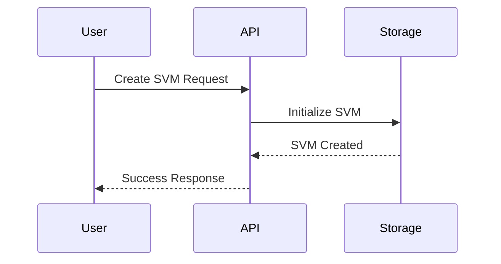

# NetApp ActiveIQ API Documentation - Development Guide

This guide provides instructions for developing and maintaining the NetApp ActiveIQ API documentation using MkDocs Material.

## 🚀 Quick Start

### Prerequisites

- Python 3.10+ (recommended: Python 3.12)
- pip (Python package installer)
- Git

### Local Development Setup

1. **Clone the repository:**
   ```bash
   git clone <repository-url>
   cd netapp-activeiq-docs
   ```

2. **Create virtual environment:**
   ```bash
   python -m venv venv
   source venv/bin/activate  # On Windows: venv\Scripts\activate
   ```

3. **Install dependencies:**
   ```bash
   pip install -r requirements.txt
   ```

4. **Start development server:**
   ```bash
   mkdocs serve
   ```

5. **Open in browser:**
   Navigate to `http://localhost:8000`

## 📁 Project Structure

```
├── .github/
│   └── workflows/
│       └── deploy-docs.yml      # GitHub Actions workflow
├── docs/
│   ├── stylesheets/
│   │   ├── extra.css           # Custom CSS styling
│   │   └── termynal.css        # Terminal animation styles
│   ├── javascripts/
│   │   ├── extra.js            # Enhanced JavaScript features
│   │   └── termynal.js         # Terminal animation script
│   ├── index.md                # Homepage
│   ├── api-endpoints.md        # API endpoints reference
│   ├── data-models.md          # Data models documentation
│   ├── examples.md             # Basic examples and use cases
│   ├── advanced-use-cases.md   # Advanced workflows with diagrams
│   ├── navigation.md           # Navigation guide
│   └── README.md               # Documentation summary
├── donnees-externes/           # Source data (analyzed)
├── mkdocs.yml                  # MkDocs configuration
├── requirements.txt            # Python dependencies
└── DEVELOPMENT.md              # This file
```

## 🛠️ Development Workflow

### Making Changes

1. **Edit documentation files:**
   - Markdown files are in the `docs/` directory
   - Follow the existing structure and formatting

2. **Preview changes locally:**
   ```bash
   mkdocs serve --livereload
   ```
   Changes will auto-reload in your browser

3. **Test the build:**
   ```bash
   mkdocs build --clean --strict
   ```

4. **Commit and push:**
   ```bash
   git add .
   git commit -m "Update documentation"
   git push
   ```

### Adding New Content

#### New Documentation Page

1. Create a new `.md` file in the `docs/` directory
2. Add front matter with tags:
   ```yaml
   ---
   tags:
     - API
     - NetApp
     - Examples
   ---
   ```
3. Update `mkdocs.yml` navigation section
4. Add links in relevant existing pages

#### New Advanced Use Case

1. Add content to `docs/advanced-use-cases.md`
2. Include sequence diagrams using Mermaid syntax:
   ```mermaid
   sequenceDiagram
       participant Client
       participant API
       Client->>API: Request
       API-->>Client: Response
   ```
3. Add Python code examples with proper syntax highlighting

#### New API Endpoint Documentation

1. Update `docs/api-endpoints.md`
2. Use the consistent format:
   ```markdown
   ### Endpoint Name
   - **Method**: `GET|POST|PATCH|DELETE`
   - **Path**: `/api/v2/path/to/endpoint`
   - **Description**: Brief description
   ```

## 🎨 Styling and Customization

### Custom CSS

Edit `docs/stylesheets/extra.css` to customize:
- NetApp brand colors
- Component styling
- Responsive design
- Dark/light theme variations

### Enhanced JavaScript

Edit `docs/javascripts/extra.js` to add:
- Interactive features
- API call demonstrations
- Enhanced search functionality
- Progress indicators

### Mermaid Diagrams

Use Mermaid syntax for sequence diagrams:


## 🔧 Configuration

### MkDocs Configuration (`mkdocs.yml`)

Key sections:
- **nav**: Site navigation structure
- **theme**: Material theme configuration
- **plugins**: Enabled plugins and settings
- **markdown_extensions**: Enhanced Markdown features

### Theme Features

Current enabled features:
- Navigation tabs and sections
- Code copy buttons
- Search with highlighting
- Dark/light mode toggle
- Instant navigation
- Content tabs
- Mermaid diagram support

## 📦 Plugins and Extensions

### Essential Plugins

- **mkdocs-material**: Material Design theme
- **mkdocs-mermaid2-plugin**: Sequence diagrams
- **mkdocs-git-revision-date-localized-plugin**: Last updated dates
- **mkdocs-awesome-pages-plugin**: Advanced navigation
- **mkdocs-macros-plugin**: Variables and macros

### Markdown Extensions

- **pymdownx.superfences**: Enhanced code blocks
- **pymdownx.tabbed**: Content tabs
- **pymdownx.details**: Collapsible sections
- **admonition**: Info/warning/tip boxes
- **toc**: Table of contents generation

## 🚀 Deployment

### GitHub Pages (Automatic)

Documentation automatically deploys via GitHub Actions when:
- Changes are pushed to `main` or `master` branch
- Files in `docs/`, `mkdocs.yml`, or `requirements.txt` are modified

### Manual Deployment

```bash
# Build the site
mkdocs build

# Deploy to GitHub Pages
mkdocs gh-deploy --force
```

### Local Preview

```bash
# Serve locally with live reload
mkdocs serve

# Serve on specific port
mkdocs serve --dev-addr localhost:8080

# Serve with strict mode (catch warnings)
mkdocs serve --strict
```

## 🔍 Troubleshooting

### Common Issues

1. **Plugin installation errors:**
   ```bash
   pip install --upgrade pip
   pip install -r requirements.txt --force-reinstall
   ```

2. **Mermaid diagrams not rendering:**
   - Check syntax with [Mermaid Live Editor](https://mermaid.live/)
   - Ensure proper indentation in YAML front matter

3. **Navigation not updating:**
   - Check `mkdocs.yml` nav section syntax
   - Ensure file paths are correct and files exist

4. **CSS/JS changes not appearing:**
   - Clear browser cache
   - Restart development server
   - Check console for JavaScript errors

### Debug Mode

Run with verbose output:
```bash
mkdocs serve --verbose
mkdocs build --verbose --clean --strict
```

## 📋 Content Guidelines

### Writing Style

- Use clear, concise language
- Include code examples for all concepts
- Add practical, real-world examples
- Use consistent terminology throughout

### Code Examples

- Always include complete, working examples
- Use syntax highlighting with language specification
- Add comments to explain complex operations
- Include both cURL and Python examples where applicable

### Sequence Diagrams

- Keep diagrams simple and focused
- Use consistent participant naming
- Include error scenarios where relevant
- Add notes for complex interactions

## 🤝 Contributing

1. Fork the repository
2. Create a feature branch: `git checkout -b feature/new-content`
3. Make your changes following these guidelines
4. Test locally with `mkdocs serve`
5. Submit a pull request with description of changes

## 📞 Support

For questions or issues:
- Check existing GitHub issues
- Review this development guide
- Test changes locally before submitting
- Include error messages in issue reports

---

*This development guide ensures consistent, high-quality documentation for the NetApp ActiveIQ API.*
