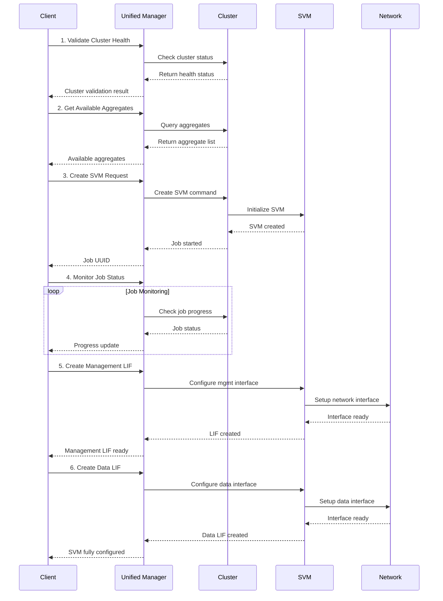
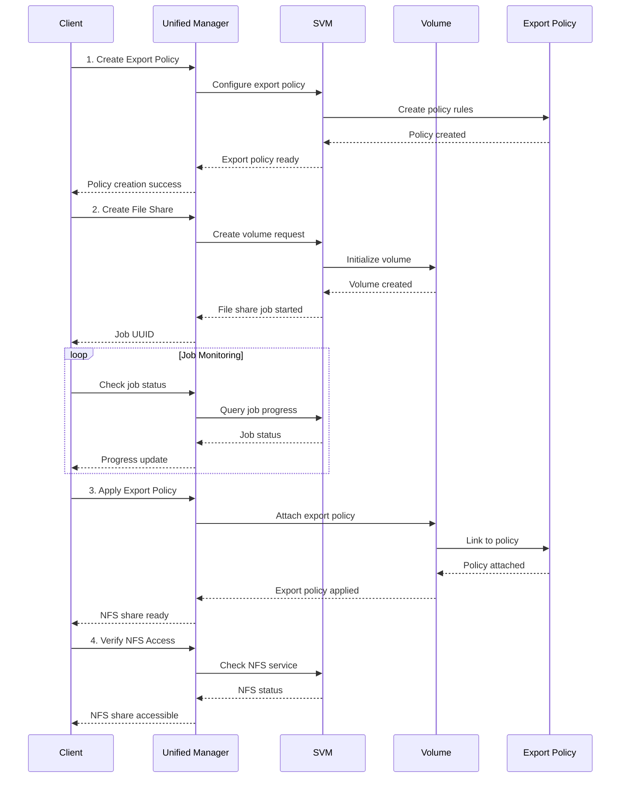
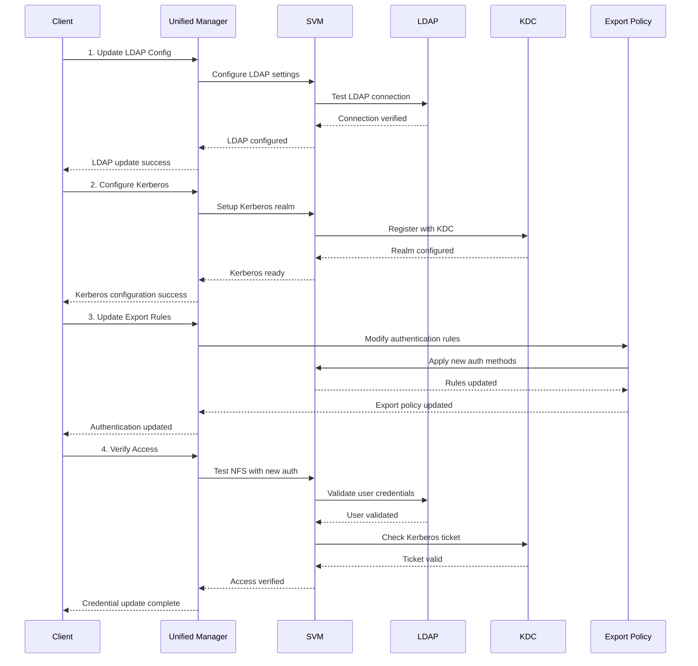
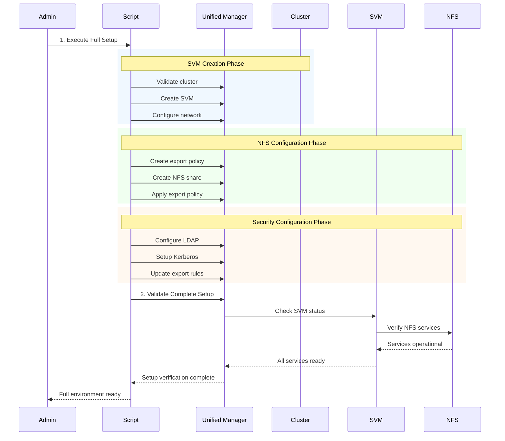

# NetApp ActiveIQ API - Advanced Use Cases

This document provides advanced use cases for NetApp ActiveIQ API, focusing on SVM management, NFS operations, and workflow automation with sequence diagrams.

## Table of Contents

1. [SVM Creation Workflow](#svm-creation-workflow)
2. [NFS Share Management](#nfs-share-management)
3. [NFS Credential Updates](#nfs-credential-updates)
4. [Sequence Diagrams](#sequence-diagrams)
5. [Complete Automation Scripts](#complete-automation-scripts)

## SVM Creation Workflow

### Overview
Storage Virtual Machines (SVMs) provide secure, multi-tenant environments for data access. This workflow demonstrates creating SVMs with proper configuration.

### Prerequisites
- Cluster must be accessible and healthy
- Sufficient storage resources available
- Administrative privileges required

### Step-by-Step SVM Creation

#### 1. Validate Cluster Prerequisites
```bash
# Check cluster health and capacity
curl -u "admin:password" -X GET \
  "https://um-server.example.com/api/v2/datacenter/cluster/clusters/{cluster_key}" \
  -H "Accept: application/json"
```

#### 2. Create SVM
```bash
curl -u "admin:password" -X POST \
  "https://um-server.example.com/api/v2/datacenter/svm/svms" \
  -H "Content-Type: application/json" \
  -d '{
    "name": "svm_nfs_prod",
    "cluster": {
      "key": "cluster-uuid-here"
    },
    "state": "running",
    "subtype": "default",
    "language": "c.utf_8",
    "allowed_protocols": ["nfs", "cifs"],
    "aggregates": [
      {
        "key": "aggregate-uuid-here"
      }
    ],
    "dns": {
      "domains": ["company.local"],
      "servers": ["10.1.1.10", "10.1.1.11"]
    },
    "ldap": {
      "enabled": false
    },
    "nis": {
      "enabled": false
    }
  }'
```

#### 3. Configure Network Interfaces
```bash
# Create management LIF
curl -u "admin:password" -X POST \
  "https://um-server.example.com/api/v2/datacenter/svm/svms/{svm_key}/network/ip/interfaces" \
  -H "Content-Type: application/json" \
  -d '{
    "name": "svm_nfs_prod_mgmt",
    "ip": {
      "address": "10.1.100.50",
      "netmask": "255.255.255.0"
    },
    "location": {
      "home_node": {
        "uuid": "node-uuid-here"
      },
      "home_port": {
        "name": "e0c"
      }
    },
    "service_policy": "default-management",
    "enabled": true
  }'

# Create data LIF for NFS
curl -u "admin:password" -X POST \
  "https://um-server.example.com/api/v2/datacenter/svm/svms/{svm_key}/network/ip/interfaces" \
  -H "Content-Type: application/json" \
  -d '{
    "name": "svm_nfs_prod_data",
    "ip": {
      "address": "10.1.100.51",
      "netmask": "255.255.255.0"
    },
    "location": {
      "home_node": {
        "uuid": "node-uuid-here"
      },
      "home_port": {
        "name": "e0d"
      }
    },
    "service_policy": "default-data-files",
    "enabled": true
  }'
```

### Python Implementation

```python
#!/usr/bin/env python3
"""
NetApp SVM Creation Automation
"""

import requests
from requests.auth import HTTPBasicAuth
import json
import time

class SVMManager:
    def __init__(self, um_host, username, password):
        self.um_host = um_host
        self.auth = HTTPBasicAuth(username, password)
        self.base_url = f"https://{um_host}/api/v2"

    def validate_cluster(self, cluster_key):
        """Validate cluster is healthy and ready for SVM creation"""
        url = f"{self.base_url}/datacenter/cluster/clusters/{cluster_key}"
        params = {"fields": "name,state,health,version"}

        response = requests.get(url, auth=self.auth, params=params)

        if response.status_code == 200:
            cluster = response.json()
            if cluster.get('state') == 'up' and cluster.get('health', {}).get('overall_status') == 'healthy':
                print(f"✓ Cluster {cluster['name']} is healthy and ready")
                return True
            else:
                print(f"✗ Cluster {cluster['name']} is not ready: {cluster.get('state')}")
                return False
        else:
            print(f"✗ Failed to validate cluster: {response.status_code}")
            return False

    def get_available_aggregates(self, cluster_key):
        """Get available aggregates for the cluster"""
        url = f"{self.base_url}/datacenter/storage/aggregates"
        params = {
            "query": f"cluster.key:{cluster_key}",
            "fields": "name,key,space.size,space.available,state"
        }

        response = requests.get(url, auth=self.auth, params=params)

        if response.status_code == 200:
            aggregates = response.json().get('records', [])
            available_aggs = []

            for agg in aggregates:
                if (agg.get('state') == 'online' and
                    agg.get('space', {}).get('available', 0) > 10737418240):  # 10GB minimum
                    available_aggs.append(agg)

            return available_aggs
        return []

    def create_svm(self, svm_config):
        """Create SVM with specified configuration"""
        url = f"{self.base_url}/datacenter/svm/svms"

        response = requests.post(url, auth=self.auth, json=svm_config)

        if response.status_code in [201, 202]:
            result = response.json()
            if 'job' in result:
                job_uuid = result['job']['uuid']
                print(f"✓ SVM creation job started: {job_uuid}")
                return self.wait_for_job(job_uuid)
            else:
                print("✓ SVM created successfully")
                return result
        else:
            print(f"✗ Failed to create SVM: {response.status_code}")
            print(f"Response: {response.text}")
            return None

    def wait_for_job(self, job_uuid, timeout=300):
        """Wait for job completion"""
        url = f"{self.base_url}/management-server/jobs/{job_uuid}"
        start_time = time.time()

        while time.time() - start_time < timeout:
            response = requests.get(url, auth=self.auth)

            if response.status_code == 200:
                job = response.json()
                state = job.get('state')

                if state == 'success':
                    print("✓ Job completed successfully")
                    return job
                elif state in ['failure', 'partial_failures']:
                    print(f"✗ Job failed: {job.get('message', 'Unknown error')}")
                    return None
                else:
                    print(f"⏳ Job in progress: {state} ({job.get('progress', 0)}%)")
                    time.sleep(10)
            else:
                print(f"✗ Failed to check job status: {response.status_code}")
                return None

        print("✗ Job timeout")
        return None

    def create_network_interface(self, svm_key, lif_config):
        """Create network interface for SVM"""
        url = f"{self.base_url}/datacenter/svm/svms/{svm_key}/network/ip/interfaces"

        response = requests.post(url, auth=self.auth, json=lif_config)

        if response.status_code in [201, 202]:
            print(f"✓ Network interface {lif_config['name']} created")
            return response.json()
        else:
            print(f"✗ Failed to create interface: {response.status_code}")
            return None

# Usage example
def create_complete_svm():
    svm_mgr = SVMManager("um-server.example.com", "admin", "password")

    cluster_key = "cluster-uuid-here"

    # Step 1: Validate cluster
    if not svm_mgr.validate_cluster(cluster_key):
        return False

    # Step 2: Get available aggregates
    aggregates = svm_mgr.get_available_aggregates(cluster_key)
    if not aggregates:
        print("✗ No suitable aggregates found")
        return False

    # Step 3: Create SVM
    svm_config = {
        "name": "svm_nfs_prod",
        "cluster": {"key": cluster_key},
        "state": "running",
        "subtype": "default",
        "language": "c.utf_8",
        "allowed_protocols": ["nfs"],
        "aggregates": [{"key": aggregates[0]['key']}]
    }

    svm_result = svm_mgr.create_svm(svm_config)
    if not svm_result:
        return False

    svm_key = svm_result.get('key') or svm_result.get('records', [{}])[0].get('key')

    # Step 4: Create network interfaces
    mgmt_lif = {
        "name": "svm_nfs_prod_mgmt",
        "ip": {
            "address": "10.1.100.50",
            "netmask": "255.255.255.0"
        },
        "service_policy": "default-management",
        "enabled": True
    }

    data_lif = {
        "name": "svm_nfs_prod_data",
        "ip": {
            "address": "10.1.100.51",
            "netmask": "255.255.255.0"
        },
        "service_policy": "default-data-files",
        "enabled": True
    }

    svm_mgr.create_network_interface(svm_key, mgmt_lif)
    svm_mgr.create_network_interface(svm_key, data_lif)

    print("✓ SVM creation workflow completed successfully")
    return True

if __name__ == "__main__":
    create_complete_svm()
```

## NFS Share Management

### Creating NFS Shares

#### 1. Create Volume for NFS Share
```bash
curl -u "admin:password" -X POST \
  "https://um-server.example.com/api/v2/storage-provider/file-shares" \
  -H "Content-Type: application/json" \
  -d '{
    "name": "shared_documents",
    "size": "500GB",
    "svm": {
      "key": "svm-key-here"
    },
    "aggregate": {
      "key": "aggregate-key-here"
    },
    "performance_service_level": {
      "key": "psl-key-here"
    },
    "export_policy": {
      "name": "default"
    },
    "unix_permissions": "755",
    "security_style": "unix",
    "space_guarantee": "none",
    "snapshot_policy": {
      "name": "default"
    }
  }'
```

#### 2. Configure NFS Export Policy
```bash
# Create export policy
curl -u "admin:password" -X POST \
  "https://um-server.example.com/api/v2/datacenter/svm/svms/{svm_key}/export-policies" \
  -H "Content-Type: application/json" \
  -d '{
    "name": "nfs_production_policy",
    "rules": [
      {
        "clients": ["10.1.0.0/16"],
        "protocols": ["nfs3", "nfs4"],
        "ro_rule": ["sys"],
        "rw_rule": ["sys"],
        "superuser": ["sys"],
        "allow_suid": false
      },
      {
        "clients": ["192.168.1.0/24"],
        "protocols": ["nfs3", "nfs4"],
        "ro_rule": ["sys"],
        "rw_rule": ["none"],
        "superuser": ["none"],
        "allow_suid": false
      }
    ]
  }'
```

#### 3. Update Volume Export Policy
```bash
curl -u "admin:password" -X PATCH \
  "https://um-server.example.com/api/v2/storage-provider/file-shares/{file_share_key}" \
  -H "Content-Type: application/json" \
  -d '{
    "export_policy": {
      "name": "nfs_production_policy"
    }
  }'
```

### Python NFS Share Manager

```python
class NFSShareManager:
    def __init__(self, um_host, username, password):
        self.um_host = um_host
        self.auth = HTTPBasicAuth(username, password)
        self.base_url = f"https://{um_host}/api/v2"

    def create_export_policy(self, svm_key, policy_name, rules):
        """Create NFS export policy with specified rules"""
        url = f"{self.base_url}/datacenter/svm/svms/{svm_key}/export-policies"

        policy_config = {
            "name": policy_name,
            "rules": rules
        }

        response = requests.post(url, auth=self.auth, json=policy_config)

        if response.status_code in [201, 202]:
            print(f"✓ Export policy {policy_name} created")
            return response.json()
        else:
            print(f"✗ Failed to create export policy: {response.status_code}")
            return None

    def create_nfs_share(self, share_config):
        """Create NFS file share"""
        url = f"{self.base_url}/storage-provider/file-shares"

        response = requests.post(url, auth=self.auth, json=share_config)

        if response.status_code in [201, 202]:
            result = response.json()
            if 'job' in result:
                return self.wait_for_job(result['job']['uuid'])
            return result
        else:
            print(f"✗ Failed to create NFS share: {response.status_code}")
            return None

    def update_share_export_policy(self, share_key, policy_name):
        """Update export policy for existing share"""
        url = f"{self.base_url}/storage-provider/file-shares/{share_key}"

        update_config = {
            "export_policy": {
                "name": policy_name
            }
        }

        response = requests.patch(url, auth=self.auth, json=update_config)

        if response.status_code == 200:
            print(f"✓ Share export policy updated to {policy_name}")
            return response.json()
        else:
            print(f"✗ Failed to update export policy: {response.status_code}")
            return None

# Complete NFS setup workflow
def setup_nfs_environment():
    nfs_mgr = NFSShareManager("um-server.example.com", "admin", "password")

    svm_key = "svm-key-here"

    # Create export policy with multiple rules
    export_rules = [
        {
            "clients": ["10.1.0.0/16"],
            "protocols": ["nfs3", "nfs4"],
            "ro_rule": ["sys"],
            "rw_rule": ["sys"],
            "superuser": ["sys"],
            "allow_suid": False
        },
        {
            "clients": ["192.168.1.0/24"],
            "protocols": ["nfs3", "nfs4"],
            "ro_rule": ["sys"],
            "rw_rule": ["none"],
            "superuser": ["none"],
            "allow_suid": False
        }
    ]

    policy_result = nfs_mgr.create_export_policy(
        svm_key,
        "production_nfs_policy",
        export_rules
    )

    if policy_result:
        # Create NFS share
        share_config = {
            "name": "shared_documents",
            "size": "500GB",
            "svm": {"key": svm_key},
            "export_policy": {"name": "production_nfs_policy"},
            "unix_permissions": "755",
            "security_style": "unix"
        }

        share_result = nfs_mgr.create_nfs_share(share_config)

        if share_result:
            print("✓ NFS environment setup completed")
            return True

    return False
```

## NFS Credential Updates

### Updating NFS Authentication and Authorization

#### 1. Update SVM LDAP Configuration
```bash
curl -u "admin:password" -X PATCH \
  "https://um-server.example.com/api/v2/datacenter/svm/svms/{svm_key}" \
  -H "Content-Type: application/json" \
  -d '{
    "ldap": {
      "enabled": true,
      "servers": ["ldap1.company.local", "ldap2.company.local"],
      "base_dn": "dc=company,dc=local",
      "bind_dn": "cn=netapp,ou=service,dc=company,dc=local",
      "bind_password": "secure_password",
      "schema": "RFC-2307",
      "port": 389,
      "use_start_tls": true
    }
  }'
```

#### 2. Update Export Policy Rules with New Authentication
```bash
curl -u "admin:password" -X PATCH \
  "https://um-server.example.com/api/v2/datacenter/svm/svms/{svm_key}/export-policies/{policy_name}/rules/{rule_index}" \
  -H "Content-Type: application/json" \
  -d '{
    "clients": ["10.1.0.0/16"],
    "protocols": ["nfs4"],
    "ro_rule": ["krb5", "sys"],
    "rw_rule": ["krb5", "sys"],
    "superuser": ["krb5"],
    "allow_suid": false,
    "allow_dev": false,
    "ntfs_unix_security": "fail"
  }'
```

#### 3. Configure Kerberos Authentication
```bash
curl -u "admin:password" -X POST \
  "https://um-server.example.com/api/v2/datacenter/svm/svms/{svm_key}/kerberos/realms" \
  -H "Content-Type: application/json" \
  -d '{
    "name": "COMPANY.LOCAL",
    "kdc_ip": "10.1.1.20",
    "kdc_port": 88,
    "admin_server_ip": "10.1.1.20",
    "admin_server_port": 749,
    "password_server_ip": "10.1.1.20",
    "password_server_port": 464,
    "clock_skew": 5,
    "comment": "Production Kerberos realm"
  }'
```

### Python Credential Management

```python
class NFSCredentialManager:
    def __init__(self, um_host, username, password):
        self.um_host = um_host
        self.auth = HTTPBasicAuth(username, password)
        self.base_url = f"https://{um_host}/api/v2"

    def update_ldap_config(self, svm_key, ldap_config):
        """Update LDAP configuration for SVM"""
        url = f"{self.base_url}/datacenter/svm/svms/{svm_key}"

        update_data = {"ldap": ldap_config}

        response = requests.patch(url, auth=self.auth, json=update_data)

        if response.status_code == 200:
            print("✓ LDAP configuration updated")
            return response.json()
        else:
            print(f"✗ Failed to update LDAP config: {response.status_code}")
            return None

    def update_export_rule_auth(self, svm_key, policy_name, rule_index, auth_config):
        """Update authentication rules for export policy"""
        url = f"{self.base_url}/datacenter/svm/svms/{svm_key}/export-policies/{policy_name}/rules/{rule_index}"

        response = requests.patch(url, auth=self.auth, json=auth_config)

        if response.status_code == 200:
            print("✓ Export rule authentication updated")
            return response.json()
        else:
            print(f"✗ Failed to update export rule: {response.status_code}")
            return None

    def configure_kerberos(self, svm_key, kerberos_config):
        """Configure Kerberos realm for SVM"""
        url = f"{self.base_url}/datacenter/svm/svms/{svm_key}/kerberos/realms"

        response = requests.post(url, auth=self.auth, json=kerberos_config)

        if response.status_code in [201, 202]:
            print("✓ Kerberos realm configured")
            return response.json()
        else:
            print(f"✗ Failed to configure Kerberos: {response.status_code}")
            return None

# Complete credential update workflow
def update_nfs_security():
    cred_mgr = NFSCredentialManager("um-server.example.com", "admin", "password")

    svm_key = "svm-key-here"

    # Update LDAP configuration
    ldap_config = {
        "enabled": True,
        "servers": ["ldap1.company.local", "ldap2.company.local"],
        "base_dn": "dc=company,dc=local",
        "bind_dn": "cn=netapp,ou=service,dc=company,dc=local",
        "bind_password": "secure_password",
        "schema": "RFC-2307",
        "use_start_tls": True
    }

    ldap_result = cred_mgr.update_ldap_config(svm_key, ldap_config)

    if ldap_result:
        # Update export policy authentication
        auth_config = {
            "clients": ["10.1.0.0/16"],
            "protocols": ["nfs4"],
            "ro_rule": ["krb5", "sys"],
            "rw_rule": ["krb5", "sys"],
            "superuser": ["krb5"],
            "allow_suid": False
        }

        auth_result = cred_mgr.update_export_rule_auth(
            svm_key,
            "production_nfs_policy",
            0,
            auth_config
        )

        if auth_result:
            # Configure Kerberos
            kerberos_config = {
                "name": "COMPANY.LOCAL",
                "kdc_ip": "10.1.1.20",
                "admin_server_ip": "10.1.1.20",
                "clock_skew": 5
            }

            krb_result = cred_mgr.configure_kerberos(svm_key, kerberos_config)

            if krb_result:
                print("✓ NFS security configuration completed")
                return True

    return False
```

## Sequence Diagrams

### SVM Creation Sequence



### NFS Share Creation Sequence



### NFS Credential Update Sequence



### Complete Workflow Integration



## API Sequence Action Tables

### SVM Creation Sequence

| **Step** | **Description**                             | **API Endpoint**                                     | **HTTP Method** |
|----------|---------------------------------------------|------------------------------------------------------|-----------------|
| 1        | Validate Cluster Health                     | `/datacenter/cluster/clusters/{cluster_key}`          | GET             |
| 2        | Get Available Aggregates                    | `/datacenter/storage/aggregates`                      | GET             |
| 3        | Create SVM                                  | `/datacenter/svm/svms`                                | POST            |
| 4        | Monitor Job Status                          | `/management-server/jobs/{uuid}`                      | GET             |
| 5        | Create Management LIF                       | `/datacenter/svm/svms/{svm_key}/network/ip/interfaces`| POST            |
| 6        | Create Data LIF                             | `/datacenter/svm/svms/{svm_key}/network/ip/interfaces`| POST            |

### NFS Share Creation Sequence

| **Step** | **Description**                 | **API Endpoint**                                         | **HTTP Method** |
|----------|---------------------------------|----------------------------------------------------------|-----------------|
| 1        | Create Export Policy            | `/datacenter/svm/svms/{svm_key}/export-policies`         | POST            |
| 2        | Create File Share               | `/storage-provider/file-shares`                          | POST            |
| 3        | Apply Export Policy             | `/storage-provider/file-shares/{file_share_key}`         | PATCH           |
| 4        | Verify NFS Access               | `/datacenter/svm/svms/{svm_key}`                         | GET             |

### NFS Credential Update Sequence

| **Step** | **Description**                 | **API Endpoint**                                         | **HTTP Method** |
|----------|---------------------------------|----------------------------------------------------------|-----------------|
| 1        | Update LDAP Config              | `/datacenter/svm/svms/{svm_key}`                         | PATCH           |
| 2        | Configure Kerberos              | `/datacenter/svm/svms/{svm_key}`                         | PATCH           |
| 3        | Update Export Rules             | `/datacenter/svm/svms/{svm_key}/export-policies`         | PATCH           |
| 4        | Verify Access                   | `/datacenter/svm/svms/{svm_key}`                         | GET             |

### Complete Workflow Integration

This workflow involves executing combined steps from SVM Creation, NFS Share Creation, and NFS Credential Update sequences. It leverages the same endpoints listed above in a phased manner.

## Complete Automation Scripts

### Master Deployment Script

```python
#!/usr/bin/env python3
"""
NetApp Complete NFS Environment Deployment
Automates SVM creation, NFS share setup, and security configuration
"""

import requests
from requests.auth import HTTPBasicAuth
import json
import time
import logging
from datetime import datetime

# Configure logging
logging.basicConfig(
    level=logging.INFO,
    format='%(asctime)s - %(levelname)s - %(message)s',
    handlers=[
        logging.FileHandler('netapp_deployment.log'),
        logging.StreamHandler()
    ]
)

class NetAppEnvironmentDeployer:
    def __init__(self, um_host, username, password):
        self.um_host = um_host
        self.auth = HTTPBasicAuth(username, password)
        self.base_url = f"https://{um_host}/api/v2"
        self.logger = logging.getLogger(__name__)

    def deploy_complete_environment(self, config):
        """Deploy complete NFS environment"""
        self.logger.info("Starting NetApp NFS environment deployment")

        try:
            # Phase 1: SVM Creation
            self.logger.info("Phase 1: Creating SVM")
            svm_result = self._create_svm_environment(config['cluster'], config['svm'])
            if not svm_result:
                return False

            svm_key = svm_result['key']

            # Phase 2: NFS Share Setup
            self.logger.info("Phase 2: Setting up NFS shares")
            share_result = self._setup_nfs_shares(svm_key, config['nfs_shares'])
            if not share_result:
                return False

            # Phase 3: Security Configuration
            self.logger.info("Phase 3: Configuring security")
            security_result = self._configure_security(svm_key, config['security'])
            if not security_result:
                return False

            # Phase 4: Validation
            self.logger.info("Phase 4: Validating deployment")
            validation_result = self._validate_deployment(svm_key)

            if validation_result:
                self.logger.info("✓ Complete NFS environment deployment successful")
                return True
            else:
                self.logger.error("✗ Deployment validation failed")
                return False

        except Exception as e:
            self.logger.error(f"Deployment failed: {str(e)}")
            return False

    def _create_svm_environment(self, cluster_config, svm_config):
        """Create SVM with network configuration"""
        # Implementation similar to previous examples
        # ... (SVM creation logic)
        pass

    def _setup_nfs_shares(self, svm_key, shares_config):
        """Setup NFS shares with export policies"""
        # Implementation for NFS share creation
        # ... (NFS setup logic)
        pass

    def _configure_security(self, svm_key, security_config):
        """Configure LDAP and Kerberos security"""
        # Implementation for security configuration
        # ... (Security setup logic)
        pass

    def _validate_deployment(self, svm_key):
        """Validate complete deployment"""
        # Implementation for deployment validation
        # ... (Validation logic)
        pass

# Example deployment configuration
deployment_config = {
    "cluster": {
        "key": "cluster-uuid-here"
    },
    "svm": {
        "name": "prod_nfs_svm",
        "protocols": ["nfs"],
        "dns_domain": "company.local",
        "dns_servers": ["10.1.1.10", "10.1.1.11"],
        "network_interfaces": [
            {
                "name": "mgmt_lif",
                "ip": "10.1.100.50",
                "netmask": "255.255.255.0",
                "role": "management"
            },
            {
                "name": "data_lif",
                "ip": "10.1.100.51",
                "netmask": "255.255.255.0",
                "role": "data"
            }
        ]
    },
    "nfs_shares": [
        {
            "name": "shared_documents",
            "size": "500GB",
            "export_policy": "production_policy",
            "unix_permissions": "755"
        },
        {
            "name": "user_homes",
            "size": "1TB",
            "export_policy": "home_directories",
            "unix_permissions": "700"
        }
    ],
    "security": {
        "ldap": {
            "enabled": True,
            "servers": ["ldap1.company.local", "ldap2.company.local"],
            "base_dn": "dc=company,dc=local"
        },
        "kerberos": {
            "realm": "COMPANY.LOCAL",
            "kdc_server": "10.1.1.20"
        }
    }
}

# Usage
if __name__ == "__main__":
    deployer = NetAppEnvironmentDeployer("um-server.example.com", "admin", "password")
    success = deployer.deploy_complete_environment(deployment_config)

    if success:
        print("Deployment completed successfully!")
    else:
        print("Deployment failed. Check logs for details.")
```

## Best Practices and Considerations

### Security Best Practices
1. **Use strong authentication** - Implement Kerberos for production environments
2. **Principle of least privilege** - Grant minimal required access
3. **Regular credential rotation** - Update service accounts periodically
4. **Network segmentation** - Use appropriate subnet restrictions
5. **Audit logging** - Monitor all API calls and changes

### Performance Considerations
1. **Aggregate selection** - Choose high-performance aggregates for critical workloads
2. **Network optimization** - Use dedicated networks for NFS traffic
3. **Export policy optimization** - Minimize rule complexity
4. **Load balancing** - Distribute NFS clients across multiple LIFs

### Monitoring and Maintenance
1. **Automated health checks** - Regular validation of services
2. **Capacity monitoring** - Track volume usage and growth
3. **Performance monitoring** - Monitor NFS latency and throughput
4. **Backup validation** - Ensure backup policies are effective

This comprehensive guide provides the foundation for advanced NetApp ActiveIQ API operations, complete with sequence diagrams and production-ready automation scripts.
