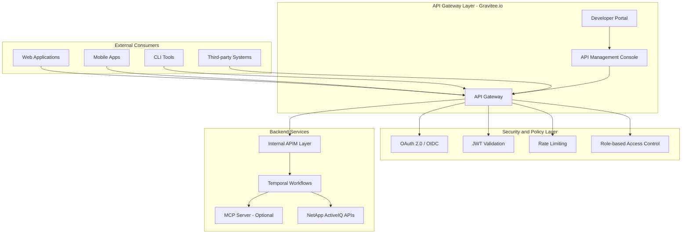

# API Management Strategy for NetApp Storage Platform

## Overview

This document outlines the comprehensive API Management strategy for exposing NetApp storage services as products through a secure, scalable, and monitored API gateway using Gravitee.io. The strategy implements a multi-layered security approach with proper governance, monitoring, and lifecycle management.

## Architecture Overview



## Product-Oriented API Catalog

### 1. NetApp Storage Management API (Core Product)

**Product Description**: Comprehensive storage management capabilities including volume operations, SVM management, and performance monitoring.

```yaml
product_definition:
  name: "NetApp Storage Management API"
  version: "v1"
  description: "Complete storage lifecycle management"
  tier: "enterprise"
  pricing_model: "usage_based"
  sla:
    availability: "99.9%"
    response_time: "< 500ms (95th percentile)"
    throughput: "1000 requests/minute"
```

**API Endpoints**:

- **Volume Operations**: `/v1/storage/volumes`
- **SVM Management**: `/v1/storage/svms`
- **Performance Monitoring**: `/v1/storage/performance`
- **Capacity Planning**: `/v1/storage/capacity`

### 2. NetApp Backup & Recovery API

**Product Description**: Automated backup management and disaster recovery orchestration.

```yaml
product_definition:
  name: "NetApp Backup & Recovery API"
  version: "v1"
  description: "Data protection and recovery services"
  tier: "premium"
  pricing_model: "subscription"
  sla:
    availability: "99.95%"
    response_time: "< 200ms (95th percentile)"
    rpo: "< 1 hour"
    rto: "< 30 minutes"
```

### 3. NetApp Analytics & AI API

**Product Description**: AI-powered storage analytics, predictive insights, and optimization recommendations.

```yaml
product_definition:
  name: "NetApp Analytics & AI API"
  version: "v1"
  description: "Intelligent storage analytics and optimization"
  tier: "premium_plus"
  pricing_model: "value_based"
  sla:
    availability: "99.9%"
    response_time: "< 1000ms (95th percentile)"
    accuracy: "> 90% prediction accuracy"
```

## Security Framework

### Authentication & Authorization

```yaml
security_layers:
  authentication:
    primary: "OAuth 2.0 with PKCE"
    secondary: "JWT Bearer Tokens"
    mfa_required: true
    token_expiry: "1 hour"
    refresh_token_expiry: "24 hours"

  authorization:
    model: "RBAC + ABAC"
    scopes:
      - "storage:read"
      - "storage:write"
      - "storage:admin"
      - "backup:manage"
      - "analytics:access"

  api_security:
    transport: "TLS 1.3 only"
    request_signing: "HMAC-SHA256"
    payload_encryption: "AES-256-GCM"
    certificate_pinning: true
```

### Role-Based Access Control

```yaml
roles:
  storage_operator:
    permissions:
      - "storage:read"
      - "performance:monitor"
    restrictions:
      - "no_admin_operations"
      - "read_only_configuration"

  storage_admin:
    permissions:
      - "storage:read"
      - "storage:write"
      - "storage:admin"
      - "backup:manage"
    restrictions:
      - "audit_log_required"
      - "approval_required_critical_ops"

  analytics_user:
    permissions:
      - "analytics:access"
      - "performance:monitor"
      - "capacity:forecast"
    restrictions:
      - "no_configuration_access"

  system_admin:
    permissions:
      - "*:*"
    restrictions:
      - "mfa_required"
      - "audit_log_comprehensive"
```

## API Gateway Configuration

### Gravitee.io Policies Implementation

```javascript
// Rate Limiting Policy
{
  "rate-limit": {
    "key": "{#request.headers['X-Client-ID']}",
    "limit": 1000,
    "periodTime": 3600,
    "periodTimeUnit": "SECONDS"
  }
}

// Circuit Breaker Policy
{
  "circuit-breaker": {
    "failureThreshold": 5,
    "timeout": 10000,
    "resetTimeout": 30000,
    "fallback": {
      "status": 503,
      "body": "Service temporarily unavailable"
    }
  }
}

// Request Transformation Policy
{
  "transform-headers": {
    "addHeaders": [
      {
        "name": "X-API-Version",
        "value": "v1"
      },
      {
        "name": "X-Request-ID",
        "value": "{#request.id}"
      }
    ],
    "removeHeaders": ["X-Internal-Token"]
  }
}
```

### API Plans & Subscription Management

```yaml
api_plans:
  basic_plan:
    name: "Basic Storage API Access"
    security: "API Key"
    rate_limits:
      requests_per_minute: 100
      requests_per_day: 10000
    features:
      - "volume_read_operations"
      - "basic_monitoring"
    pricing: "free"

  professional_plan:
    name: "Professional Storage Management"
    security: "OAuth 2.0"
    rate_limits:
      requests_per_minute: 1000
      requests_per_day: 100000
    features:
      - "full_volume_management"
      - "svm_operations"
      - "performance_analytics"
    pricing: "$100/month"

  enterprise_plan:
    name: "Enterprise Storage Platform"
    security: "OAuth 2.0 + JWT"
    rate_limits:
      requests_per_minute: 5000
      requests_per_day: 1000000
    features:
      - "all_storage_operations"
      - "ai_analytics"
      - "priority_support"
    pricing: "custom"
```

## Monitoring & Analytics

### API Metrics & KPIs

```yaml
monitoring_dashboard:
  operational_metrics:
    - api_response_time_p95
    - api_availability_percentage
    - error_rate_percentage
    - requests_per_second
    - concurrent_connections

  business_metrics:
    - api_adoption_rate
    - developer_portal_engagement
    - api_plan_distribution
    - revenue_per_api
    - customer_satisfaction_score

  security_metrics:
    - authentication_failure_rate
    - authorization_violations
    - suspicious_activity_alerts
    - certificate_expiry_warnings
```

### Alerting Configuration

```yaml
alerting_rules:
  high_error_rate:
    condition: "error_rate > 5%"
    duration: "5 minutes"
    severity: "critical"
    channels: ["pagerduty", "slack"]

  response_time_degradation:
    condition: "p95_response_time > 1000ms"
    duration: "10 minutes"
    severity: "warning"
    channels: ["slack", "email"]

  security_violation:
    condition: "authentication_failures > 10 per minute"
    duration: "1 minute"
    severity: "critical"
    channels: ["security_team", "pagerduty"]
```

## Developer Experience

### API Documentation Strategy

```yaml
documentation_approach:
  format: "OpenAPI 3.0"
  interactive_docs: true
  code_samples:
    languages: ["curl", "python", "javascript", "go"]
  tutorials:
    - "getting_started"
    - "authentication_guide"
    - "volume_management_walkthrough"
    - "performance_optimization"

  developer_portal_features:
    - api_explorer
    - subscription_management
    - usage_analytics
    - support_tickets
    - community_forum
```

### SDK Strategy

```yaml
sdk_development:
  languages:
    - python
    - javascript
    - go
    - java

  features:
    - automatic_authentication
    - retry_mechanisms
    - error_handling
    - async_support
    - pagination_helpers

  distribution:
    - npm_registry
    - pypi
    - maven_central
    - go_modules
```

## Deployment Architecture

### Gravitee.io Components Deployment

```yaml
deployment_architecture:
  api_gateway:
    replicas: 3
    resources:
      cpu: "2"
      memory: "4Gi"
    config:
      cluster_mode: true
      health_checks: enabled

  management_api:
    replicas: 2
    resources:
      cpu: "1"
      memory: "2Gi"
    database: "mongodb"

  portal_ui:
    replicas: 2
    resources:
      cpu: "0.5"
      memory: "1Gi"
    cdn_enabled: true

  elasticsearch:
    replicas: 3
    resources:
      cpu: "2"
      memory: "8Gi"
    storage: "100Gi"
```

### High Availability Configuration

```yaml
high_availability:
  load_balancing:
    algorithm: "round_robin"
    health_checks:
      path: "/health"
      interval: "30s"
      timeout: "5s"

  clustering:
    enabled: true
    discovery: "kubernetes"
    sync_interval: "5s"

  backup_strategy:
    configuration_backup: "daily"
    analytics_backup: "weekly"
    retention: "30 days"
```

## Security Compliance

### Compliance Frameworks

```yaml
compliance_requirements:
  iso_27001:
    - access_control_policy
    - information_security_policy
    - incident_management
    - risk_assessment

  soc2_type2:
    - security_controls
    - availability_controls
    - processing_integrity
    - confidentiality

  gdpr:
    - data_protection_by_design
    - consent_management
    - data_subject_rights
    - breach_notification
```

### Audit & Logging

```yaml
audit_configuration:
  log_levels:
    security_events: "INFO"
    api_access: "DEBUG"
    system_events: "WARN"

  log_retention:
    security_logs: "7 years"
    access_logs: "1 year"
    system_logs: "6 months"

  log_destinations:
    - "elasticsearch"
    - "splunk"
    - "s3_archive"
```

## Lifecycle Management

### API Versioning Strategy

```yaml
versioning_strategy:
  approach: "URL path versioning"
  format: "/v{major}.{minor}"
  deprecation_policy:
    notice_period: "6 months"
    support_period: "12 months"
    migration_assistance: true

  backward_compatibility:
    breaking_changes: "major version only"
    feature_additions: "minor version"
    bug_fixes: "patch version"
```

### Change Management

```yaml
change_management:
  approval_workflow:
    - "api_design_review"
    - "security_review"
    - "performance_review"
    - "documentation_review"

  testing_phases:
    - "unit_tests"
    - "integration_tests"
    - "performance_tests"
    - "security_tests"
    - "user_acceptance_tests"

  deployment_strategy:
    - "blue_green_deployment"
    - "canary_releases"
    - "feature_flags"
    - "rollback_procedures"
```

## Cost Optimization

### Resource Management

```yaml
cost_optimization:
  auto_scaling:
    enabled: true
    min_replicas: 2
    max_replicas: 10
    target_cpu: 70%
    target_memory: 80%

  caching_strategy:
    api_responses: "redis"
    ttl: "5 minutes"
    cache_hit_ratio_target: "> 80%"

  monitoring_costs:
    metrics_retention: "30 days"
    logs_retention: "7 days"
    analytics_sampling: "10%"
```

## Migration Plan

### Implementation Phases

```yaml
migration_phases:
  phase_1_foundation:
    duration: "4 weeks"
    deliverables:
      - "gravitee_deployment"
      - "basic_security_setup"
      - "core_api_exposure"

  phase_2_security:
    duration: "3 weeks"
    deliverables:
      - "oauth_integration"
      - "rbac_implementation"
      - "audit_logging"

  phase_3_advanced:
    duration: "4 weeks"
    deliverables:
      - "developer_portal"
      - "analytics_dashboard"
      - "monetization_setup"

  phase_4_optimization:
    duration: "2 weeks"
    deliverables:
      - "performance_tuning"
      - "monitoring_enhancement"
      - "documentation_completion"
```

This comprehensive API management strategy provides a secure, scalable, and product-oriented approach to exposing NetApp storage services through Gravitee.io, ensuring proper governance, monitoring, and developer experience while maintaining enterprise-grade security standards.
