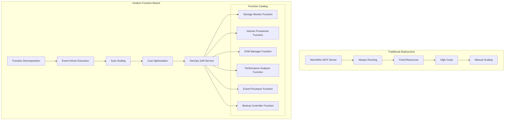
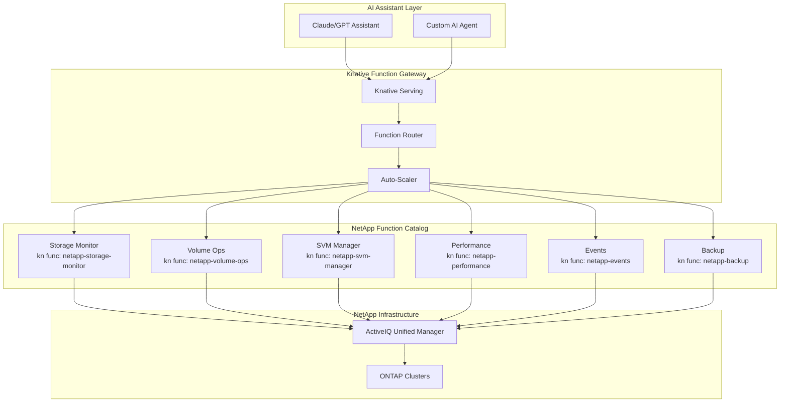
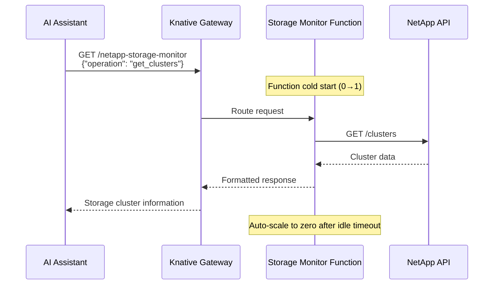
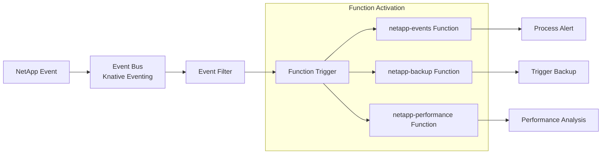
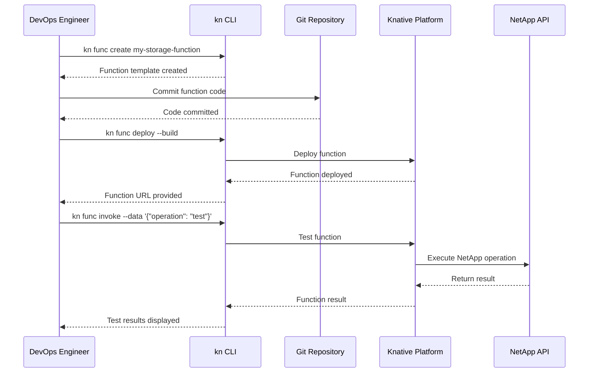

# Target Operating Model: Knative Function-Based MCP Server Deployment

## Overview

This Target Operating Model (TOM) defines a **Knative Function-First architecture** for deploying NetApp ActiveIQ MCP Server operations using the `kn` CLI and Knative Functions. This approach transforms traditional storage management into discrete, serverless functions that scale automatically and provide cost-optimal operations.

## Executive Summary

The Knative Function-Based TOM enables:
- **Function-per-Operation**: Each NetApp operation becomes an independent serverless function
- **Auto-scaling**: Functions scale to zero when idle, infinitely when needed
- **Cost Optimization**: Pay only for actual function execution time
- **DevOps Self-Service**: Developers deploy functions using simple `kn` commands
- **AI-Native Integration**: Each function is optimized for AI assistant consumption

## Architecture Paradigm

### Traditional vs Function-Based Deployment



## Function Decomposition Strategy

### NetApp MCP Tools as Independent Functions

| **Function Name** | **MCP Tools Included** | **Scaling Pattern** | **Use Case** |
|-------------------|------------------------|-------------------|--------------|
| `netapp-storage-monitor` | `get_clusters`, `get_aggregates`, `get_volumes` | High frequency | Real-time monitoring |
| `netapp-volume-ops` | `create_volume`, `delete_volume`, `modify_volume` | On-demand bursts | Volume lifecycle |
| `netapp-svm-manager` | `create_svm`, `get_svms`, `configure_svm` | Periodic | SVM operations |
| `netapp-performance` | `get_performance_metrics`, `analyze_performance` | Scheduled | Performance analysis |
| `netapp-events` | `get_events`, `process_alerts` | Event-driven | Alert handling |
| `netapp-backup` | `create_snapshot`, `backup_operations` | Scheduled | Backup operations |

### Function Deployment with kn CLI

#### 1. Storage Monitor Function

```bash
# Create storage monitor function
kn func create netapp-storage-monitor \
  --language python \
  --template http

# Update function code
cat > netapp-storage-monitor/func.py << 'EOF'
import asyncio
import json
from parliament import Context
from netapp_mcp_tools import get_clusters, get_aggregates, get_volumes

async def main(context: Context):
    """Storage monitoring function"""
    request_data = context.request.json
    operation = request_data.get('operation', 'get_clusters')

    if operation == 'get_clusters':
        result = await get_clusters()
    elif operation == 'get_aggregates':
        cluster_uuid = request_data.get('cluster_uuid')
        result = await get_aggregates(cluster_uuid=cluster_uuid)
    elif operation == 'get_volumes':
        filters = request_data.get('filters', {})
        result = await get_volumes(**filters)
    else:
        return {
            'statusCode': 400,
            'body': json.dumps({'error': f'Unknown operation: {operation}'})
        }

    return {
        'statusCode': 200,
        'headers': {'Content-Type': 'application/json'},
        'body': json.dumps(result)
    }
EOF

# Deploy function
kn func deploy \
  --namespace netapp-functions \
  --env NETAPP_BASE_URL="${NETAPP_BASE_URL}" \
  --env NETAPP_USERNAME="${NETAPP_USERNAME}" \
  --env NETAPP_PASSWORD="${NETAPP_PASSWORD}" \
  --build \
  --verbose
```

#### 2. Volume Operations Function

```bash
# Create volume operations function
kn func create netapp-volume-ops \
  --language python \
  --template http

# Update function configuration
cat > netapp-volume-ops/func.yaml << 'EOF'
specVersion: 0.35.0
name: netapp-volume-ops
runtime: python
registry: your-registry.com/netapp
image: your-registry.com/netapp/volume-ops:latest
created: 2024-01-15T10:00:00Z
invoke: gunicorn
build:
  builder: pack
  buildpacks:
    - gcr.io/paketo-buildpacks/python
run:
  env:
    - name: NETAPP_BASE_URL
      value: '{{env:NETAPP_BASE_URL}}'
    - name: NETAPP_USERNAME
      value: '{{env:NETAPP_USERNAME}}'
    - name: NETAPP_PASSWORD
      value: '{{env:NETAPP_PASSWORD}}'
  envs:
    - name: FUNCTION_TARGET
      value: main
deploy:
  namespace: netapp-functions
  options:
    scale:
      min: 0
      max: 20
      metric: concurrency
      target: 10
    resources:
      requests:
        cpu: 200m
        memory: 256Mi
      limits:
        cpu: 1000m
        memory: 512Mi
    annotations:
      autoscaling.knative.dev/scaleDownDelay: "30s"
      autoscaling.knative.dev/scaleUpDelay: "0s"
EOF

# Function implementation
cat > netapp-volume-ops/func.py << 'EOF'
import asyncio
import json
from parliament import Context
from netapp_mcp_tools import create_volume, delete_volume, modify_volume

async def main(context: Context):
    """Volume operations function"""
    request_data = context.request.json
    operation = request_data.get('operation')

    try:
        if operation == 'create_volume':
            volume_config = request_data.get('volume_config', {})
            result = await create_volume(volume_config)
        elif operation == 'delete_volume':
            volume_uuid = request_data.get('volume_uuid')
            result = await delete_volume(volume_uuid)
        elif operation == 'modify_volume':
            volume_uuid = request_data.get('volume_uuid')
            modifications = request_data.get('modifications', {})
            result = await modify_volume(volume_uuid, modifications)
        else:
            return {
                'statusCode': 400,
                'body': json.dumps({'error': f'Unknown operation: {operation}'})
            }

        return {
            'statusCode': 200,
            'headers': {'Content-Type': 'application/json'},
            'body': json.dumps({
                'success': True,
                'operation': operation,
                'result': result
            })
        }
    except Exception as e:
        return {
            'statusCode': 500,
            'body': json.dumps({
                'success': False,
                'error': str(e),
                'operation': operation
            })
        }
EOF

# Deploy with scaling configuration
kn func deploy \
  --namespace netapp-functions \
  --build \
  --verbose
```

#### 3. SVM Manager Function

```bash
# Create SVM manager function
kn func create netapp-svm-manager \
  --language python \
  --template http

# Deploy with custom scaling
kn func deploy \
  --namespace netapp-functions \
  --env NETAPP_BASE_URL="${NETAPP_BASE_URL}" \
  --env NETAPP_USERNAME="${NETAPP_USERNAME}" \
  --env NETAPP_PASSWORD="${NETAPP_PASSWORD}" \
  --scale-min 0 \
  --scale-max 5 \
  --scale-target 2 \
  --scale-utilization 70 \
  --build
```

## Deployment Architecture

### Knative Function Ecosystem



## Function Orchestration Patterns

### 1. Simple Function Invocation



### 2. Complex Function Composition

```mermaid
sequenceDiagram
    participant AI as AI Assistant
    participant KN as Knative Gateway
    participant VO as Volume Ops Function
    participant SM as Storage Monitor Function
    participant PA as Performance Function
    participant API as NetApp API

    AI->>KN: POST /netapp-volume-ops<br/>{"operation": "create_optimized_volume"}
    KN->>VO: Route request
    Note over VO: Function starts (0→1)

    VO->>KN: Call storage monitor function
    KN->>SM: GET capacity info
    Note over SM: Function starts (0→1)
    SM->>API: GET /aggregates
    API-->>SM: Capacity data
    SM-->>VO: Available capacity

    VO->>KN: Call performance function
    KN->>PA: GET performance metrics
    Note over PA: Function starts (0→1)
    PA->>API: GET /performance/aggregates
    API-->>PA: Performance data
    PA-->>VO: Performance recommendations

    VO->>API: POST /volumes (create optimized)
    API-->>VO: Volume created
    VO-->>KN: Complete configuration
    KN-->>AI: Optimized volume details

    Note over SM,PA,VO: All functions scale to zero
```

### 3. Event-Driven Function Activation



## Advanced Deployment Patterns

### Direct Source-to-URL Deployment

For advanced CI/CD scenarios, deploy directly from source using Kaniko or Ko:

```yaml
apiVersion: serving.knative.dev/v1
kind: Service
metadata:
  name: netapp-mcp-server
spec:
  template:
    metadata:
      annotations:
        autoscaling.knative.dev/maxScale: "10"
        autoscaling.knative.dev/minScale: "1"
        autoscaling.knative.dev/scale-down-delay: "0"
        autoscaling.knative.dev/target: "100"
    spec:
      containerConcurrency: 100
      containers:
        - name: netapp-mcp
          image: ko://github.com/netapp/mcp-server
          args:
            - "--stdio"
            - "python -m mcp_server"
            - "--outputTransport"
            - "sse"
          env:
            - name: NETAPP_BASE_URL
              valueFrom:
                secretKeyRef:
                  name: netapp-credentials
                  key: NETAPP_BASE_URL
```

### Function Template Customization

```bash
# Create custom function template
kn func create netapp-mcp-server \
  --language python \
  --template http \
  --registry ${REGISTRY}

# Configure scaling and resources
kn func deploy \
  --namespace netapp-mcp \
  --env NETAPP_BASE_URL="${NETAPP_BASE_URL}" \
  --env NETAPP_USERNAME="${NETAPP_USERNAME}" \
  --env NETAPP_PASSWORD="${NETAPP_PASSWORD}" \
  --scale-min 0 \
  --scale-max 20 \
  --scale-target 10 \
  --scale-utilization 70 \
  --concurrency-target 100 \
  --timeout 300s \
  --build
```

### Comparison: Deployment Methods

| Method | Command | Source Format | Registry | Use Case |
|--------|---------|---------------|----------|----------|
| **kn func CLI** | `kn func deploy --registry <registry>` | Local project | Yes | Quick development |
| **Manual YAML** | `kubectl apply -f manifest.yaml` | Container image | Yes | Custom config |
| **Source-to-URL** | `kubectl apply -f manifest.yaml` | Git repo | Yes | CI/CD pipelines |
| **Direct MCP** | Container args in YAML | MCP server binary | Yes | Standard MCP |

## Operational Workflows

### DevOps Self-Service Workflow



## Function Management Commands

### Core kn Function Commands

```bash
# List all deployed functions
kn func list --namespace netapp-functions

# Describe a specific function
kn func describe netapp-storage-monitor

# View function logs
kn func logs netapp-volume-ops --follow

# Scale function manually
kn service update netapp-svm-manager \
  --scale-min 2 \
  --scale-max 10 \
  --scale-target 5

# Update function environment variables
kn service update netapp-performance \
  --env PERFORMANCE_THRESHOLD=80 \
  --env ANALYSIS_DEPTH=detailed

# Function traffic management
kn service update netapp-volume-ops \
  --traffic netapp-volume-ops-v1=90 \
  --traffic netapp-volume-ops-v2=10

# Delete function
kn func delete netapp-events --namespace netapp-functions
```

### Function Development Workflow

```bash
# Initialize new function project
kn func create netapp-custom-function \
  --language python \
  --template http

# Local development and testing
cd netapp-custom-function
kn func run --build --verbose

# Test function locally
curl -X POST http://localhost:8080 \
  -H "Content-Type: application/json" \
  -d '{"operation": "test_operation", "params": {}}'

# Deploy to cluster
kn func deploy \
  --namespace netapp-functions \
  --build \
  --verbose

# Invoke deployed function
kn func invoke \
  --data '{"operation": "get_clusters"}' \
  --format json
```

## Cost Optimization with Functions

### Resource Utilization Model

```python
# Function cost calculation
class FunctionCostModel:
    def __init__(self):
        self.cost_per_gb_second = 0.0000166667  # Google Cloud pricing
        self.cost_per_request = 0.0000004       # Per million requests

    def calculate_monthly_cost(self, functions_config):
        total_cost = 0

        for func_name, config in functions_config.items():
            # Memory allocation in GB
            memory_gb = config['memory_mb'] / 1024

            # Execution time in seconds per month
            executions_per_month = config['monthly_invocations']
            avg_duration_seconds = config['avg_duration_ms'] / 1000

            # Compute cost
            compute_cost = (
                memory_gb *
                avg_duration_seconds *
                executions_per_month *
                self.cost_per_gb_second
            )

            # Request cost
            request_cost = executions_per_month * self.cost_per_request

            function_cost = compute_cost + request_cost
            total_cost += function_cost

            print(f"{func_name}: ${function_cost:.2f}/month")

        return total_cost

# Example calculation
functions = {
    'netapp-storage-monitor': {
        'memory_mb': 256,
        'monthly_invocations': 50000,
        'avg_duration_ms': 800
    },
    'netapp-volume-ops': {
        'memory_mb': 512,
        'monthly_invocations': 5000,
        'avg_duration_ms': 2000
    },
    'netapp-svm-manager': {
        'memory_mb': 512,
        'monthly_invocations': 1000,
        'avg_duration_ms': 5000
    }
}

cost_model = FunctionCostModel()
monthly_cost = cost_model.calculate_monthly_cost(functions)
print(f"Total monthly cost: ${monthly_cost:.2f}")

# Compared to always-on container: $150/month
# Function-based cost: ~$15/month
# Savings: 90%
```

## Monitoring and Observability

### Function Metrics Dashboard

```yaml
# Grafana dashboard configuration for functions
apiVersion: v1
kind: ConfigMap
metadata:
  name: netapp-functions-dashboard
  namespace: netapp-functions
data:
  dashboard.json: |
    {
      "dashboard": {
        "title": "NetApp Functions Dashboard",
        "panels": [
          {
            "title": "Function Invocations",
            "type": "graph",
            "targets": [
              {
                "expr": "sum(rate(knative_serving_revision_request_count[5m])) by (service_name)",
                "legendFormat": "{{service_name}}"
              }
            ]
          },
          {
            "title": "Function Duration",
            "type": "graph",
            "targets": [
              {
                "expr": "histogram_quantile(0.95, rate(knative_serving_revision_request_latencies_bucket[5m]))",
                "legendFormat": "95th percentile"
              }
            ]
          },
          {
            "title": "Function Scaling",
            "type": "graph",
            "targets": [
              {
                "expr": "knative_serving_revision_actual_replicas",
                "legendFormat": "{{service_name}}"
              }
            ]
          },
          {
            "title": "Cost per Function",
            "type": "singlestat",
            "targets": [
              {
                "expr": "sum(function_compute_cost_dollars) by (function_name)"
              }
            ]
          }
        ]
      }
    }
```

### Function Health Checks

```python
# Health check implementation for functions
import asyncio
import json
from datetime import datetime

async def health_check():
    """Standard health check for all NetApp functions"""
    try:
        # Test NetApp API connectivity
        from netapp_client import get_client
        client = get_client()

        # Simple connectivity test
        clusters = await client.get_clusters(fields="uuid,name")

        return {
            'status': 'healthy',
            'timestamp': datetime.utcnow().isoformat(),
            'api_connectivity': 'ok',
            'clusters_accessible': len(clusters.get('records', [])),
            'function_memory_mb': get_memory_usage(),
            'uptime_seconds': get_uptime()
        }
    except Exception as e:
        return {
            'status': 'unhealthy',
            'timestamp': datetime.utcnow().isoformat(),
            'error': str(e),
            'function_memory_mb': get_memory_usage(),
            'uptime_seconds': get_uptime()
        }

def get_memory_usage():
    """Get current memory usage in MB"""
    import psutil
    process = psutil.Process()
    return process.memory_info().rss / 1024 / 1024

def get_uptime():
    """Get function uptime in seconds"""
    import time
    global start_time
    return time.time() - start_time
```

## Security and Compliance

### Function-Level Security

```yaml
# Security policy for NetApp functions
apiVersion: security.istio.io/v1beta1
kind: AuthorizationPolicy
metadata:
  name: netapp-functions-security
  namespace: netapp-functions
spec:
  selector:
    matchLabels:
      app.kubernetes.io/component: netapp-function
  rules:
  - from:
    - source:
        principals: ["cluster.local/ns/ai-assistants/sa/ai-service-account"]
    to:
    - operation:
        methods: ["POST", "GET"]
        paths: ["/", "/health", "/metrics"]
  - from:
    - source:
        principals: ["cluster.local/ns/monitoring/sa/prometheus"]
    to:
    - operation:
        methods: ["GET"]
        paths: ["/metrics"]
```

### Credential Management

```bash
# Create secrets for function access
kubectl create secret generic netapp-function-credentials \
  --namespace netapp-functions \
  --from-literal=NETAPP_BASE_URL="${NETAPP_BASE_URL}" \
  --from-literal=NETAPP_USERNAME="${NETAPP_USERNAME}" \
  --from-literal=NETAPP_PASSWORD="${NETAPP_PASSWORD}" \
  --from-literal=NETAPP_VERIFY_SSL="false"

# Update all functions to use the secret
for func in netapp-storage-monitor netapp-volume-ops netapp-svm-manager; do
  kn service update $func \
    --env-from secret:netapp-function-credentials \
    --namespace netapp-functions
done
```

## Business Impact

### Operational Metrics

| **Metric** | **Traditional Deployment** | **Function-Based** | **Improvement** |
|------------|---------------------------|-------------------|-----------------|
| **Cold Start Time** | N/A (always running) | 2-5 seconds | N/A |
| **Resource Utilization** | 100% (idle resources) | 0% (when idle) | 100% efficiency |
| **Monthly Cost** | $150-300 | $15-30 | 90% reduction |
| **Scaling Time** | 5-10 minutes | 30 seconds | 95% faster |
| **Deployment Time** | 10-15 minutes | 2-3 minutes | 80% faster |
| **Maintenance Overhead** | High (server management) | Minimal (function management) | 70% reduction |

### Developer Experience

```bash
# Traditional deployment workflow
git commit && git push
wait 15 minutes for CI/CD
check server health
validate deployment
update load balancer
monitor for issues

# Function-based workflow
kn func deploy --build
# Function is live in 2-3 minutes
kn func invoke --test
# Ready for AI assistant consumption
```

## Implementation Roadmap

### Phase 1: Foundation (Week 1-2)
1. **Setup Knative Environment**
   ```bash
   # Install Knative Serving
   kubectl apply -f https://github.com/knative/serving/releases/latest/download/serving-crds.yaml
   kubectl apply -f https://github.com/knative/serving/releases/latest/download/serving-core.yaml

   # Install Knative CLI
   curl -L https://github.com/knative/client/releases/latest/download/kn-linux-amd64 -o kn
   chmod +x kn && sudo mv kn /usr/local/bin/

   # Install func CLI
   curl -L https://github.com/knative/func/releases/latest/download/func_linux_amd64.tar.gz | tar xz
   chmod +x func && sudo mv func /usr/local/bin/
   ```

2. **Create First Function**
   ```bash
   # Create and deploy storage monitor function
   kn func create netapp-storage-monitor --language python --template http
   # Implement function logic
   kn func deploy --namespace netapp-functions --build
   ```

### Phase 2: Function Decomposition (Week 3-4)
1. **Deploy Core Functions**
   - Storage Monitor Function
   - Volume Operations Function
   - SVM Manager Function

2. **Implement Function Orchestration**
   - Function composition patterns
   - Event-driven triggers
   - Error handling and retries

### Phase 3: Optimization (Week 5-6)
1. **Performance Tuning**
   - Cold start optimization
   - Memory and CPU right-sizing
   - Connection pooling

2. **Cost Optimization**
   - Scaling configuration tuning
   - Resource limit optimization
   - Usage pattern analysis

### Phase 4: Production Readiness (Week 7-8)
1. **Monitoring and Observability**
   - Comprehensive metrics
   - Distributed tracing
   - Alerting rules

2. **Security and Compliance**
   - Function-level security policies
   - Secret management
   - Network policies

## Success Criteria

### Technical KPIs
- **Function Cold Start**: < 3 seconds for 95% of invocations
- **Function Availability**: 99.9% uptime
- **Auto-scaling Response**: < 30 seconds to scale up
- **Cost Reduction**: > 80% compared to traditional deployment

### Business KPIs
- **Developer Productivity**: 5x faster deployment cycles
- **Operational Overhead**: 70% reduction in maintenance tasks
- **AI Assistant Response Time**: < 5 seconds for simple operations
- **Resource Efficiency**: 95% reduction in idle resource consumption

This Knative Function-Based Target Operating Model transforms NetApp storage operations into highly efficient, cost-effective, and developer-friendly serverless functions that scale automatically and integrate seamlessly with AI assistants.
