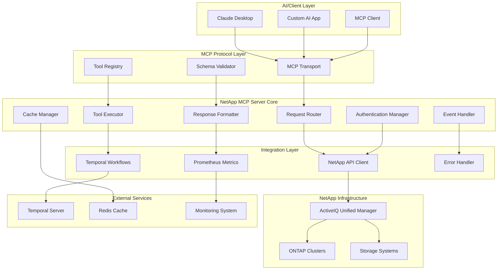
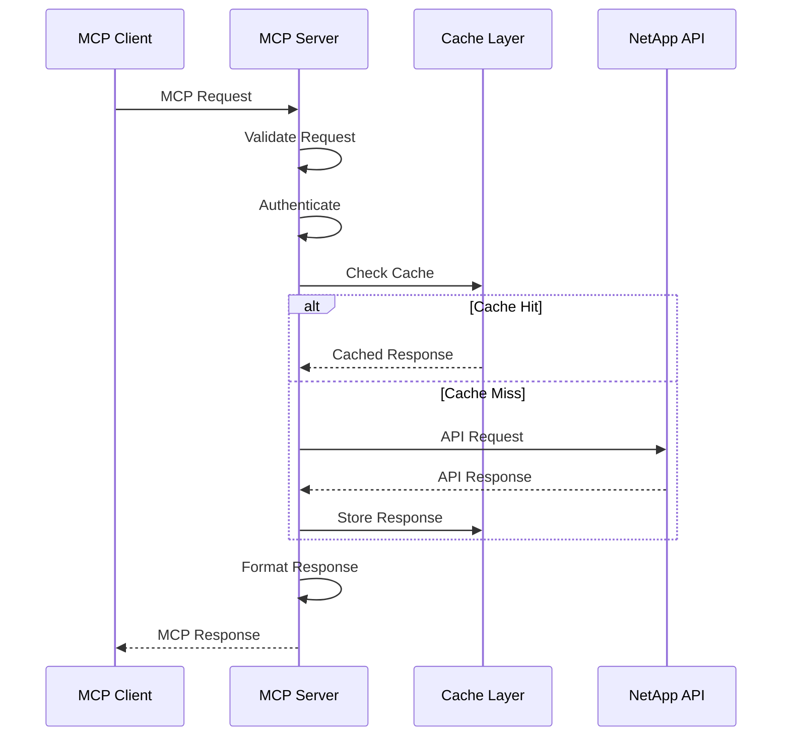
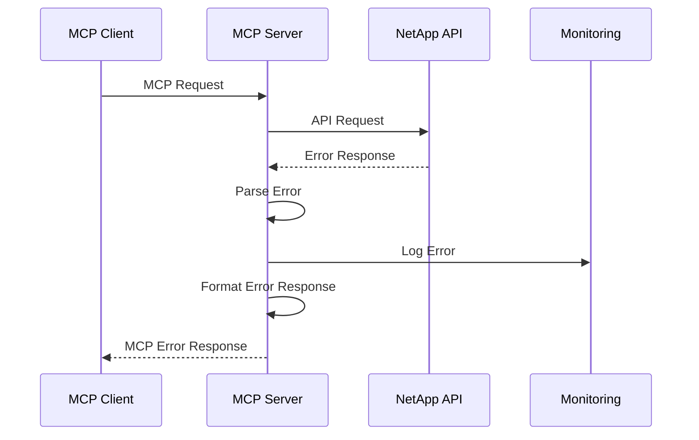
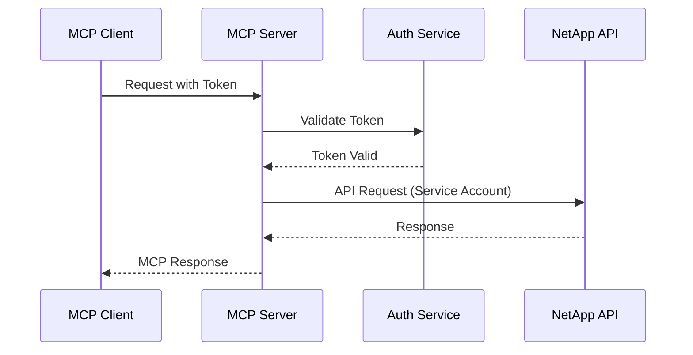

# System Design

## Overview

The NetApp ActiveIQ MCP Server implements a bridge between the Model Context Protocol (MCP) and NetApp's ActiveIQ Unified Manager API, enabling AI assistants and automation tools to interact with NetApp storage infrastructure through natural language interfaces.

## High-Level Architecture



## Component Architecture

### MCP Protocol Layer

#### MCP Transport
- **Purpose**: Handles MCP protocol communication
- **Responsibilities**:
  - Message serialization/deserialization
  - Protocol version negotiation
  - Connection management
  - Error propagation

#### Tool Registry
- **Purpose**: Maintains registry of available MCP tools
- **Responsibilities**:
  - Tool discovery and registration
  - Schema validation
  - Tool metadata management
  - Capability advertisement

#### Schema Validator
- **Purpose**: Validates MCP messages and tool arguments
- **Responsibilities**:
  - JSON schema validation
  - Type checking
  - Parameter validation
  - Error reporting

### Server Core

#### Request Router
- **Purpose**: Routes incoming MCP requests to appropriate handlers
- **Implementation**:
```python
class RequestRouter:
    def __init__(self):
        self.tools = ToolRegistry()
        self.auth = AuthenticationManager()
        
    async def route_request(self, request: MCPRequest) -> MCPResponse:
        # Authenticate request
        if not await self.auth.validate(request):
            return MCPResponse.error("Authentication failed")
            
        # Route to tool
        tool = self.tools.get_tool(request.method)
        if not tool:
            return MCPResponse.error("Tool not found")
            
        return await tool.execute(request.params)
```

#### Tool Executor
- **Purpose**: Executes NetApp operations through registered tools
- **Key Features**:
  - Async execution
  - Timeout handling
  - Rate limiting
  - Result caching

#### Response Formatter
- **Purpose**: Formats responses according to MCP specification
- **Responsibilities**:
  - Result serialization
  - Error formatting
  - Schema compliance
  - Content negotiation

#### Authentication Manager
- **Purpose**: Manages NetApp API authentication
- **Implementation**:
```python
class AuthenticationManager:
    def __init__(self, config: NetAppConfig):
        self.session = aiohttp.ClientSession(
            auth=aiohttp.BasicAuth(config.username, config.password),
            connector=aiohttp.TCPConnector(ssl=config.verify_ssl)
        )
        
    async def validate_connection(self) -> bool:
        try:
            async with self.session.get(f"{self.base_url}/datacenter/cluster/clusters") as resp:
                return resp.status == 200
        except Exception:
            return False
```

### Integration Layer

#### NetApp API Client
- **Purpose**: Interfaces with ActiveIQ Unified Manager API
- **Key Features**:
  - Connection pooling
  - Retry logic
  - Response caching
  - Error handling

```python
class NetAppAPIClient:
    def __init__(self, config: NetAppConfig):
        self.base_url = f"https://{config.host}/api/v2"
        self.session = self._create_session(config)
        
    async def get_clusters(self, **params) -> List[Dict]:
        url = f"{self.base_url}/datacenter/cluster/clusters"
        async with self.session.get(url, params=params) as resp:
            data = await resp.json()
            return data.get('records', [])
```

#### Temporal Workflows
- **Purpose**: Orchestrates complex, long-running NetApp operations
- **Use Cases**:
  - SVM creation workflows
  - Volume provisioning
  - Data migration
  - Backup operations

#### Prometheus Metrics
- **Purpose**: Exposes operational metrics
- **Metrics**:
  - Request count and duration
  - NetApp API response times
  - Error rates
  - Cache hit/miss ratios

## Data Flow

### Request Processing Flow



### Error Handling Flow



## Scalability Design

### Horizontal Scaling
- **Stateless Design**: Server instances are stateless
- **Load Balancing**: Support for multiple server instances
- **Shared Cache**: Redis for cross-instance caching
- **Database**: External storage for persistent data

### Performance Optimization
- **Connection Pooling**: Reuse HTTP connections to NetApp APIs
- **Async Processing**: Non-blocking I/O operations
- **Caching Strategy**: Multi-level caching (memory + Redis)
- **Request Batching**: Batch multiple requests when possible

### Resource Management
```python
class ResourceManager:
    def __init__(self, config: Config):
        self.semaphore = asyncio.Semaphore(config.max_concurrent_requests)
        self.connection_pool = aiohttp.TCPConnector(
            limit=config.max_connections,
            limit_per_host=config.max_connections_per_host
        )
    
    async def execute_with_limit(self, coro):
        async with self.semaphore:
            return await coro
```

## Security Architecture

### Authentication Flow


### Security Layers
1. **Transport Security**: TLS encryption
2. **Authentication**: JWT tokens or API keys
3. **Authorization**: Role-based access control
4. **NetApp Security**: Service account with minimal permissions
5. **Input Validation**: Strict parameter validation
6. **Output Sanitization**: Sensitive data filtering

## Configuration Management

### Configuration Schema
```yaml
# Server configuration
server:
  host: "0.0.0.0"
  port: 8080
  workers: 4
  max_connections: 100
  timeout: 30

# NetApp configuration
netapp:
  um_host: "unified-manager.company.com"
  username: "service-account"
  password: "${NETAPP_PASSWORD}"
  verify_ssl: false
  timeout: 30
  max_retries: 3

# Cache configuration
cache:
  type: "redis"
  url: "redis://localhost:6379"
  ttl: 300
  max_size: 1000

# Monitoring configuration
monitoring:
  metrics_enabled: true
  metrics_port: 9090
  health_check_interval: 30
  log_level: "INFO"
```

## Deployment Architecture

### Container Architecture
```dockerfile
FROM python:3.11-slim

# Install dependencies
COPY requirements.txt .
RUN pip install -r requirements.txt

# Copy application
COPY . /app
WORKDIR /app

# Set up user
RUN adduser --disabled-password --gecos '' netapp
USER netapp

# Health check
HEALTHCHECK --interval=30s --timeout=10s --start-period=5s --retries=3 \
  CMD curl -f http://localhost:8080/health || exit 1

CMD ["python", "-m", "netapp_mcp_server"]
```

### Kubernetes Deployment
```yaml
apiVersion: apps/v1
kind: Deployment
metadata:
  name: netapp-mcp-server
spec:
  replicas: 3
  selector:
    matchLabels:
      app: netapp-mcp-server
  template:
    metadata:
      labels:
        app: netapp-mcp-server
    spec:
      containers:
      - name: netapp-mcp-server
        image: netapp/activeiq-mcp-server:latest
        ports:
        - containerPort: 8080
        env:
        - name: NETAPP_UM_HOST
          valueFrom:
            secretKeyRef:
              name: netapp-credentials
              key: um-host
        resources:
          requests:
            memory: "512Mi"
            cpu: "250m"
          limits:
            memory: "1Gi"
            cpu: "500m"
        livenessProbe:
          httpGet:
            path: /health
            port: 8080
          initialDelaySeconds: 30
          periodSeconds: 10
```

## Monitoring and Observability

### Metrics Collection
- **Application Metrics**: Request rates, response times, error rates
- **System Metrics**: CPU, memory, disk usage
- **NetApp Metrics**: API response times, connection status
- **Business Metrics**: Tool usage, user activity

### Logging Strategy
```python
import structlog

logger = structlog.get_logger("netapp.mcp.server")

async def execute_tool(tool_name: str, params: dict):
    logger.info("tool.execute.start", tool=tool_name, params=params)
    
    try:
        result = await tool.execute(params)
        logger.info("tool.execute.success", tool=tool_name, result_size=len(result))
        return result
    except Exception as e:
        logger.error("tool.execute.error", tool=tool_name, error=str(e))
        raise
```

### Health Checks
```python
class HealthChecker:
    async def check_health(self) -> Dict[str, Any]:
        checks = {
            "server": await self.check_server(),
            "netapp": await self.check_netapp_connection(),
            "cache": await self.check_cache(),
            "temporal": await self.check_temporal()
        }
        
        status = "healthy" if all(checks.values()) else "unhealthy"
        return {"status": status, "checks": checks}
```

## Future Enhancements

### Planned Features
1. **GraphQL Support**: Alternative query interface
2. **WebSocket Support**: Real-time event streaming
3. **Plugin System**: Extensible tool architecture
4. **Multi-tenant Support**: Isolated environments
5. **Advanced Caching**: Intelligent cache invalidation
6. **ML Integration**: Predictive analytics

### Scalability Roadmap
1. **Database Layer**: Persistent storage for complex queries
2. **Event Streaming**: Kafka/Pulsar for event processing
3. **Microservices**: Split into specialized services
4. **API Gateway**: Centralized routing and security
5. **Service Mesh**: Advanced networking and observability
