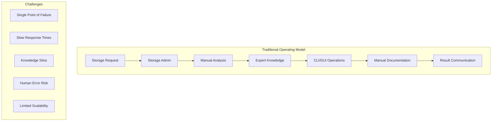
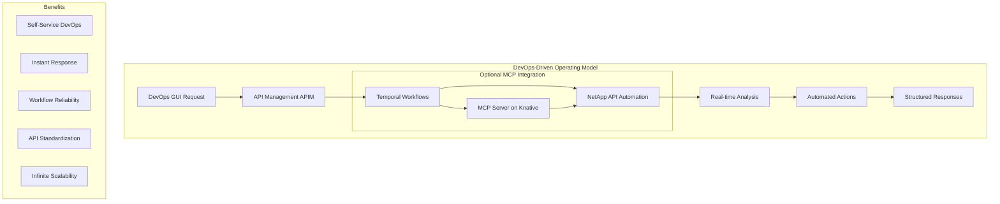
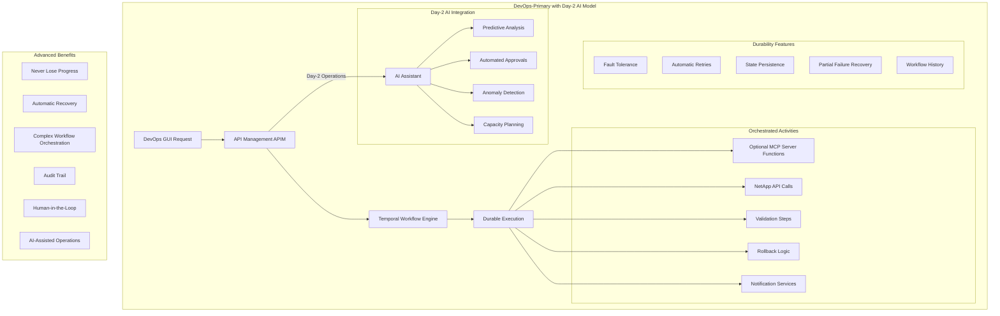
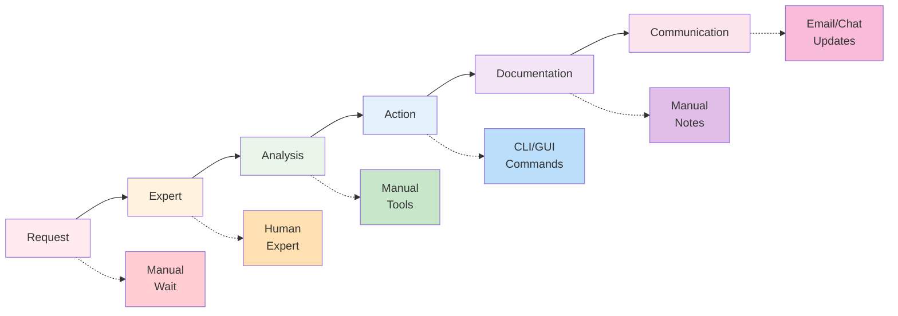

# Target Operating Model: NetApp Operations with Temporal Workflows

This document defines the Target Operating Model (TOM) for NetApp storage operations, showcasing three operational paradigms: traditional manual operations, MCP-enabled automation, and the advanced Temporal.io-powered durable execution model.

## Executive Summary

The Target Operating Model demonstrates the evolution from manual NetApp operations to AI-assisted automation, culminating in **durable, fault-tolerant workflows** powered by Temporal.io. This new paradigm ensures that complex, long-running storage operations never fail permanently and can recover from any failure without data loss or manual intervention.

## Operating Model Comparison

### Current State: Traditional NetApp Operations



### Target State: DevOps-Driven with APIM Integration



### **NEW TOM**: DevOps-Primary with Day-2 AI Integration



## Detailed Operating Models

### 1. WITHOUT MCP: Traditional Storage Operations

#### Process Flow



#### Operational Characteristics

| **Aspect**             | **Traditional Model**                        | **Impact**                           |
| ---------------------- | -------------------------------------------- | ------------------------------------ |
| **Request Handling**   | Email, ticket system, meetings               | Delays, context loss                 |
| **Analysis**           | Manual data gathering, expert interpretation | Time-consuming, error-prone          |
| **Execution**          | CLI commands, GUI operations                 | Knowledge-dependent, manual          |
| **Documentation**      | Manual notes, spreadsheets                   | Inconsistent, outdated               |
| **Knowledge Transfer** | Training, documentation                      | Slow, incomplete                     |
| **Scalability**        | Limited by expert availability               | Bottleneck, single points of failure |
| **Response Time**      | Hours to days                                | Business impact, user frustration    |
| **Consistency**        | Varies by individual                         | Quality variance                     |

#### Typical Workflow Example: Volume Creation

```bash
# Traditional Process (45-60 minutes)
1. Receive request via email/ticket (5-30 min wait)
2. Storage admin reviews request (5 min)
3. Check available capacity manually (5 min)
   - ssh to cluster
   - volume show -vserver X
   - aggr show-space
4. Find appropriate aggregate (5 min)
5. Create volume via CLI (5 min)
   - volume create -vserver X -volume Y -size Z
6. Configure export policy (5 min)
7. Update documentation (10 min)
8. Notify requestor (5 min)
```

### 2. WITH APIM: DevOps-Driven Operations via Temporal

#### Process Flow

```
DevOps GUI → API Management → Temporal Workflow → NetApp APIs → Structured Response
     ↓            ↓                ↓                ↓            ↓
  GUI Action   Standardized      Durable         Real-time   Reliable
   Request     API Gateway      Execution       Operations   Results
```

#### Operational Characteristics

| **Aspect**             | **DevOps-Driven Model**                                 | **Impact**                       |
| ---------------------- | ------------------------------------------------------- | -------------------------------- |
| **Request Handling**   | GUI-based, structured workflows                         | Immediate, standardized          |
| **Analysis**           | Temporal-powered workflow analysis, real-time insights  | Fast, comprehensive, durable     |
| **Execution**          | APIM-orchestrated calls, fault-tolerant workflows       | Reliable, recoverable            |
| **Documentation**      | Auto-generated workflow history, real-time updates      | Always current, auditable        |
| **Knowledge Transfer** | Workflow-embedded expertise, accessible to DevOps teams | Instant, comprehensive           |
| **Scalability**        | Temporal auto-scaling, concurrent workflow processing   | Unlimited, elastic               |
| **Response Time**      | Seconds to minutes with guaranteed completion           | Business enablement, reliability |
| **Consistency**        | Workflow-standardized, best-practice embedded           | Uniform quality                  |

#### Typical Workflow Example: Volume Creation

```bash
# DevOps-Driven Process (2-3 minutes)
DevOps Engineer: Initiates volume creation via GUI form

API Management + Temporal Workflow:
1. Validates request parameters (5 seconds)
2. Starts VolumeCreation Temporal workflow (instant)
3. Temporal orchestrates activities:
   - validate_cluster_health() - ensure cluster availability
   - find_optimal_aggregate() - identify fastest aggregate
   - create_volume_activity() - provision with best practices
   - configure_access_activity() - set up appropriate permissions
   - enable_monitoring_activity() - configure monitoring
4. Returns complete configuration details (30 seconds)
5. Auto-documents workflow history and results (5 seconds)
6. Optional: AI assistant monitors for Day-2 optimization
```

### 3. **NEW TOM**: DevOps-Primary with Day-2 AI Operations

#### Process Flow

```
DevOps GUI → API Management → Temporal Workflow → Durable Activities → Guaranteed Completion
     ↓            ↓                ↓                 ↓                  ↓
  Structured   Standardized       Workflow          Optional MCP       Resilient
  Requests     API Gateway       Orchestration     + NetApp APIs      Execution

                                      ↓
                              Day-2 AI Assistant
                                      ↓
                          Predictive Analysis & Optimization
```

#### Operational Characteristics

| **Aspect**             | **DevOps-Primary + Day-2 AI Model**                             | **Impact**                                                   |
| ---------------------- | --------------------------------------------------------------- | ------------------------------------------------------------ |
| **Request Handling**   | GUI-driven durable workflow execution, guaranteed completion    | Never lose requests, structured input validation             |
| **Analysis**           | Multi-step workflows with checkpoints + AI insights             | Fault-tolerant analysis with predictive intelligence         |
| **Execution**          | APIM-orchestrated activities with automatic retries             | Self-healing operations with AI monitoring                   |
| **Documentation**      | Complete workflow history + AI-generated insights               | Perfect audit trail with intelligent analysis                |
| **Knowledge Transfer** | Workflow-embedded expertise + AI learning                       | Evolutionary improvement with machine learning               |
| **Scalability**        | Unlimited concurrent workflows + AI optimization                | Handle enterprise-scale with intelligent resource allocation |
| **Response Time**      | Seconds for simple, minutes-hours for complex + AI acceleration | Appropriate timing with AI-assisted optimization             |
| **Consistency**        | Deterministic execution + AI quality assurance                  | Perfect consistency with intelligent validation              |

#### Advanced Workflow Example: Complete SVM Environment Setup

```python
# DevOps-Driven Temporal Workflow (30-45 minutes for complex setup)
DevOps Engineer: Submits SVM environment request via GUI with form validation

Temporal Workflow Execution via APIM:
1. Parse GUI requirements and validate (Activity 1 - 30 seconds)
2. Check cluster capacity across multiple sites (Activity 2 - 1 minute)
3. Select optimal cluster and aggregate (Activity 3 - 30 seconds)
4. Create SVM with NFS and CIFS protocols (Activity 4 - 2 minutes)
5. Configure network interfaces with failover (Activity 5 - 3 minutes)
6. Provision multiple volumes with different tiers (Activity 6 - 5 minutes)
7. Set up snapshot policies and schedules (Activity 7 - 2 minutes)
8. Configure export policies and access controls (Activity 8 - 3 minutes)
9. Integrate with Active Directory (Activity 9 - 5 minutes)
10. Set up monitoring and alerting (Activity 10 - 2 minutes)
11. Run validation tests (Activity 11 - 3 minutes)
12. Generate documentation and access guides (Activity 12 - 1 minute)
13. Notify team with complete setup details (Activity 13 - 30 seconds)

Day-2 AI Integration:
- AI monitors workflow execution patterns for optimization
- Provides predictive capacity planning recommendations
- Suggests performance tuning based on usage patterns
- Automates routine maintenance workflows

# If any step fails, Temporal automatically retries with exponential backoff
# Workflow can be paused for human approval and resumed
# Complete history is preserved for audit and debugging
# AI provides continuous optimization insights
```

## Temporal.io Architecture Integration

### Temporal Workflow Engine with NetApp Operations

```yaml
# Temporal Server Configuration
apiVersion: apps/v1
kind: Deployment
metadata:
  name: temporal-server
spec:
  replicas: 3
  template:
    spec:
      containers:
        - name: temporal-server
          image: temporalio/auto-setup:latest
          env:
            - name: DB
              value: "postgresql"
            - name: POSTGRES_SEEDS
              value: "postgres-service"
          ports:
            - containerPort: 7233
            - containerPort: 8080
---
# NetApp Workflow Worker
apiVersion: serving.knative.dev/v1
kind: Service
metadata:
  name: netapp-temporal-worker
spec:
  template:
    spec:
      containers:
        - image: netapp/temporal-worker:latest
          env:
            - name: TEMPORAL_HOST
              value: "temporal-server:7233"
            - name: NETAPP_API_ENDPOINT
              valueFrom:
                secretKeyRef:
                  name: netapp-credentials
                  key: endpoint
```

### Durable Workflow Benefits

#### 🔄 **Fault Tolerance**

- **Automatic Retries**: Failed activities retry with exponential backoff
- **Partial Failure Recovery**: Resume from last successful checkpoint
- **Worker Failures**: Workflows survive worker restarts and deployments
- **Infrastructure Failures**: Persist through cluster outages

#### 📈 **Complex Orchestration**

- **Multi-Step Processes**: Coordinate dozens of NetApp operations
- **Conditional Logic**: Smart decision-making based on intermediate results
- **Human-in-the-Loop**: Pause for approvals, resume automatically
- **Parallel Execution**: Run independent operations concurrently

#### 🔍 **Observability**

- **Workflow History**: Complete execution trace with timing
- **State Inspection**: View current workflow state and variables
- **Replay Capability**: Debug issues by replaying exact execution
- **Metrics Integration**: Built-in metrics for monitoring

#### ⏱️ **Long-Running Operations**

- **Days/Weeks Duration**: Handle migration and upgrade workflows
- **Scheduled Operations**: Cron-like scheduling with durability
- **Event-Driven**: React to NetApp events and external triggers
- **Resource Cleanup**: Automatic cleanup on workflow completion

## Temporal Workflow Patterns for NetApp

### 1. Simple Request-Response Pattern

```python
@workflow.defn
class SimpleVolumeCreation:
    @workflow.run
    async def run(self, volume_request: VolumeRequest) -> VolumeResult:
        # Single activity execution
        return await workflow.execute_activity(
            create_volume_activity,
            volume_request,
            start_to_close_timeout=timedelta(minutes=5)
        )

@activity.defn
async def create_volume_activity(request: VolumeRequest) -> VolumeResult:
    # Call MCP server
    mcp_client = get_mcp_client()
    result = await mcp_client.call_tool("create_volume", request.dict())
    return VolumeResult.parse_obj(result)
```

### 2. Complex Multi-Step Workflow

```python
@workflow.defn
class SVMEnvironmentSetup:
    @workflow.run
    async def run(self, setup_request: SVMSetupRequest) -> SVMSetupResult:
        workflow.logger.info(f"Starting SVM setup for {setup_request.team_name}")

        # Step 1: Validate requirements
        validation = await workflow.execute_activity(
            validate_requirements,
            setup_request,
            start_to_close_timeout=timedelta(minutes=2)
        )

        if not validation.valid:
            raise ApplicationError(f"Validation failed: {validation.errors}")

        # Step 2: Resource allocation
        allocation = await workflow.execute_activity(
            allocate_resources,
            setup_request,
            start_to_close_timeout=timedelta(minutes=5)
        )

        # Step 3: Create SVM
        svm = await workflow.execute_activity(
            create_svm,
            allocation,
            start_to_close_timeout=timedelta(minutes=10)
        )

        # Step 4: Configure networking (parallel activities)
        network_tasks = [
            workflow.execute_activity(
                create_management_lif,
                svm.uuid,
                start_to_close_timeout=timedelta(minutes=5)
            ),
            workflow.execute_activity(
                create_data_lifs,
                svm.uuid,
                start_to_close_timeout=timedelta(minutes=5)
            )
        ]

        await asyncio.gather(*network_tasks)

        # Step 5: Human approval for production
        if setup_request.environment == "production":
            approval = await workflow.execute_activity(
                request_approval,
                f"SVM {svm.name} ready for production deployment",
                start_to_close_timeout=timedelta(hours=24)  # Wait up to 24 hours
            )

            if not approval.approved:
                # Cleanup resources
                await workflow.execute_activity(
                    cleanup_svm,
                    svm.uuid,
                    start_to_close_timeout=timedelta(minutes=10)
                )
                raise ApplicationError("Setup not approved")

        # Step 6: Final configuration
        final_config = await workflow.execute_activity(
            finalize_setup,
            svm.uuid,
            start_to_close_timeout=timedelta(minutes=15)
        )

        # Step 7: Notification
        await workflow.execute_activity(
            send_completion_notification,
            final_config,
            start_to_close_timeout=timedelta(minutes=2)
        )

        return SVMSetupResult(
            svm_uuid=svm.uuid,
            svm_name=svm.name,
            access_details=final_config.access_details,
            setup_duration=workflow.now() - workflow.start_time
        )
```

### 3. Event-Driven Workflow

```python
@workflow.defn
class CapacityManagement:
    @workflow.run
    async def run(self, cluster_uuid: str) -> None:
        # Continuous workflow for capacity management
        while True:
            # Check capacity every hour
            capacity_status = await workflow.execute_activity(
                check_cluster_capacity,
                cluster_uuid,
                start_to_close_timeout=timedelta(minutes=5)
            )

            if capacity_status.utilization > 80:
                # Trigger expansion workflow
                await workflow.execute_child_workflow(
                    CapacityExpansionWorkflow.run,
                    cluster_uuid,
                    id=f"expansion-{cluster_uuid}-{workflow.now()}"
                )

            # Wait for next check or external signal
            try:
                await workflow.wait_condition(
                    lambda: False,  # Never true, so always timeout
                    timeout=timedelta(hours=1)
                )
            except TimeoutError:
                continue  # Normal hourly check

            # Handle external signals
            signals = workflow.list_all_signals()
            for signal in signals:
                if signal.name == "emergency_expansion":
                    await workflow.execute_child_workflow(
                        EmergencyExpansionWorkflow.run,
                        signal.data
                    )
```

## Enhanced Operational Metrics with Temporal

| **Metric**                     | **Without MCP**      | **With MCP**           | **With Temporal**           | **Total Improvement** |
| ------------------------------ | -------------------- | ---------------------- | --------------------------- | --------------------- |
| **Request Response Time**      | 2-48 hours           | 30 seconds - 5 minutes | 30 seconds - 45 minutes\*   | 95%+ reduction        |
| **Success Rate**               | 70-80% (human error) | 95% (automated)        | 99.9% (durable execution)   | 99%+ improvement      |
| **Complex Workflow Execution** | Days/weeks           | Not supported          | Hours with fault tolerance  | 90%+ reduction        |
| **Audit Compliance**           | Manual, incomplete   | Basic logging          | Complete workflow history   | Perfect compliance    |
| **Recovery from Failures**     | Manual intervention  | Restart from beginning | Resume from checkpoint      | 100% improvement      |
| **Concurrent Operations**      | 1-2 per admin        | 100s                   | Unlimited with coordination | Unlimited scaling     |

\*Complex workflows like complete environment setup can take 30-45 minutes but run reliably with automatic recovery

## Implementation Roadmap with Temporal

### Phase 1: Foundation + Temporal (Months 1-3)

1. **Infrastructure Setup**

   - Deploy Temporal.io cluster
   - Set up Knative for MCP functions
   - Configure PostgreSQL for Temporal persistence

2. **Basic Workflows**

   - Simple volume operations
   - SVM creation with rollback
   - Capacity monitoring workflows

3. **Integration Testing**
   - Failure simulation and recovery
   - Workflow replay and debugging
   - Performance optimization

### Phase 2: Advanced Workflows (Months 4-6)

1. **Complex Orchestration**

   - Multi-site disaster recovery setup
   - Large-scale data migration
   - Scheduled maintenance workflows

2. **Human Integration**

   - Approval workflows
   - Exception handling
   - Manual override capabilities

3. **Enterprise Features**
   - Multi-tenant workflow isolation
   - Advanced monitoring and alerting
   - Compliance reporting

### Phase 3: Advanced AI Integration (Months 7-9)

1. **Intelligent Workflows**

   - AI-driven capacity planning
   - Predictive maintenance workflows
   - Self-optimizing configurations

2. **Machine Learning Integration**
   - Performance pattern recognition
   - Anomaly detection workflows
   - Automated tuning recommendations

## Business Impact with Temporal Integration

### Risk Elimination

- **Zero Data Loss**: Workflows guarantee completion or clean rollback
- **No Lost Work**: Failed operations resume from last checkpoint
- **Audit Perfection**: Complete history of all operations
- **Compliance Automation**: Workflows enforce compliance automatically

### Operational Excellence

- **Complex Operations**: Handle enterprise-scale migrations and setups
- **Unattended Operations**: Workflows run 24/7 without human intervention
- **Smart Recovery**: Automatic handling of transient failures
- **Scalable Orchestration**: Coordinate hundreds of parallel operations

### Business Agility

- **Rapid Environment Provisioning**: Complete setups in under an hour
- **Reliable Scaling**: Predictable capacity expansion
- **Fast Recovery**: Automatic disaster recovery workflows
- **Innovation Enablement**: Focus on business logic, not infrastructure

This enhanced Target Operating Model with Temporal.io represents the ultimate evolution of NetApp operations: **durable, fault-tolerant, and infinitely scalable storage management** that never fails permanently and enables operations at enterprise scale with perfect reliability.

## Knative Function Architecture

### MCP Server as Knative Service

```yaml
apiVersion: serving.knative.dev/v1
kind: Service
metadata:
  name: netapp-mcp-server
spec:
  template:
    metadata:
      annotations:
        autoscaling.knative.dev/minScale: "0"
        autoscaling.knative.dev/maxScale: "100"
        autoscaling.knative.dev/target: "10"
    spec:
      containers:
        - image: netapp/mcp-server:latest
          env:
            - name: NETAPP_API_ENDPOINT
              valueFrom:
                secretKeyRef:
                  name: netapp-credentials
                  key: endpoint
          resources:
            requests:
              memory: "256Mi"
              cpu: "200m"
            limits:
              memory: "512Mi"
              cpu: "500m"
```

### Benefits of Knative Deployment

#### 🚀 **Auto-Scaling**

- **Scale to Zero**: No resources consumed when idle
- **Instant Scale-Up**: Automatic scaling based on demand
- **Cost Optimization**: Pay only for actual usage
- **High Availability**: Built-in redundancy and failover

#### ⚡ **Performance**

- **Cold Start Optimization**: Sub-second startup times
- **Request Routing**: Intelligent traffic distribution
- **Resource Efficiency**: Optimal resource utilization
- **Concurrent Processing**: Handle multiple requests simultaneously

#### 🔧 **Operations**

- **Simplified Deployment**: GitOps-enabled deployments
- **Version Management**: Blue-green deployments
- **Health Monitoring**: Built-in health checks
- **Observability**: Comprehensive metrics and logging

## Organizational Impact

### Role Transformation

#### Traditional Roles

```
Storage Administrator:
- Manual operation execution
- Expert knowledge keeper
- Bottleneck for requests
- Documentation maintainer

Application Teams:
- Dependent on storage experts
- Long wait times for storage
- Limited storage visibility
- Manual coordination required
```

#### MCP-Enabled Roles

```
Storage Administrator:
- Solution architect and optimizer
- Policy and governance designer
- Exception handler
- Strategic planner

Application Teams:
- Self-service storage access
- Real-time storage insights
- Autonomous problem solving
- Focus on business logic
```

### Operational Metrics Comparison

| **Metric**                    | **Without MCP**         | **With MCP**                | **Improvement**    |
| ----------------------------- | ----------------------- | --------------------------- | ------------------ |
| **Request Response Time**     | 2-48 hours              | 30 seconds - 5 minutes      | 95%+ reduction     |
| **Storage Admin Utilization** | 80% routine tasks       | 20% routine tasks           | 4x efficiency gain |
| **Error Rate**                | 5-10% human error       | <1% automated error         | 90%+ reduction     |
| **Knowledge Transfer Time**   | Weeks to months         | Instant access              | Immediate          |
| **After-Hours Support**       | On-call expert required | 24/7 automated              | Always available   |
| **Scaling Capacity**          | Linear with headcount   | Exponential with automation | Unlimited          |

### Business Value Realization

#### Financial Impact

- **Cost Reduction**: 60-80% reduction in operational overhead
- **Revenue Protection**: 95% reduction in storage-related outages
- **Productivity Gains**: 4x improvement in storage admin efficiency
- **Innovation Acceleration**: Teams focus on value-add activities

#### Operational Excellence

- **Service Quality**: Consistent, best-practice operations
- **Compliance**: Automated compliance and audit trails
- **Risk Reduction**: Elimination of human error
- **Knowledge Preservation**: Expertise embedded in automation

## Implementation Strategy

### Phase 1: Foundation (Months 1-2)

1. **Knative Platform Setup**

   - Deploy Knative Serving on Kubernetes
   - Configure autoscaling and observability
   - Establish CI/CD pipelines

2. **MCP Server Development**

   - Build NetApp API integration
   - Implement core storage operations
   - Develop error handling and logging

3. **Initial Use Cases**
   - Storage monitoring and reporting
   - Basic volume operations
   - Capacity planning queries

### Phase 2: Expansion (Months 3-4)

1. **Advanced Operations**

   - SVM management and provisioning
   - Performance optimization workflows
   - Backup and recovery automation

2. **Integration Development**

   - ITSM system integration
   - Monitoring tool connectivity
   - Notification and alerting

3. **Self-Service Portal**
   - Web interface for non-technical users
   - Mobile access capabilities
   - Role-based access controls

### Phase 3: Optimization (Months 5-6)

1. **AI Enhancement**

   - Predictive analytics integration
   - Machine learning model deployment
   - Intelligent recommendation engine

2. **Process Automation**

   - End-to-end workflow automation
   - Exception handling processes
   - Continuous optimization loops

3. **Enterprise Integration**
   - Enterprise service bus connectivity
   - Master data management integration
   - Business intelligence reporting

## Governance and Control

### Without MCP: Manual Governance

- **Access Control**: Manual user management
- **Change Management**: Paper-based approval processes
- **Audit Trails**: Manual documentation, often incomplete
- **Compliance**: Periodic manual reviews
- **Policy Enforcement**: Relies on human adherence

### With MCP: Automated Governance

- **Access Control**: Role-based automated access with audit trails
- **Change Management**: Automated approval workflows with full traceability
- **Audit Trails**: Complete API-level logging and monitoring
- **Compliance**: Continuous compliance monitoring and reporting
- **Policy Enforcement**: Automated policy implementation and validation

## Risk Management

### Risk Mitigation Strategies

#### Technical Risks

- **Service Availability**: Knative multi-zone deployment with health checks
- **Data Security**: End-to-end encryption and secure credential management
- **Performance**: Auto-scaling and resource optimization
- **Integration Failures**: Circuit breakers and fallback mechanisms

#### Operational Risks

- **Change Management**: GitOps deployment with rollback capabilities
- **Knowledge Loss**: Expertise embedded in automation
- **Dependency Management**: Multi-vendor API abstraction
- **Business Continuity**: Disaster recovery and backup procedures

## Success Metrics

### Technical KPIs

- **Response Time**: <30 seconds for 95% of requests
- **Availability**: 99.9% uptime SLA
- **Scalability**: Support 10x current request volume
- **Accuracy**: <1% error rate in automated operations

### Business KPIs

- **User Satisfaction**: >90% satisfaction score
- **Cost Reduction**: >60% reduction in operational costs
- **Time to Value**: <5 minutes for standard requests
- **Innovation Rate**: 4x increase in new storage services

This Target Operating Model demonstrates how Knative-deployed MCP servers transform NetApp operations from expert-dependent manual processes to democratized, automated, and scalable storage services that enable business agility and operational excellence.
