# NetApp ActiveIQ MCP Server - Technical Documentation

## Overview

This document provides comprehensive technical documentation for the NetApp ActiveIQ MCP Server, including detailed component models, sequence diagrams, and architectural patterns for the Temporal.io-powered durable execution system.

## Component Model (CMP-XXXX)

### Component Registry

| **Component ID** | **Component Name** | **Type** | **Purpose** | **Dependencies** |
|------------------|-------------------|----------|-------------|------------------|
| **CMP-0001** | AI Assistant Interface | External | Natural language processing and user interaction | Claude Desktop, Custom AI Apps |
| **CMP-0002** | MCP Protocol Gateway | Service | MCP protocol handling and routing | CMP-0003, CMP-0004 |
| **CMP-0003** | Request Router | Service | Route MCP requests to appropriate handlers | CMP-0005, CMP-0006 |
| **CMP-0004** | Schema Validator | Service | Validate MCP messages and tool arguments | JSON Schema Library |
| **CMP-0005** | Tool Registry | Service | Manage and discover available MCP tools | CMP-0008, CMP-0009 |
| **CMP-0006** | Response Formatter | Service | Format responses according to MCP specification | CMP-0003 |
| **CMP-0007** | Authentication Manager | Service | Handle NetApp API authentication and security | CMP-0010, CMP-0015 |
| **CMP-0008** | NetApp API Client | Service | Interface with ActiveIQ Unified Manager API | CMP-0007, CMP-0016 |
| **CMP-0009** | Temporal Workflow Engine | Platform | Orchestrate durable, fault-tolerant workflows | CMP-0010, CMP-0011, CMP-0012 |
| **CMP-0010** | Workflow Activities | Service | Execute individual NetApp operations | CMP-0008, CMP-0013 |
| **CMP-0011** | Temporal Workers | Service | Process workflow activities and maintain state | CMP-0009, CMP-0010 |
| **CMP-0012** | Workflow State Store | Data | Persist workflow state and execution history | PostgreSQL Database |
| **CMP-0013** | Cache Manager | Service | Manage response caching and performance optimization | Redis, CMP-0008 |
| **CMP-0014** | Event Processor | Service | Handle NetApp events and trigger workflows | CMP-0009, CMP-0016 |
| **CMP-0015** | Security Context | Service | Manage credentials, certificates, and access control | Kubernetes Secrets, Vault |
| **CMP-0016** | NetApp Infrastructure | External | ActiveIQ Unified Manager and ONTAP clusters | External NetApp Systems |
| **CMP-0017** | Knative Serving | Platform | Serverless container orchestration and auto-scaling | Kubernetes, Istio/Kourier |
| **CMP-0018** | Monitoring Stack | Platform | Observability, metrics, and alerting | Prometheus, Grafana, Jaeger |
| **CMP-0019** | Configuration Manager | Service | Manage environment-specific configurations | ConfigMaps, Secrets |
| **CMP-0020** | Health Monitor | Service | System health checks and readiness probes | CMP-0008, CMP-0009, CMP-0013 |

### Component Architecture Diagram

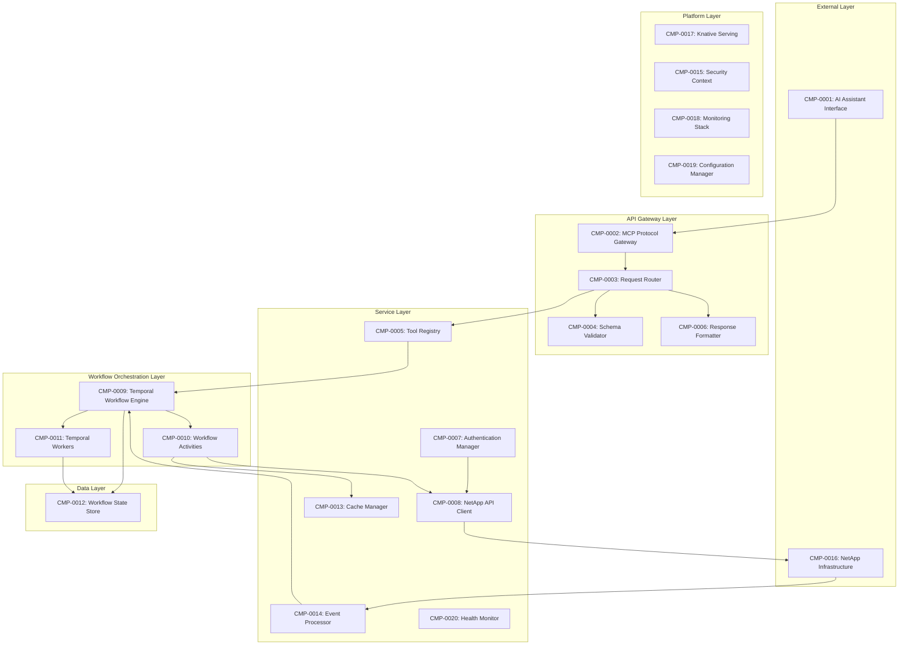

## Detailed Sequence Diagrams

### 1. Simple Volume Creation Workflow (DevOps GUI Primary)

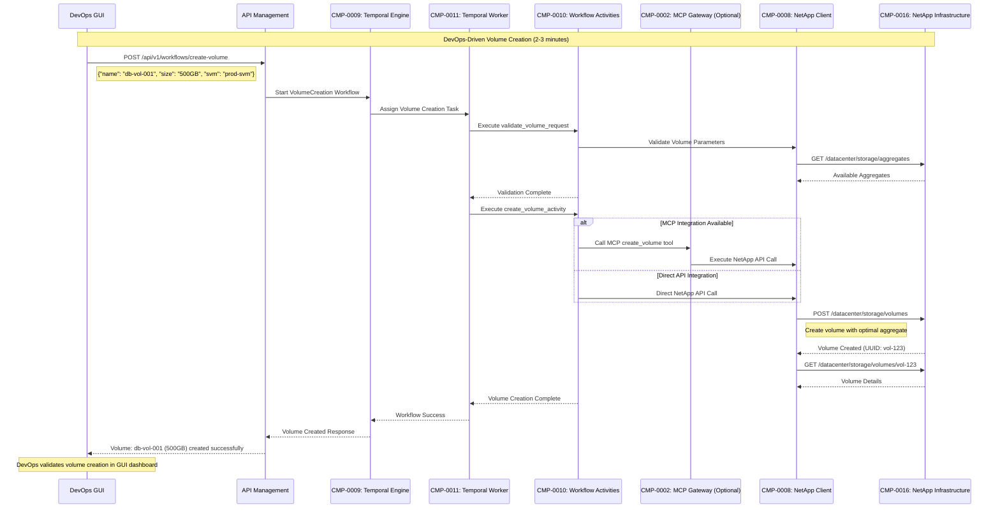

### 2. Complex SVM Environment Setup with Temporal (DevOps Primary)

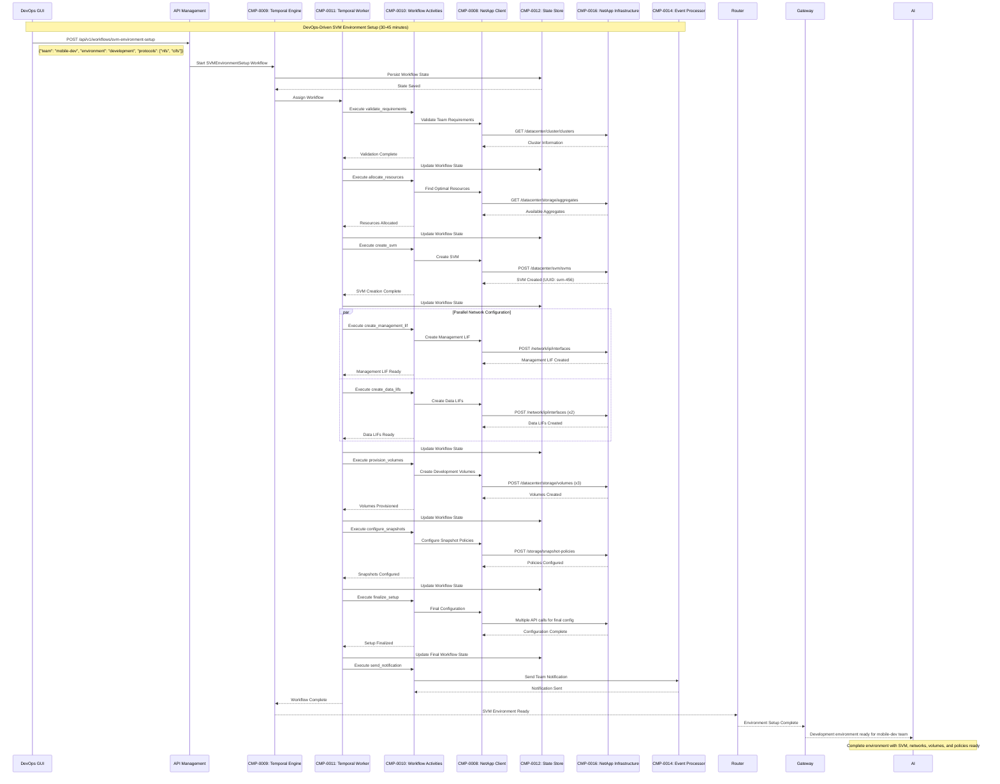

### 3. Event-Driven Capacity Management (Day-2 AI Integration)

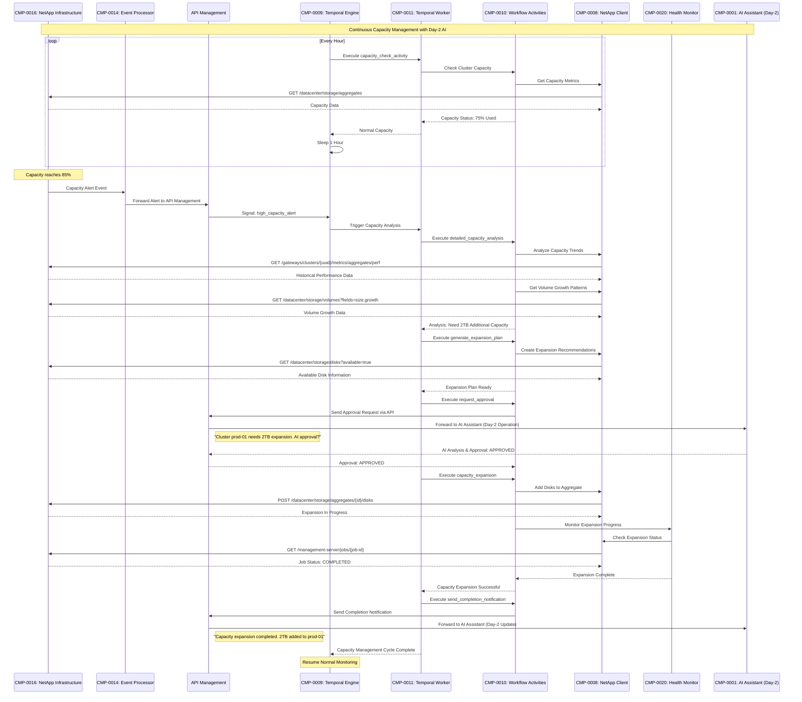

### 4. Failure Recovery and Retry Mechanism (DevOps Primary)

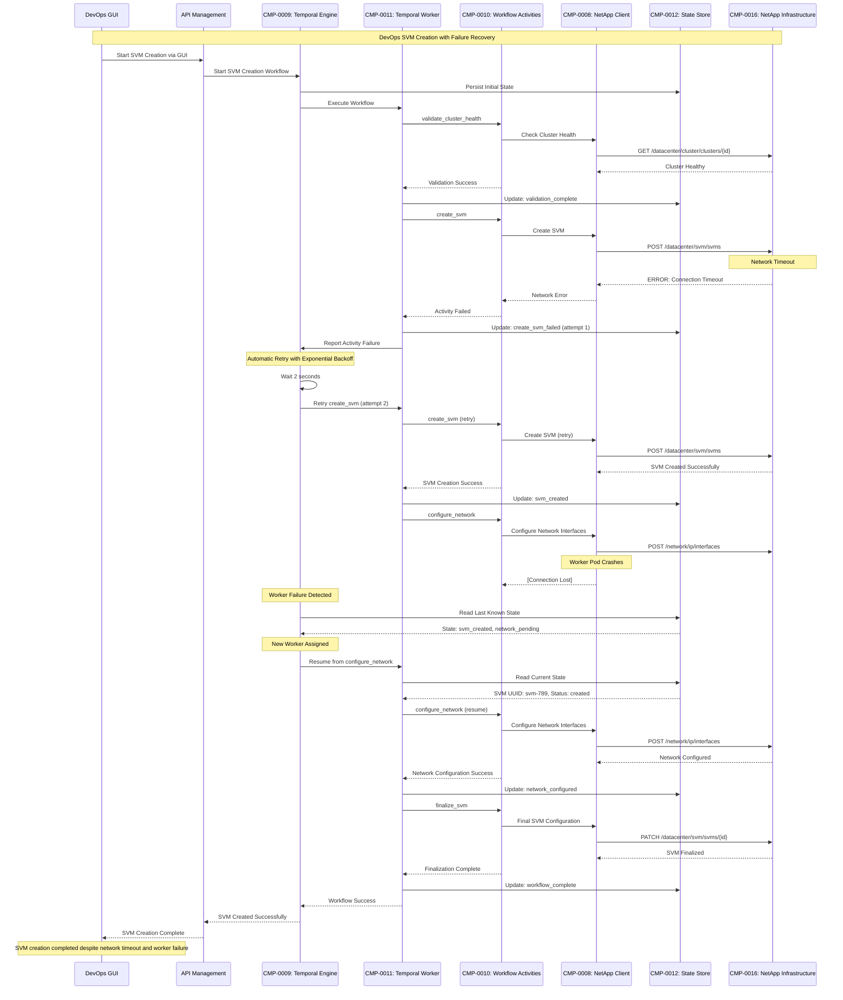

### 5. Human-in-the-Loop Approval Workflow (DevOps + AI Day-2)

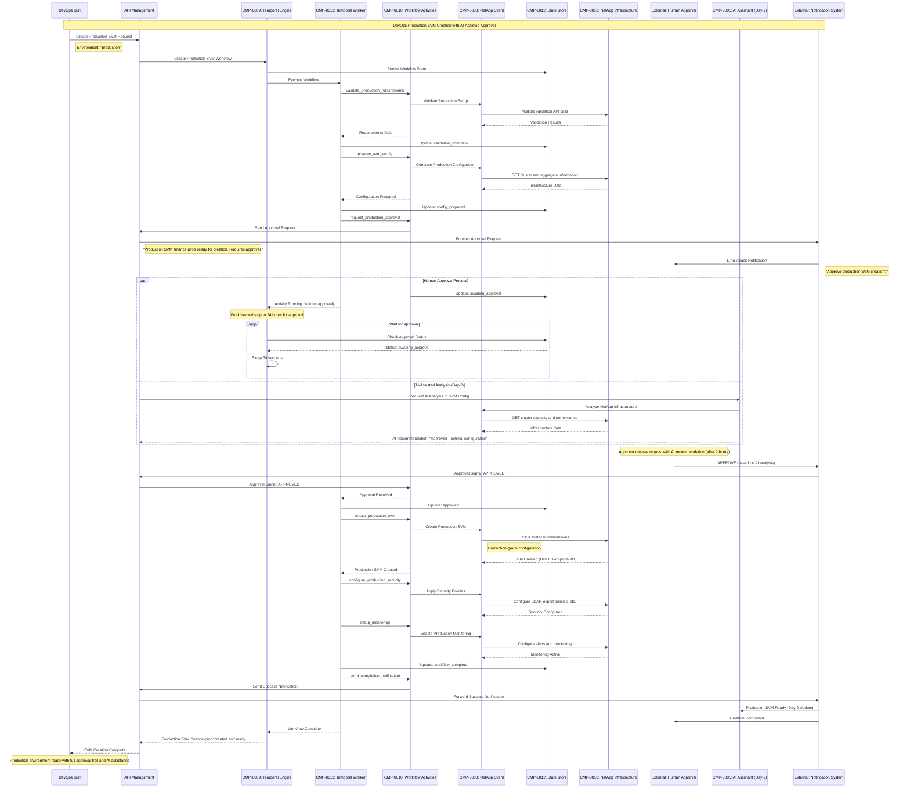

### 6. Multi-Site Data Replication Setup (DevOps Primary)

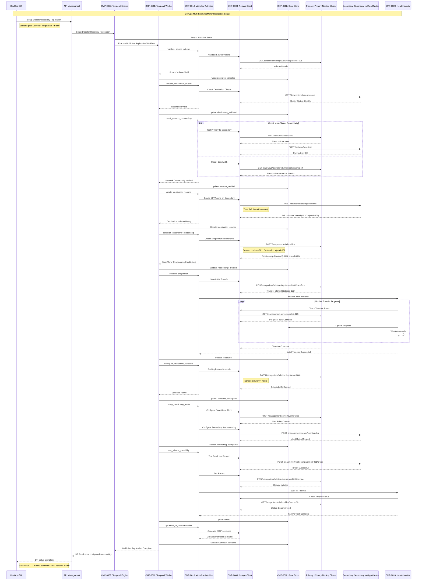

## Component Interaction Patterns

### 1. Request Processing Pattern

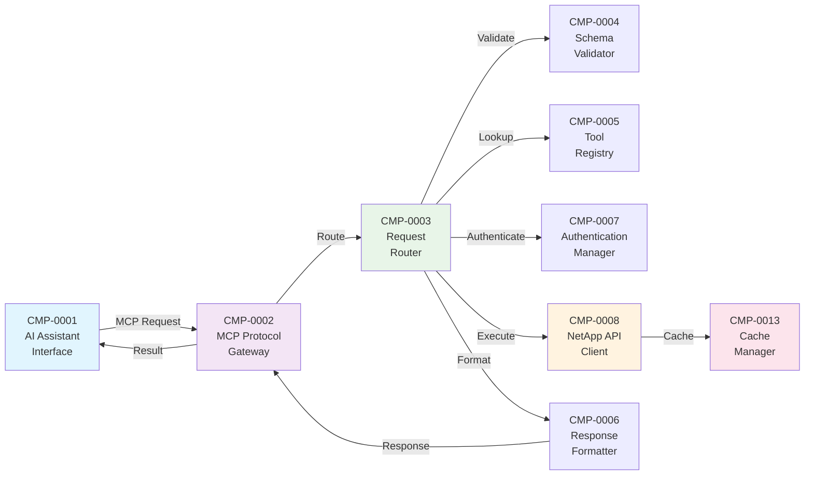

### 2. Workflow Orchestration Pattern

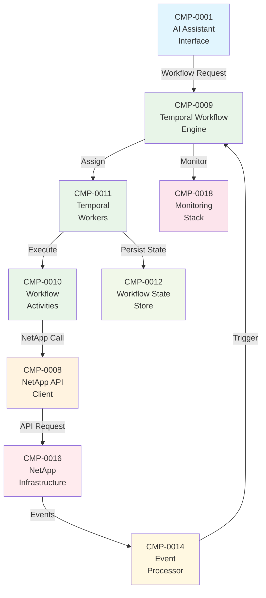

### 3. Event-Driven Pattern

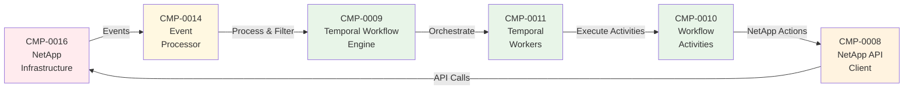

### 4. Cache-Enabled Request Pattern

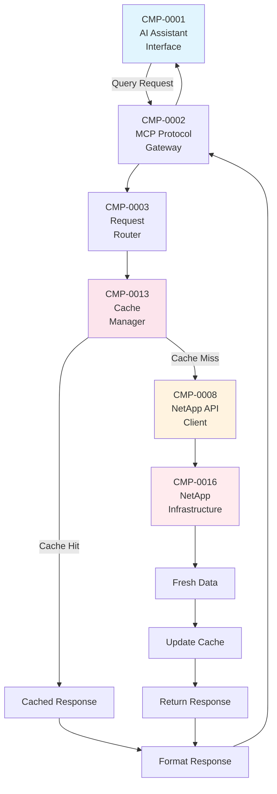

### 5. Security Context Pattern

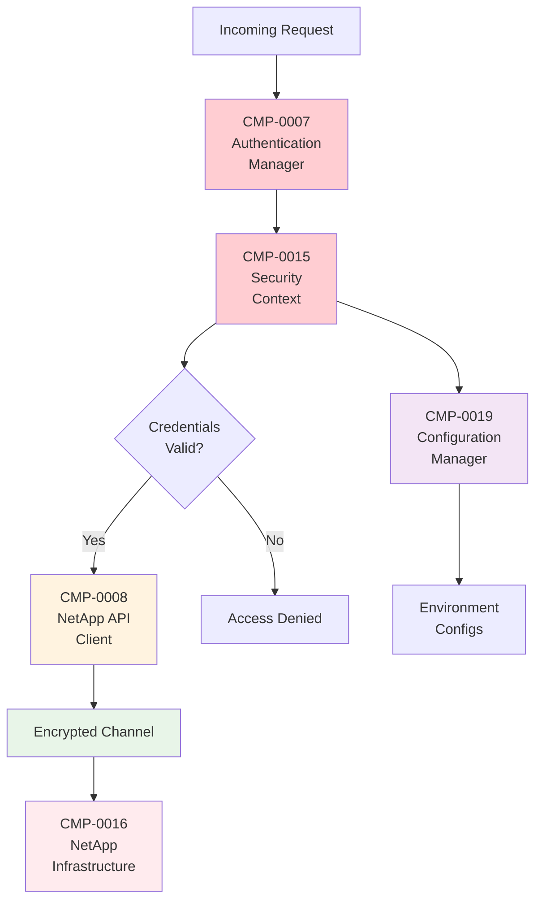

### 6. Health Monitoring Pattern

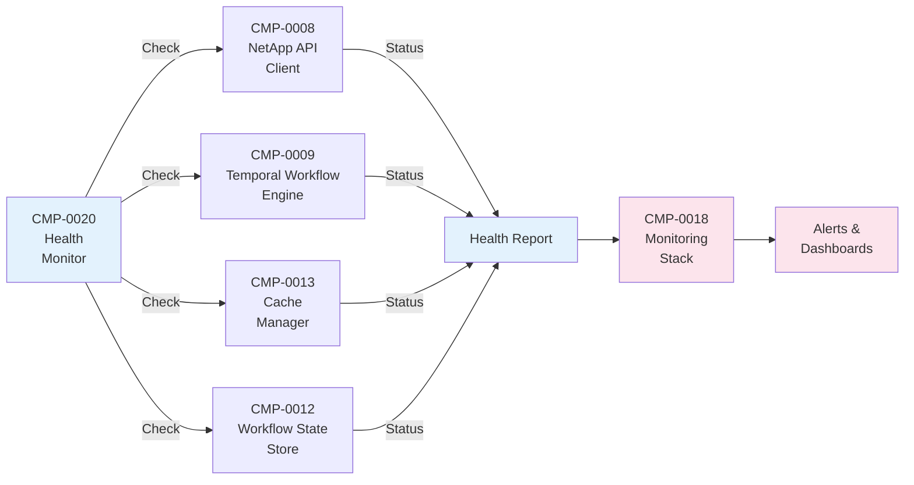

## Technical Specifications

### Component Specifications

#### CMP-0009: Temporal Workflow Engine

**Configuration:**
```yaml
apiVersion: apps/v1
kind: Deployment
metadata:
  name: temporal-server
  labels:
    component: CMP-0009
spec:
  replicas: 3
  template:
    spec:
      containers:
      - name: temporal-server
        image: temporalio/auto-setup:1.20.0
        ports:
        - containerPort: 7233
          name: grpc
        - containerPort: 8080
          name: web
        env:
        - name: DB
          value: postgresql
        - name: POSTGRES_SEEDS
          value: postgres-cluster:5432
        - name: DYNAMIC_CONFIG_FILE_PATH
          value: /etc/temporal/config/dynamicconfig.yaml
        resources:
          requests:
            memory: 1Gi
            cpu: 500m
          limits:
            memory: 2Gi
            cpu: 1000m
```

**Interfaces:**
- **gRPC API**: Port 7233 for workflow and activity communication
- **Web UI**: Port 8080 for workflow monitoring and debugging
- **Database**: PostgreSQL for state persistence

#### CMP-0008: NetApp API Client

**Configuration:**
```python
class NetAppAPIClient:
    def __init__(self, config: NetAppConfig):
        self.base_url = f"https://{config.host}/api/v2"
        self.session = aiohttp.ClientSession(
            auth=aiohttp.BasicAuth(config.username, config.password),
            connector=aiohttp.TCPConnector(
                ssl=False if not config.verify_ssl else None,
                limit=20,
                limit_per_host=10,
                keepalive_timeout=30
            ),
            timeout=aiohttp.ClientTimeout(total=config.timeout)
        )

    async def make_request(self, method: str, endpoint: str, **kwargs):
        url = f"{self.base_url}/{endpoint.lstrip('/')}"
        async with self.session.request(method, url, **kwargs) as response:
            response.raise_for_status()
            return await response.json()
```

**API Endpoints Supported:**
- Administration: `/admin/*`
- Datacenter: `/datacenter/*`
- Storage Provider: `/storage-provider/*`
- Management Server: `/management-server/*`
- Gateways: `/gateways/*`

### Performance Specifications

| **Component** | **Throughput** | **Latency** | **Scalability** | **Resource Requirements** |
|---------------|----------------|-------------|-----------------|--------------------------|
| **CMP-0002** | 1000 req/sec | <10ms | Horizontal (Knative) | 256Mi RAM, 200m CPU |
| **CMP-0008** | 500 req/sec | <100ms | Connection pooling | 512Mi RAM, 500m CPU |
| **CMP-0009** | 10000 workflows/sec | <50ms | Cluster-wide | 2Gi RAM, 1 CPU |
| **CMP-0011** | 1000 activities/sec | Variable | Worker scaling | 1Gi RAM, 500m CPU |
| **CMP-0013** | 5000 ops/sec | <5ms | Redis cluster | 1Gi RAM, 200m CPU |

### Security Specifications

#### Authentication and Authorization

```yaml
# CMP-0015: Security Context Configuration
apiVersion: v1
kind: Secret
metadata:
  name: netapp-credentials
  namespace: netapp-mcp
type: Opaque
data:
  endpoint: <base64-encoded-url>
  username: <base64-encoded-username>
  password: <base64-encoded-password>
  ca-cert: <base64-encoded-ca-certificate>

---
apiVersion: v1
kind: ServiceAccount
metadata:
  name: netapp-mcp-service
  namespace: netapp-mcp
  annotations:
    component: CMP-0007

---
apiVersion: rbac.authorization.k8s.io/v1
kind: Role
metadata:
  namespace: netapp-mcp
  name: netapp-mcp-role
rules:
- apiGroups: [""]
  resources: ["secrets", "configmaps"]
  verbs: ["get", "list"]
- apiGroups: ["serving.knative.dev"]
  resources: ["services"]
  verbs: ["get", "list", "patch"]
```

#### Network Security

```yaml
# Network Policy for Component Isolation
apiVersion: networking.k8s.io/v1
kind: NetworkPolicy
metadata:
  name: netapp-mcp-network-policy
  namespace: netapp-mcp
spec:
  podSelector:
    matchLabels:
      app.kubernetes.io/part-of: netapp-mcp
  policyTypes:
  - Ingress
  - Egress
  ingress:
  - from:
    - namespaceSelector:
        matchLabels:
          name: knative-serving
    ports:
    - protocol: TCP
      port: 8080
  egress:
  - to:
    - namespaceSelector: {}
    ports:
    - protocol: TCP
      port: 443  # NetApp HTTPS
    - protocol: TCP
      port: 7233 # Temporal gRPC
    - protocol: TCP
      port: 5432 # PostgreSQL
    - protocol: TCP
      port: 6379 # Redis
```

## Monitoring and Observability

### Metrics Collection

```yaml
# CMP-0018: Monitoring Stack Configuration
apiVersion: monitoring.coreos.com/v1
kind: ServiceMonitor
metadata:
  name: netapp-mcp-components
  namespace: netapp-mcp
spec:
  selector:
    matchLabels:
      app.kubernetes.io/part-of: netapp-mcp
  endpoints:
  - port: metrics
    path: /metrics
    interval: 30s
    scrapeTimeout: 10s
```

### Key Metrics

| **Component** | **Metric Name** | **Type** | **Purpose** |
|---------------|-----------------|----------|-------------|
| **CMP-0002** | `mcp_requests_total` | Counter | Track request volume |
| **CMP-0008** | `netapp_api_calls_total` | Counter | Monitor API usage |
| **CMP-0009** | `temporal_workflow_executions_total` | Counter | Workflow tracking |
| **CMP-0011** | `temporal_activity_executions_total` | Counter | Activity monitoring |
| **CMP-0013** | `cache_operations_total` | Counter | Cache performance |
| **CMP-0020** | `health_check_status` | Gauge | System health |

### Distributed Tracing

```python
# OpenTelemetry Integration
from opentelemetry import trace
from opentelemetry.exporter.jaeger.thrift import JaegerExporter
from opentelemetry.sdk.trace import TracerProvider
from opentelemetry.sdk.trace.export import BatchSpanProcessor

# Configure tracing for all components
tracer_provider = TracerProvider()
jaeger_exporter = JaegerExporter(
    agent_host_name="jaeger-agent",
    agent_port=6831
)
span_processor = BatchSpanProcessor(jaeger_exporter)
tracer_provider.add_span_processor(span_processor)
trace.set_tracer_provider(tracer_provider)

# Component-specific tracers
cmp_0002_tracer = trace.get_tracer("CMP-0002-MCP-Gateway")
cmp_0008_tracer = trace.get_tracer("CMP-0008-NetApp-Client")
cmp_0009_tracer = trace.get_tracer("CMP-0009-Temporal-Engine")
```

This comprehensive technical documentation provides detailed component models, sequence diagrams, and specifications for implementing and operating the NetApp ActiveIQ MCP Server with Temporal.io integration.
