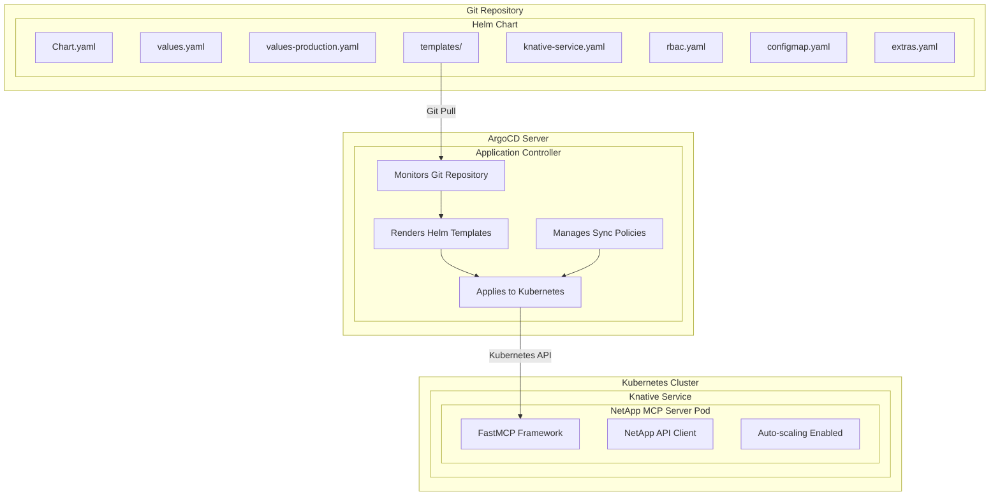

# NetApp ActiveIQ MCP Server - ArgoCD & Helm Deployment Guide

This comprehensive guide covers deploying the NetApp ActiveIQ Unified Manager MCP Server using ArgoCD for GitOps and Helm for package management on Knative.

## Table of Contents

1. [Architecture Overview](#architecture-overview)
2. [Prerequisites](#prerequisites)
3. [Helm Chart Structure](#helm-chart-structure)
4. [ArgoCD Configuration](#argocd-configuration)
5. [Environment Setup](#environment-setup)
6. [Deployment Process](#deployment-process)
7. [GitOps Workflow](#gitops-workflow)
8. [Monitoring and Observability](#monitoring-and-observability)
9. [Security Configuration](#security-configuration)
10. [Troubleshooting](#troubleshooting)
11. [Best Practices](#best-practices)

## Architecture Overview

### GitOps Architecture with ArgoCD



### Key Benefits

- **GitOps Workflow**: Declarative, versioned infrastructure
- **Automated Deployment**: Self-healing and drift detection
- **Multi-Environment**: Consistent deployments across environments
- **Helm Packaging**: Reusable, configurable templates
- **Knative Serverless**: Auto-scaling and resource efficiency

## Prerequisites

### Infrastructure Requirements

```bash
# Required components
kubectl >= 1.24
helm >= 3.8
argocd >= 2.5

# Kubernetes cluster with:
# - Knative Serving >= 1.8
# - ArgoCD >= 2.5
# - Prometheus Operator (optional)
# - External Secrets Operator (optional)
```

### Repository Structure

```
├── helm/
│   └── netapp-mcp/
│       ├── Chart.yaml
│       ├── values.yaml
│       ├── values-production.yaml
│       ├── values-staging.yaml
│       └── templates/
│           ├── _helpers.tpl
│           ├── knative-service.yaml
│           ├── rbac.yaml
│           ├── configmap.yaml
│           └── extras.yaml
├── argocd/
│   ├── application.yaml
│   ├── application-staging.yaml
│   └── application-dev.yaml
└── docs/
    └── ARGOCD_HELM_DEPLOYMENT.md
```

## Helm Chart Structure

### Chart Configuration

The Helm chart provides comprehensive configuration options:

#### Core Components
- **Knative Service**: Serverless deployment with auto-scaling
- **RBAC**: ServiceAccount, Role, and RoleBinding
- **ConfigMap**: Application configuration and feature flags
- **Secret**: NetApp credentials (optional, supports external secrets)
- **NetworkPolicy**: Security and traffic restrictions
- **ServiceMonitor**: Prometheus monitoring integration

#### Key Features
- **Multi-environment support**: Dev, staging, production values
- **External secrets integration**: Support for external-secrets operator
- **Comprehensive validation**: Input validation and error handling
- **Production-ready defaults**: Security, performance, and reliability
- **Extensible configuration**: Support for custom volumes, environment variables

### Values Hierarchy

```yaml
# Base values.yaml (development defaults)
image:
  registry: docker.io
  tag: "latest"

knative:
  template:
    annotations:
      autoscaling.knative.dev/minScale: "1"
      autoscaling.knative.dev/maxScale: "10"

# Production overrides (values-production.yaml)
image:
  registry: registry.company.com
  tag: "1.0.0"

knative:
  template:
    annotations:
      autoscaling.knative.dev/minScale: "2"
      autoscaling.knative.dev/maxScale: "20"
```

## ArgoCD Configuration

### Application Manifest

The ArgoCD Application provides:

- **GitOps Integration**: Automatic sync from Git repository
- **Helm Rendering**: Template processing with environment-specific values
- **Sync Policies**: Automated deployment with self-healing
- **Multi-environment**: Support for dev, staging, and production
- **RBAC Integration**: Role-based access control

### Project Configuration

The ArgoCD AppProject includes:

- **Source Repositories**: Allowed Git repositories
- **Destination Clusters**: Target Kubernetes clusters and namespaces
- **Resource Whitelist**: Allowed Kubernetes resources
- **RBAC Policies**: Role-based access for teams
- **Sync Windows**: Deployment time restrictions

## Environment Setup

### 1. Create Git Repository

```bash
# Initialize repository structure
mkdir netapp-mcp-server
cd netapp-mcp-server

# Create directory structure
mkdir -p helm/netapp-mcp/templates
mkdir -p argocd
mkdir -p docs

# Copy Helm chart files
cp -r helm/ netapp-mcp-server/helm/
cp -r argocd/ netapp-mcp-server/argocd/

# Initialize Git repository
git init
git add .
git commit -m "Initial commit: NetApp MCP Server Helm chart and ArgoCD configuration"
git remote add origin https://github.com/your-org/netapp-mcp-server
git push -u origin main
```

### 2. Install ArgoCD

```bash
# Create ArgoCD namespace
kubectl create namespace argocd

# Install ArgoCD
kubectl apply -n argocd -f https://raw.githubusercontent.com/argoproj/argo-cd/stable/manifests/install.yaml

# Wait for ArgoCD to be ready
kubectl wait --for=condition=available --timeout=300s deployment/argocd-server -n argocd

# Get ArgoCD admin password
kubectl -n argocd get secret argocd-initial-admin-secret -o jsonpath="{.data.password}" | base64 -d

# Port forward to access ArgoCD UI
kubectl port-forward svc/argocd-server -n argocd 8080:443
```

### 3. Configure ArgoCD CLI

```bash
# Install ArgoCD CLI
brew install argocd  # macOS
# or
curl -sSL -o /usr/local/bin/argocd https://github.com/argoproj/argo-cd/releases/latest/download/argocd-linux-amd64

# Login to ArgoCD
argocd login localhost:8080 --username admin --password <password>

# Create project
argocd proj create netapp-integration \
  --description "NetApp Integration Platform Project" \
  --src "https://github.com/your-org/netapp-mcp-server" \
  --dest "https://kubernetes.default.svc,netapp-mcp"
```

## Deployment Process

### 1. Validate Helm Chart

```bash
# Navigate to chart directory
cd helm/netapp-mcp

# Validate chart syntax
helm lint .

# Test template rendering
helm template netapp-mcp-server . \
  --values values.yaml \
  --values values-production.yaml

# Check for Kubernetes resource validation
helm template netapp-mcp-server . \
  --values values.yaml \
  --values values-production.yaml | kubectl apply --dry-run=client -f -
```

### 2. Create Environment-Specific Values

```bash
# Create staging values
cat > values-staging.yaml << EOF
image:
  tag: "staging"

knative:
  template:
    annotations:
      autoscaling.knative.dev/minScale: "1"
      autoscaling.knative.dev/maxScale: "5"

app:
  logLevel: "DEBUG"
  extraEnv:
    ENVIRONMENT: "staging"

monitoring:
  serviceMonitor:
    enabled: false
EOF

# Create development values
cat > values-dev.yaml << EOF
image:
  tag: "dev"

knative:
  template:
    annotations:
      autoscaling.knative.dev/minScale: "0"
      autoscaling.knative.dev/maxScale: "3"

app:
  logLevel: "DEBUG"
  extraEnv:
    ENVIRONMENT: "development"

networkPolicy:
  enabled: false

tests:
  enabled: false
EOF
```

### 3. Deploy with ArgoCD

```bash
# Create ArgoCD application
kubectl apply -f argocd/application.yaml

# Check application status
argocd app get netapp-mcp-server

# Sync application
argocd app sync netapp-mcp-server

# Monitor deployment
argocd app wait netapp-mcp-server --health
```

### 4. Verify Deployment

```bash
# Check Knative service
kubectl get ksvc netapp-mcp-server -n netapp-mcp

# Check pods
kubectl get pods -n netapp-mcp

# Check logs
kubectl logs -l app.kubernetes.io/name=netapp-mcp-server -n netapp-mcp

# Run Helm tests
helm test netapp-mcp-server -n netapp-mcp
```

## GitOps Workflow

### 1. Development Workflow

```bash
# 1. Create feature branch
git checkout -b feature/update-scaling

# 2. Update Helm values
vim helm/netapp-mcp/values-production.yaml

# 3. Test changes locally
helm template netapp-mcp-server helm/netapp-mcp \
  --values helm/netapp-mcp/values.yaml \
  --values helm/netapp-mcp/values-production.yaml

# 4. Commit changes
git add .
git commit -m "feat: increase production scaling limits"

# 5. Create pull request
git push origin feature/update-scaling
```

### 2. Promotion Workflow

```bash
# Development → Staging
argocd app create netapp-mcp-server-staging \
  --repo https://github.com/your-org/netapp-mcp-server \
  --path helm/netapp-mcp \
  --dest-server https://kubernetes.default.svc \
  --dest-namespace netapp-mcp-staging \
  --values-literal-file values.yaml \
  --values-literal-file values-staging.yaml

# Staging → Production (after approval)
argocd app sync netapp-mcp-server --prune
```

### 3. Rollback Procedure

```bash
# View application history
argocd app history netapp-mcp-server

# Rollback to previous version
argocd app rollback netapp-mcp-server <revision-id>

# Or rollback via Git
git revert <commit-hash>
git push origin main
```

## Monitoring and Observability

### 1. ArgoCD Monitoring

```bash
# Check application health
argocd app get netapp-mcp-server --output wide

# View sync status
argocd app sync-status netapp-mcp-server

# Check resource status
kubectl get application netapp-mcp-server -n argocd -o yaml
```

### 2. Application Monitoring

```bash
# Prometheus metrics (if ServiceMonitor enabled)
kubectl get servicemonitor netapp-mcp-server-servicemonitor -n netapp-mcp

# Check Knative service metrics
kubectl get ksvc netapp-mcp-server -n netapp-mcp -o yaml

# Application logs
kubectl logs -l app.kubernetes.io/name=netapp-mcp-server -n netapp-mcp --tail=100
```

### 3. Alerting Configuration

```yaml
# PrometheusRule for alerting
apiVersion: monitoring.coreos.com/v1
kind: PrometheusRule
metadata:
  name: netapp-mcp-server-alerts
spec:
  groups:
    - name: netapp-mcp-server
      rules:
        - alert: NetAppMCPServerDown
          expr: up{job="netapp-mcp-server"} == 0
          for: 5m
          annotations:
            summary: "NetApp MCP Server is down"

        - alert: ArgocdSyncFailed
          expr: argocd_app_health_status{health_status!="Healthy"} == 1
          for: 10m
          annotations:
            summary: "ArgoCD sync failed for {{ $labels.name }}"
```

## Security Configuration

### 1. External Secrets Integration

```yaml
# ExternalSecret for production credentials
apiVersion: external-secrets.io/v1beta1
kind: ExternalSecret
metadata:
  name: netapp-activeiq-prod-credentials
  namespace: netapp-mcp
spec:
  refreshInterval: 1h
  secretStoreRef:
    name: vault-backend
    kind: SecretStore
  target:
    name: netapp-activeiq-prod-credentials
    creationPolicy: Owner
  data:
    - secretKey: NETAPP_BASE_URL
      remoteRef:
        key: netapp/production/activeiq
        property: base_url
    - secretKey: NETAPP_USERNAME
      remoteRef:
        key: netapp/production/activeiq
        property: username
    - secretKey: NETAPP_PASSWORD
      remoteRef:
        key: netapp/production/activeiq
        property: password
```

### 2. RBAC Configuration

```yaml
# ArgoCD RBAC policy
apiVersion: v1
kind: ConfigMap
metadata:
  name: argocd-rbac-cm
  namespace: argocd
data:
  policy.csv: |
    # NetApp team permissions
    p, role:netapp-admin, applications, *, netapp-integration/*, allow
    p, role:netapp-admin, repositories, *, *, allow
    p, role:netapp-developer, applications, get, netapp-integration/*, allow
    p, role:netapp-developer, applications, sync, netapp-integration/*, allow

    # Group assignments
    g, netapp-admins, role:netapp-admin
    g, netapp-developers, role:netapp-developer
```

### 3. Network Policies

```yaml
# Network policy for ArgoCD access
apiVersion: networking.k8s.io/v1
kind: NetworkPolicy
metadata:
  name: argocd-netapp-mcp-access
  namespace: netapp-mcp
spec:
  podSelector:
    matchLabels:
      app.kubernetes.io/name: netapp-mcp-server
  policyTypes:
    - Ingress
  ingress:
    - from:
        - namespaceSelector:
            matchLabels:
              name: argocd
      ports:
        - protocol: TCP
          port: 8080
```

## Troubleshooting

### 1. ArgoCD Issues

```bash
# Check ArgoCD application status
argocd app get netapp-mcp-server --hard-refresh

# View application events
kubectl describe application netapp-mcp-server -n argocd

# Check ArgoCD server logs
kubectl logs deployment/argocd-server -n argocd

# Refresh application
argocd app get netapp-mcp-server --refresh
```

### 2. Helm Issues

```bash
# Check Helm release status
helm status netapp-mcp-server -n netapp-mcp

# View Helm release history
helm history netapp-mcp-server -n netapp-mcp

# Debug template rendering
helm template netapp-mcp-server helm/netapp-mcp \
  --values values.yaml \
  --values values-production.yaml \
  --debug

# Validate against Kubernetes API
helm template netapp-mcp-server helm/netapp-mcp \
  --values values.yaml \
  --values values-production.yaml | \
  kubectl apply --dry-run=server -f -
```

### 3. Knative Issues

```bash
# Check Knative service status
kubectl describe ksvc netapp-mcp-server -n netapp-mcp

# Check Knative revisions
kubectl get revisions -n netapp-mcp

# Check Knative configuration
kubectl get configuration netapp-mcp-server -n netapp-mcp -o yaml

# Check Knative routes
kubectl get routes -n netapp-mcp
```

### 4. Common Problems and Solutions

| Problem | Cause | Solution |
|---------|-------|----------|
| Sync Failed | Invalid Helm values | Validate Helm chart with `helm lint` |
| Pod CrashLoop | Missing secrets | Check secret configuration and external-secrets |
| Service Not Ready | Resource limits | Increase memory/CPU limits |
| Network Issues | NetworkPolicy blocking | Review and adjust NetworkPolicy rules |
| Image Pull Errors | Registry access | Verify image registry and pull secrets |

## Best Practices

### 1. Repository Organization

```bash
# Recommended structure
├── apps/
│   ├── production/
│   │   └── netapp-mcp-server.yaml
│   ├── staging/
│   │   └── netapp-mcp-server.yaml
│   └── development/
│       └── netapp-mcp-server.yaml
├── charts/
│   └── netapp-mcp/
├── environments/
│   ├── production/
│   ├── staging/
│   └── development/
└── shared/
    ├── secrets/
    └── policies/
```

### 2. Version Management

```bash
# Use semantic versioning for Helm charts
# Chart.yaml
version: 1.2.3
appVersion: "1.2.3"

# Tag releases in Git
git tag -a v1.2.3 -m "Release version 1.2.3"
git push origin v1.2.3

# Use specific image tags in production
image:
  tag: "v1.2.3"  # Not "latest"
```

### 3. Environment Promotion

```bash
# 1. Always test in development first
# 2. Promote to staging for integration testing
# 3. Deploy to production with approval

# Use different branches for different environments
git checkout -b staging/v1.2.3
git checkout -b production/v1.2.3
```

### 4. Security Practices

- **Never commit secrets** to Git repository
- **Use external secret management** (Vault, AWS Secrets Manager)
- **Implement RBAC** for ArgoCD access
- **Enable NetworkPolicies** in production
- **Use signed commits** for critical changes
- **Regular security scanning** of images and charts

### 5. Monitoring and Alerting

- **Monitor ArgoCD sync status** with Prometheus
- **Set up alerts** for failed deployments
- **Track deployment metrics** and trends
- **Implement health checks** for applications
- **Use distributed tracing** for complex workflows

This comprehensive guide provides everything needed to successfully deploy and operate the NetApp ActiveIQ MCP Server using ArgoCD and Helm in a production GitOps environment.
