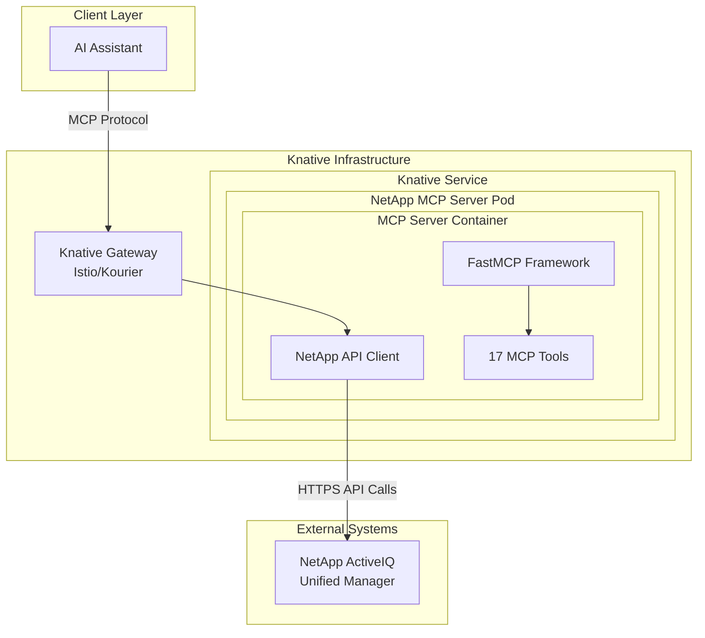

# NetApp ActiveIQ MCP Server - Knative Function Deployment

Deploy NetApp ActiveIQ MCP Server as serverless Knative functions to enable scalable, on-demand storage operations with automatic scaling and cost optimization.

## Target Operating Model

This deployment enables a **function-based architecture** where NetApp storage operations are delivered as serverless functions that scale automatically based on demand, transforming traditional expert-dependent storage management into democratized, AI-accessible operations.

## Table of Contents

1. [Prerequisites](#prerequisites)
2. [Architecture Overview](#architecture-overview)
3. [Container Preparation](#container-preparation)
4. [Kubernetes Resources](#kubernetes-resources)
5. [Deployment Process](#deployment-process)
6. [Configuration Management](#configuration-management)
7. [Monitoring and Observability](#monitoring-and-observability)
8. [Security Considerations](#security-considerations)
9. [Scaling and Performance](#scaling-and-performance)
10. [Troubleshooting](#troubleshooting)
11. [Maintenance and Updates](#maintenance-and-updates)

## Prerequisites

### Infrastructure Requirements

- **Kubernetes Cluster**: v1.24+ with Knative Serving installed
- **Knative Serving**: v1.8+ with networking layer (Istio/Kourier)
- **Container Registry**: Docker Hub, GCR, ECR, or private registry
- **Resource Requirements**:
  - Minimum: 2 vCPUs, 4GB RAM per cluster
  - Recommended: 4 vCPUs, 8GB RAM per cluster

### Tools Required

```bash
# Install required CLI tools
kubectl >= 1.24
kustomize >= 4.5
docker >= 20.10
kn (Knative CLI) >= 1.8

# Optional but recommended
helm >= 3.8
istioctl >= 1.15 (if using Istio)
```

### Access Requirements

- **Kubernetes Cluster**: Admin or sufficient RBAC permissions
- **NetApp ActiveIQ**: API access credentials
- **Container Registry**: Push/pull permissions

## Architecture Overview

### Knative Serverless Architecture



### Key Benefits

- **Auto-scaling**: Scale to zero when idle, scale up on demand
- **Resource Efficiency**: Pay only for actual usage
- **High Availability**: Built-in redundancy and failover
- **Blue-Green Deployments**: Zero-downtime updates
- **Traffic Splitting**: Gradual rollout capabilities

## Container Preparation

### 1. Build Container Image

```bash
# Navigate to project directory
cd /Users/brun_s/Documents/veille-technologique/Professionel/donnees-d-entree/PE-AsProduct/netapp

# Build the container image
docker build -t netapp-mcp-server:latest \
  --build-arg BUILD_DATE="$(date -u +'%Y-%m-%dT%H:%M:%SZ')" \
  --build-arg VCS_REF="$(git rev-parse HEAD)" \
  --build-arg VERSION="1.0.0" \
  -f Dockerfile .

# Tag for registry (replace with your registry)
docker tag netapp-mcp-server:latest your-registry.com/netapp/mcp-server:1.0.0
docker tag netapp-mcp-server:latest your-registry.com/netapp/mcp-server:latest
```

### 2. Push to Container Registry

```bash
# Login to your container registry
docker login your-registry.com

# Push images
docker push your-registry.com/netapp/mcp-server:1.0.0
docker push your-registry.com/netapp/mcp-server:latest
```

### 3. Verify Container

```bash
# Test container locally
docker run --rm -it \
  -e NETAPP_BASE_URL="https://your-netapp-aiqum.example.com/api" \
  -e NETAPP_USERNAME="test-user" \
  -e NETAPP_PASSWORD="test-password" \
  your-registry.com/netapp/mcp-server:latest \
  python test_mcp_server.py connection
```

## Kubernetes Resources

### Directory Structure

```
k8s/
├── rbac.yaml              # Namespace, ServiceAccount, RBAC
├── secret.yaml            # Credentials and certificates
├── configmap.yaml         # Application configuration
├── knative-service.yaml   # Knative Service definition
└── kustomization.yaml     # Kustomize configuration
```

### Resource Overview

| Resource | Purpose | Key Features |
|----------|---------|--------------|
| Namespace | Isolation | `netapp-mcp` namespace |
| ServiceAccount | Identity | Minimal permissions |
| Secret | Credentials | NetApp API credentials |
| ConfigMap | Configuration | Feature flags, endpoints |
| Knative Service | Deployment | Auto-scaling, serverless |
| NetworkPolicy | Security | Traffic restrictions |

## Deployment Process

### 1. Prepare Environment

```bash
# Set environment variables
export KUBE_NAMESPACE="netapp-mcp"
export NETAPP_BASE_URL="https://your-netapp-aiqum.example.com/api"
export NETAPP_USERNAME="your-username"
export NETAPP_PASSWORD="your-password"
export CONTAINER_REGISTRY="your-registry.com"
export IMAGE_TAG="1.0.0"
```

### 2. Update Configuration

```bash
# Update secret with actual credentials
sed -i "s|https://your-netapp-aiqum.example.com/api|${NETAPP_BASE_URL}|g" k8s/secret.yaml
sed -i "s|your-username|${NETAPP_USERNAME}|g" k8s/secret.yaml
sed -i "s|your-password|${NETAPP_PASSWORD}|g" k8s/secret.yaml

# Update image reference
sed -i "s|netapp-mcp-server:latest|${CONTAINER_REGISTRY}/netapp/mcp-server:${IMAGE_TAG}|g" k8s/knative-service.yaml
```

### 3. Deploy with Kustomize

```bash
# Preview deployment
kubectl kustomize k8s/

# Deploy all resources
kubectl apply -k k8s/

# Verify deployment
kubectl get all -n netapp-mcp
```

### 4. Alternative: Individual Resource Deployment

```bash
# Deploy in order
kubectl apply -f k8s/rbac.yaml
kubectl apply -f k8s/secret.yaml
kubectl apply -f k8s/configmap.yaml
kubectl apply -f k8s/knative-service.yaml
```

### 5. Verify Deployment

```bash
# Check Knative service status
kn service describe netapp-mcp-server -n netapp-mcp

# Check pod status
kubectl get pods -n netapp-mcp

# Check service logs
kubectl logs -f -l app=netapp-mcp-server -n netapp-mcp

# Test service endpoint
kubectl get ksvc netapp-mcp-server -n netapp-mcp -o jsonpath='{.status.url}'
```

## Configuration Management

### Environment-Specific Configurations

#### Development Environment

```yaml
# k8s/overlays/dev/kustomization.yaml
apiVersion: kustomize.config.k8s.io/v1beta1
kind: Kustomization

namespace: netapp-mcp-dev

resources:
  - ../../base

patches:
  - target:
      kind: Service
      name: netapp-mcp-server
      group: serving.knative.dev
    patch: |-
      - op: replace
        path: /spec/template/metadata/annotations/autoscaling.knative.dev~1minScale
        value: "0"
      - op: replace
        path: /spec/template/spec/containers/0/resources/limits/memory
        value: "256Mi"
```

#### Production Environment

```yaml
# k8s/overlays/prod/kustomization.yaml
apiVersion: kustomize.config.k8s.io/v1beta1
kind: Kustomization

namespace: netapp-mcp-prod

resources:
  - ../../base

patches:
  - target:
      kind: Service
      name: netapp-mcp-server
      group: serving.knative.dev
    patch: |-
      - op: replace
        path: /spec/template/metadata/annotations/autoscaling.knative.dev~1minScale
        value: "2"
      - op: replace
        path: /spec/template/metadata/annotations/autoscaling.knative.dev~1maxScale
        value: "50"
      - op: replace
        path: /spec/template/spec/containers/0/resources/limits/memory
        value: "1Gi"
```

### Credential Management

#### Using External Secret Operators

```yaml
# For external-secrets operator
apiVersion: external-secrets.io/v1beta1
kind: SecretStore
metadata:
  name: vault-backend
  namespace: netapp-mcp
spec:
  provider:
    vault:
      server: "https://vault.company.com"
      path: "secret"
      auth:
        kubernetes:
          mountPath: "kubernetes"
          role: "netapp-mcp-role"
---
apiVersion: external-secrets.io/v1beta1
kind: ExternalSecret
metadata:
  name: netapp-credentials
  namespace: netapp-mcp
spec:
  refreshInterval: 1h
  secretStoreRef:
    name: vault-backend
    kind: SecretStore
  target:
    name: netapp-activeiq-credentials
    creationPolicy: Owner
  data:
    - secretKey: NETAPP_BASE_URL
      remoteRef:
        key: netapp/activeiq
        property: base_url
    - secretKey: NETAPP_USERNAME
      remoteRef:
        key: netapp/activeiq
        property: username
    - secretKey: NETAPP_PASSWORD
      remoteRef:
        key: netapp/activeiq
        property: password
```

## Monitoring and Observability

### Prometheus Metrics

```yaml
# ServiceMonitor for Prometheus
apiVersion: monitoring.coreos.com/v1
kind: ServiceMonitor
metadata:
  name: netapp-mcp-server
  namespace: netapp-mcp
spec:
  selector:
    matchLabels:
      app: netapp-mcp-server
  endpoints:
  - port: http
    path: /metrics
    interval: 30s
    scrapeTimeout: 10s
```

### Logging Configuration

```yaml
# Fluent Bit configuration for log aggregation
apiVersion: v1
kind: ConfigMap
metadata:
  name: fluent-bit-config
  namespace: netapp-mcp
data:
  fluent-bit.conf: |
    [INPUT]
        Name tail
        Path /var/log/containers/netapp-mcp-server-*.log
        Tag kube.netapp.mcp.*
        Parser docker
        DB /var/log/flb_kube.db
        Mem_Buf_Limit 50MB

    [OUTPUT]
        Name forward
        Match kube.netapp.mcp.*
        Host fluent-aggregator.logging.svc.cluster.local
        Port 24224
```

### Health Check Endpoints

```python
# Add to mcp_server.py for health checks
@mcp.tool()
async def health_check() -> str:
    """Health check endpoint for Kubernetes probes"""
    try:
        client = get_client()
        # Simple test to verify connectivity
        await client._make_request("GET", "/admin/system")
        return json.dumps({"status": "healthy", "timestamp": datetime.utcnow().isoformat()})
    except Exception as e:
        return json.dumps({"status": "unhealthy", "error": str(e), "timestamp": datetime.utcnow().isoformat()})
```

## Security Considerations

### Network Security

```yaml
# Istio VirtualService for additional security
apiVersion: networking.istio.io/v1beta1
kind: VirtualService
metadata:
  name: netapp-mcp-server
  namespace: netapp-mcp
spec:
  hosts:
  - netapp-mcp-server.netapp-mcp.svc.cluster.local
  http:
  - match:
    - headers:
        authorization:
          prefix: "Bearer "
    route:
    - destination:
        host: netapp-mcp-server.netapp-mcp.svc.cluster.local
  - route:
    - destination:
        host: netapp-mcp-server.netapp-mcp.svc.cluster.local
      weight: 0
    fault:
      abort:
        percentage:
          value: 100
        httpStatus: 401
```

### Pod Security Standards

```yaml
# PodSecurityPolicy (deprecated) or Pod Security Standards
apiVersion: v1
kind: Namespace
metadata:
  name: netapp-mcp
  labels:
    pod-security.kubernetes.io/enforce: restricted
    pod-security.kubernetes.io/audit: restricted
    pod-security.kubernetes.io/warn: restricted
```

## Scaling and Performance

### Autoscaling Configuration

```yaml
# Custom autoscaling based on CPU and memory
apiVersion: autoscaling/v2
kind: HorizontalPodAutoscaler
metadata:
  name: netapp-mcp-hpa
  namespace: netapp-mcp
spec:
  scaleTargetRef:
    apiVersion: serving.knative.dev/v1
    kind: Service
    name: netapp-mcp-server
  minReplicas: 1
  maxReplicas: 20
  metrics:
  - type: Resource
    resource:
      name: cpu
      target:
        type: Utilization
        averageUtilization: 70
  - type: Resource
    resource:
      name: memory
      target:
        type: Utilization
        averageUtilization: 80
  behavior:
    scaleUp:
      stabilizationWindowSeconds: 60
      policies:
      - type: Percent
        value: 100
        periodSeconds: 60
    scaleDown:
      stabilizationWindowSeconds: 300
      policies:
      - type: Percent
        value: 50
        periodSeconds: 60
```

### Performance Tuning

```yaml
# Knative Service with performance optimizations
spec:
  template:
    metadata:
      annotations:
        # Cold start optimization
        autoscaling.knative.dev/activation-scale: "3"
        # Request routing optimization
        serving.knative.dev/rollout-duration: "120s"
        # Resource optimization
        run.googleapis.com/cpu-throttling: "false"
    spec:
      containers:
      - name: netapp-mcp-server
        resources:
          requests:
            memory: "512Mi"
            cpu: "500m"
          limits:
            memory: "1Gi"
            cpu: "1000m"
        env:
        - name: PYTHONUNBUFFERED
          value: "1"
        - name: HTTPX_POOL_CONNECTIONS
          value: "20"
        - name: HTTPX_POOL_MAX_KEEPALIVE
          value: "10"
```

## Troubleshooting

### Common Issues and Solutions

#### 1. Pod Startup Issues

```bash
# Check pod events
kubectl describe pod -l app=netapp-mcp-server -n netapp-mcp

# Check container logs
kubectl logs -l app=netapp-mcp-server -n netapp-mcp --previous

# Check resource constraints
kubectl top pods -n netapp-mcp
```

#### 2. Network Connectivity Issues

```bash
# Test network connectivity from pod
kubectl exec -it <pod-name> -n netapp-mcp -- \
  curl -k https://your-netapp-aiqum.example.com/api/admin/system

# Check DNS resolution
kubectl exec -it <pod-name> -n netapp-mcp -- \
  nslookup your-netapp-aiqum.example.com

# Verify network policies
kubectl get networkpolicy -n netapp-mcp
```

#### 3. Knative Service Issues

```bash
# Check Knative service status
kn service describe netapp-mcp-server -n netapp-mcp

# Check revisions
kn revision list -s netapp-mcp-server -n netapp-mcp

# Check routes
kn route describe netapp-mcp-server -n netapp-mcp
```

#### 4. Authentication Issues

```bash
# Verify secret content
kubectl get secret netapp-activeiq-credentials -n netapp-mcp -o yaml

# Test credentials manually
kubectl run test-pod --rm -i --tty --image=curlimages/curl -- \
  curl -u "username:password" \
  https://your-netapp-aiqum.example.com/api/admin/system
```

### Debug Mode Deployment

```yaml
# Temporary debug configuration
spec:
  template:
    spec:
      containers:
      - name: netapp-mcp-server
        command: ["/bin/bash"]
        args: ["-c", "sleep 3600"]
        env:
        - name: LOG_LEVEL
          value: "DEBUG"
        - name: PYTHONUNBUFFERED
          value: "1"
```

## Maintenance and Updates

### Rolling Updates

```bash
# Update image tag in kustomization.yaml
sed -i 's/newTag: .*/newTag: 1.1.0/' k8s/kustomization.yaml

# Apply updates
kubectl apply -k k8s/

# Monitor rollout
kubectl rollout status deployment/netapp-mcp-server -n netapp-mcp
```

### Blue-Green Deployment

```yaml
# Knative traffic splitting
spec:
  traffic:
  - percent: 90
    revisionName: netapp-mcp-server-v1
  - percent: 10
    revisionName: netapp-mcp-server-v2
    tag: canary
```

### Backup and Recovery

```bash
# Backup current configuration
kubectl get all,secrets,configmaps -n netapp-mcp -o yaml > netapp-mcp-backup.yaml

# Restore from backup
kubectl apply -f netapp-mcp-backup.yaml
```

### Health Monitoring

```bash
#!/bin/bash
# Health check script
NAMESPACE="netapp-mcp"
SERVICE="netapp-mcp-server"

# Check service health
if kn service describe $SERVICE -n $NAMESPACE | grep -q "Ready.*True"; then
    echo "✓ Service is healthy"
else
    echo "✗ Service is unhealthy"
    kubectl logs -l app=$SERVICE -n $NAMESPACE --tail=50
fi

# Check scaling
REPLICAS=$(kubectl get pods -l app=$SERVICE -n $NAMESPACE --no-headers | wc -l)
echo "Current replicas: $REPLICAS"

# Check resource usage
kubectl top pods -l app=$SERVICE -n $NAMESPACE
```

## Integration Examples

### CI/CD Pipeline (GitHub Actions)

```yaml
# .github/workflows/deploy-knative.yml
name: Deploy to Knative
on:
  push:
    branches: [main]
    paths: ['mcp_server.py', 'k8s/**']

jobs:
  deploy:
    runs-on: ubuntu-latest
    steps:
    - uses: actions/checkout@v3

    - name: Build and push image
      run: |
        docker build -t ${{ secrets.REGISTRY }}/netapp/mcp-server:${{ github.sha }} .
        docker push ${{ secrets.REGISTRY }}/netapp/mcp-server:${{ github.sha }}

    - name: Deploy to Kubernetes
      run: |
        echo "${{ secrets.KUBECONFIG }}" | base64 -d > kubeconfig
        export KUBECONFIG=kubeconfig

        cd k8s
        kustomize edit set image netapp-mcp-server=${{ secrets.REGISTRY }}/netapp/mcp-server:${{ github.sha }}
        kubectl apply -k .

        # Wait for rollout
        kubectl rollout status ksvc/netapp-mcp-server -n netapp-mcp
```

### Temporal Workflow Integration

```python
# temporal_netapp_workflow.py
@workflow.defn
class NetAppMCPWorkflow:
    @workflow.run
    async def run(self, request: NetAppRequest) -> NetAppResponse:
        # Use MCP server for data collection
        mcp_data = await workflow.execute_activity(
            query_mcp_server,
            request,
            start_to_close_timeout=timedelta(minutes=5)
        )

        # Process data and execute NetApp operations
        result = await workflow.execute_activity(
            process_netapp_data,
            mcp_data,
            start_to_close_timeout=timedelta(minutes=10)
        )

        return result

@activity.defn
async def query_mcp_server(request: NetAppRequest) -> dict:
    # Connect to Knative service
    mcp_url = "http://netapp-mcp-server.netapp-mcp.svc.cluster.local"

    async with httpx.AsyncClient() as client:
        response = await client.post(
            f"{mcp_url}/query",
            json=request.dict()
        )
        return response.json()
```

This comprehensive deployment guide provides everything needed to successfully deploy and operate the NetApp ActiveIQ MCP Server on Knative, with production-ready configurations, monitoring, security, and maintenance procedures.
