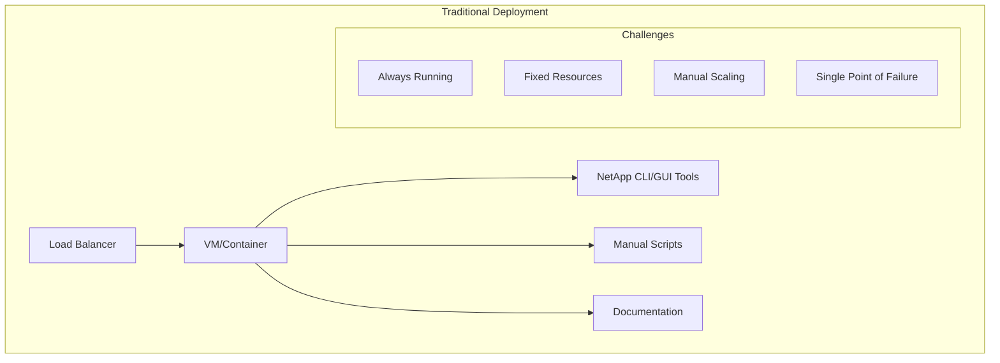
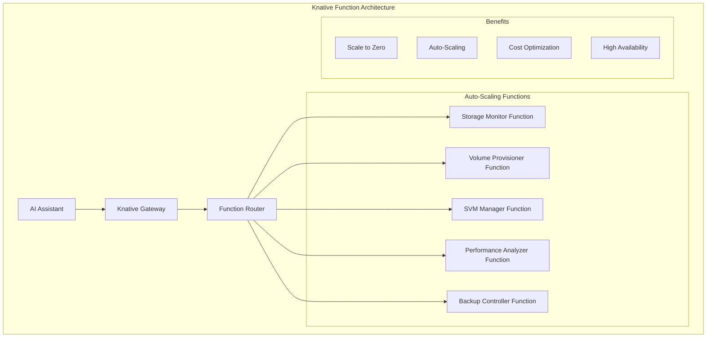
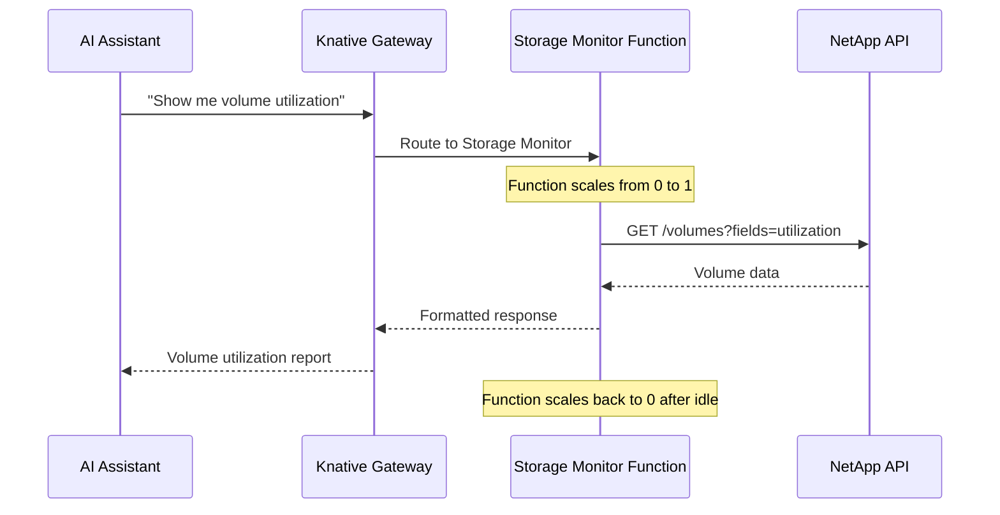
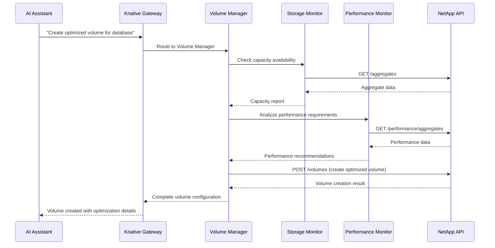
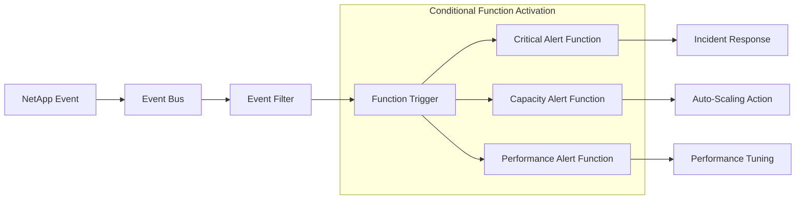

# Function-Based Architecture: NetApp MCP Server on Knative

## Overview

This document details the function-based deployment architecture that transforms NetApp storage operations into serverless, scalable functions using Knative, enabling AI-assisted storage management with automatic scaling and cost optimization.

## Architectural Paradigm Shift

### Traditional Architecture: Monolithic Storage Management



### Function-Based Architecture: Serverless Storage Operations



## Function Decomposition Strategy

### NetApp Operations as Functions

| **Function** | **Purpose** | **Scaling Pattern** | **Resource Profile** |
|--------------|-------------|-------------------|---------------------|
| **Storage Monitor** | Real-time capacity and health monitoring | High frequency, predictable | Low CPU, Medium Memory |
| **Volume Provisioner** | Create and manage volumes | On-demand bursts | Medium CPU, High Memory |
| **SVM Manager** | Storage Virtual Machine operations | Infrequent, scheduled | High CPU, High Memory |
| **Performance Analyzer** | Performance metrics and analysis | Periodic, data-intensive | High CPU, Medium Memory |
| **Event Processor** | Alert and event management | Event-driven, variable | Low CPU, Low Memory |
| **Backup Controller** | Backup and snapshot operations | Scheduled, batch | Medium CPU, High Memory |

### Function Deployment Model

```yaml
# Example: Storage Monitor Function
apiVersion: serving.knative.dev/v1
kind: Service
metadata:
  name: netapp-storage-monitor
  namespace: netapp-functions
spec:
  template:
    metadata:
      annotations:
        autoscaling.knative.dev/minScale: "1"
        autoscaling.knative.dev/maxScale: "10"
        autoscaling.knative.dev/target: "5"
        autoscaling.knative.dev/targetUtilizationPercentage: "70"
    spec:
      containers:
      - image: netapp/storage-monitor:latest
        env:
        - name: FUNCTION_TYPE
          value: "STORAGE_MONITOR"
        - name: NETAPP_API_ENDPOINT
          valueFrom:
            secretKeyRef:
              name: netapp-credentials
              key: endpoint
        resources:
          requests:
            memory: "256Mi"
            cpu: "200m"
          limits:
            memory: "512Mi"
            cpu: "500m"
        ports:
        - containerPort: 8080
        livenessProbe:
          httpGet:
            path: /health
            port: 8080
          initialDelaySeconds: 30
          periodSeconds: 10
        readinessProbe:
          httpGet:
            path: /ready
            port: 8080
          initialDelaySeconds: 5
          periodSeconds: 5
```

## Function Orchestration Patterns

### 1. Direct Function Invocation



### 2. Function Composition for Complex Operations



### 3. Event-Driven Function Activation



## Cost Optimization Through Functions

### Resource Utilization Comparison

| **Deployment Model** | **Idle Resource Usage** | **Peak Resource Usage** | **Cost Efficiency** |
|---------------------|------------------------|------------------------|-------------------|
| **Traditional VM** | 100% (always running) | 100% | Low |
| **Container (always-on)** | 80% (baseline resources) | 100% | Medium |
| **Knative Functions** | 0% (scale to zero) | 100% (auto-scale) | High |

### Cost Model Analysis

```python
# Cost comparison calculation
def calculate_monthly_costs():
    # Traditional deployment
    traditional_cost = {
        'vm_instance': 150,  # Always running VM
        'storage': 50,       # Persistent storage
        'networking': 30,    # Network costs
        'total': 230
    }
    
    # Function-based deployment
    function_cost = {
        'compute_time': 45,      # Pay per execution
        'storage': 10,           # Minimal persistent storage
        'networking': 15,        # Reduced network costs
        'knative_overhead': 5,   # Platform costs
        'total': 75
    }
    
    savings = traditional_cost['total'] - function_cost['total']
    savings_percentage = (savings / traditional_cost['total']) * 100
    
    return {
        'traditional': traditional_cost,
        'functions': function_cost,
        'monthly_savings': savings,
        'savings_percentage': savings_percentage
    }

# Result: ~67% cost reduction with function-based architecture
```

## Auto-Scaling Patterns

### 1. Demand-Based Scaling

```yaml
# Horizontal Pod Autoscaler for functions
apiVersion: autoscaling/v2
kind: HorizontalPodAutoscaler
metadata:
  name: netapp-volume-provisioner-hpa
spec:
  scaleTargetRef:
    apiVersion: serving.knative.dev/v1
    kind: Service
    name: netapp-volume-provisioner
  minReplicas: 0
  maxReplicas: 50
  metrics:
  - type: Resource
    resource:
      name: cpu
      target:
        type: Utilization
        averageUtilization: 70
  - type: Pods
    pods:
      metric:
        name: concurrent_requests
      target:
        type: AverageValue
        averageValue: "10"
  behavior:
    scaleUp:
      stabilizationWindowSeconds: 30
      policies:
      - type: Percent
        value: 100
        periodSeconds: 30
    scaleDown:
      stabilizationWindowSeconds: 300
      policies:
      - type: Percent
        value: 50
        periodSeconds: 60
```

### 2. Predictive Scaling

```python
# Predictive scaling based on historical patterns
class PredictiveScaler:
    def __init__(self):
        self.patterns = {
            'business_hours': (9, 17),  # 9 AM to 5 PM
            'peak_days': ['monday', 'tuesday', 'wednesday'],
            'maintenance_windows': ['sunday_2am']
        }
    
    def predict_scaling_needs(self, current_time):
        hour = current_time.hour
        day = current_time.strftime('%A').lower()
        
        # Pre-scale for business hours
        if self.patterns['business_hours'][0] <= hour <= self.patterns['business_hours'][1]:
            if day in self.patterns['peak_days']:
                return {'min_scale': 2, 'max_scale': 20}
            else:
                return {'min_scale': 1, 'max_scale': 10}
        
        # Scale to zero during off-hours
        return {'min_scale': 0, 'max_scale': 5}
    
    def apply_scaling_config(self, service_name, scaling_config):
        # Update Knative service annotations
        annotations = {
            'autoscaling.knative.dev/minScale': str(scaling_config['min_scale']),
            'autoscaling.knative.dev/maxScale': str(scaling_config['max_scale'])
        }
        # Apply via Kubernetes API
        return self.update_knative_service(service_name, annotations)
```

## Monitoring and Observability

### Function-Level Metrics

```yaml
# ServiceMonitor for function metrics
apiVersion: monitoring.coreos.com/v1
kind: ServiceMonitor
metadata:
  name: netapp-functions-monitor
  namespace: netapp-functions
spec:
  selector:
    matchLabels:
      app.kubernetes.io/component: netapp-function
  endpoints:
  - port: metrics
    path: /metrics
    interval: 30s
    scrapeTimeout: 10s
  namespaceSelector:
    matchNames:
    - netapp-functions
```

### Key Function Metrics

| **Metric** | **Purpose** | **Alert Threshold** |
|------------|-------------|-------------------|
| `function_invocation_count` | Track function usage | N/A (informational) |
| `function_duration_seconds` | Monitor performance | >30s for 95th percentile |
| `function_error_rate` | Track reliability | >5% error rate |
| `function_cold_start_duration` | Optimize startup | >5s startup time |
| `function_concurrent_requests` | Scale monitoring | >80% of max capacity |
| `function_memory_usage_bytes` | Resource optimization | >90% of limit |

### Distributed Tracing

```python
# OpenTelemetry tracing for function calls
from opentelemetry import trace
from opentelemetry.instrumentation.requests import RequestsInstrumentor

tracer = trace.get_tracer(__name__)

@mcp.tool()
async def create_volume_with_tracing(volume_config: dict) -> str:
    with tracer.start_as_current_span("create_volume") as span:
        span.set_attribute("volume.size", volume_config.get("size"))
        span.set_attribute("volume.svm", volume_config.get("svm"))
        
        try:
            # Function execution
            result = await netapp_client.create_volume(volume_config)
            span.set_attribute("operation.status", "success")
            span.set_attribute("volume.uuid", result.get("uuid"))
            return result
        except Exception as e:
            span.set_attribute("operation.status", "error")
            span.set_attribute("error.message", str(e))
            raise
```

## Security in Function Architecture

### Function-Level Security

```yaml
# Pod Security Context for functions
apiVersion: v1
kind: Pod
spec:
  securityContext:
    runAsNonRoot: true
    runAsUser: 1000
    runAsGroup: 1000
    fsGroup: 1000
    seccompProfile:
      type: RuntimeDefault
  containers:
  - name: netapp-function
    securityContext:
      allowPrivilegeEscalation: false
      readOnlyRootFilesystem: true
      capabilities:
        drop:
        - ALL
    volumeMounts:
    - name: tmp
      mountPath: /tmp
    - name: var-tmp
      mountPath: /var/tmp
  volumes:
  - name: tmp
    emptyDir: {}
  - name: var-tmp
    emptyDir: {}
```

### Network Security for Functions

```yaml
# NetworkPolicy for function isolation
apiVersion: networking.k8s.io/v1
kind: NetworkPolicy
metadata:
  name: netapp-functions-netpol
  namespace: netapp-functions
spec:
  podSelector:
    matchLabels:
      app.kubernetes.io/component: netapp-function
  policyTypes:
  - Ingress
  - Egress
  ingress:
  - from:
    - namespaceSelector:
        matchLabels:
          name: knative-serving
    ports:
    - protocol: TCP
      port: 8080
  egress:
  - to:
    - namespaceSelector: {}
      podSelector:
        matchLabels:
          app: netapp-api
    ports:
    - protocol: TCP
      port: 443
  - to: []
    ports:
    - protocol: TCP
      port: 53
    - protocol: UDP
      port: 53
```

## Deployment Strategies

### 1. Blue-Green Deployments

```yaml
# Traffic splitting for gradual rollout
apiVersion: serving.knative.dev/v1
kind: Service
metadata:
  name: netapp-storage-monitor
spec:
  traffic:
  - percent: 90
    revisionName: netapp-storage-monitor-v1
  - percent: 10
    revisionName: netapp-storage-monitor-v2
    tag: canary
```

### 2. Canary Deployments

```python
# Automated canary deployment controller
class CanaryController:
    def __init__(self):
        self.success_threshold = 0.95  # 95% success rate
        self.error_threshold = 0.05    # 5% error rate
        
    async def promote_canary(self, service_name, canary_revision):
        # Monitor canary metrics for 10 minutes
        metrics = await self.monitor_canary(canary_revision, duration=600)
        
        if metrics['success_rate'] >= self.success_threshold:
            # Promote canary to 100% traffic
            await self.update_traffic_split(service_name, {
                canary_revision: 100
            })
            return True
        else:
            # Rollback canary
            await self.rollback_canary(service_name)
            return False
    
    async def monitor_canary(self, revision, duration):
        # Collect metrics from Prometheus
        query = f'sum(rate(function_requests_total{{revision="{revision}"}}[5m]))'
        # Implementation details...
        return {'success_rate': 0.98, 'error_rate': 0.02}
```

## Best Practices

### Function Design Principles

1. **Single Responsibility**: Each function handles one specific NetApp operation
2. **Stateless Design**: Functions maintain no state between invocations
3. **Idempotent Operations**: Functions can be safely retried
4. **Fast Startup**: Optimize cold start times for better user experience
5. **Resource Efficiency**: Right-size function resources for optimal cost

### Performance Optimization

```python
# Connection pooling for NetApp API calls
class NetAppClientPool:
    def __init__(self):
        self.pool = asyncio.Queue(maxsize=10)
        self.initialize_pool()
    
    async def initialize_pool(self):
        for _ in range(5):  # Pre-create 5 connections
            client = NetAppClient()
            await client.connect()
            await self.pool.put(client)
    
    async def get_client(self):
        if self.pool.empty():
            # Create new client if pool is empty
            client = NetAppClient()
            await client.connect()
            return client
        return await self.pool.get()
    
    async def return_client(self, client):
        if not client.is_connected():
            await client.reconnect()
        await self.pool.put(client)

# Usage in function
@mcp.tool()
async def optimized_volume_query(query_params: dict) -> str:
    client = await client_pool.get_client()
    try:
        result = await client.get_volumes(query_params)
        return json.dumps(result)
    finally:
        await client_pool.return_client(client)
```

This function-based architecture transforms NetApp storage operations from traditional monolithic deployments to highly scalable, cost-effective serverless functions that automatically adapt to demand while maintaining high availability and performance.
