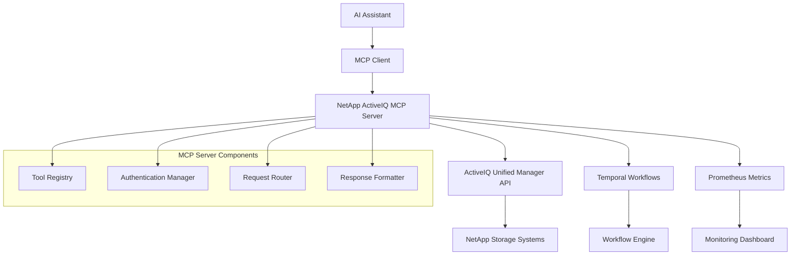

# NetApp ActiveIQ MCP Server Overview

## What is the NetApp ActiveIQ MCP Server?

The NetApp ActiveIQ MCP (Model Context Protocol) Server is a specialized server implementation that bridges NetApp's ActiveIQ Unified Manager API with AI assistants and automation tools through the standardized MCP protocol. This server enables AI applications to interact with NetApp storage infrastructure using natural language and structured queries.

## Key Features

### 🔗 **MCP Protocol Compliance**
- Full compliance with the Model Context Protocol specification
- Standardized tool definitions for NetApp operations
- Seamless integration with MCP-compatible AI assistants

### 🏗️ **NetApp Integration**
- Direct connection to ActiveIQ Unified Manager APIs
- Real-time access to storage metrics and events
- Support for all major NetApp storage operations

### ⚡ **High Performance**
- Async/await architecture for concurrent operations
- Connection pooling and request optimization
- Built-in caching for frequently accessed data

### 🔒 **Enterprise Security**
- Secure credential management
- Role-based access control integration
- SSL/TLS encryption for all communications

## Architecture Overview

## Use Cases

### 📊 **Storage Monitoring**
- Query cluster health and performance metrics
- Monitor volume capacity and utilization
- Track storage efficiency metrics
- Generate custom reports

### 🔧 **Infrastructure Management**
- Automate SVM creation and configuration
- Manage NFS/CIFS shares
- Configure network interfaces
- Handle storage provisioning

### 📈 **Performance Analysis**
- Real-time performance monitoring
- Historical trend analysis
- Capacity planning insights
- Bottleneck identification

### 🚨 **Event Management**
- Real-time event processing
- Automated alert handling
- Incident response workflows
- Problem resolution tracking

## Benefits

### For **Storage Administrators**
- Natural language queries for complex storage operations
- Automated routine tasks and workflows
- Real-time insights and recommendations
- Simplified multi-cluster management

### For **Developers**
- Standardized API through MCP protocol
- Rich tool ecosystem for NetApp operations
- Easy integration with existing workflows
- Comprehensive documentation and examples

### For **AI Applications**
- Direct access to storage infrastructure data
- Context-aware storage operations
- Automated decision making capabilities
- Seamless workflow integration

## Getting Started

1. **[Quick Start](quick-start.md)** - Get up and running in 5 minutes
2. **[Installation](installation.md)** - Detailed installation guide
3. **[Configuration](configuration.md)** - Configure for your environment

## Next Steps

- Explore the [Architecture](../architecture/system-design.md) for technical details
- Check out [API Reference](../api/mcp-tools.md) for available tools
- See [Examples](../examples/basic-usage.md) for practical implementations
- Learn about [Deployment](../deployment/docker.md) options

## Support

- **Documentation**: This comprehensive documentation site
- **GitHub Issues**: Report bugs and request features
- **Community**: Join our discussion forums
- **Enterprise Support**: NetApp support channels for enterprise customers
