# Mermaid Diagram Testing Page

This page contains various Mermaid diagrams to test the MkDocs Mermaid integration and identify any syntax issues.

## 1. Basic Flowchart

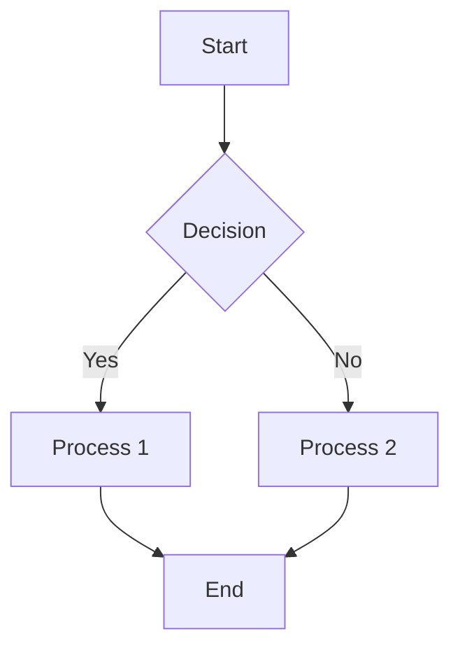

## 2. Sequence Diagram

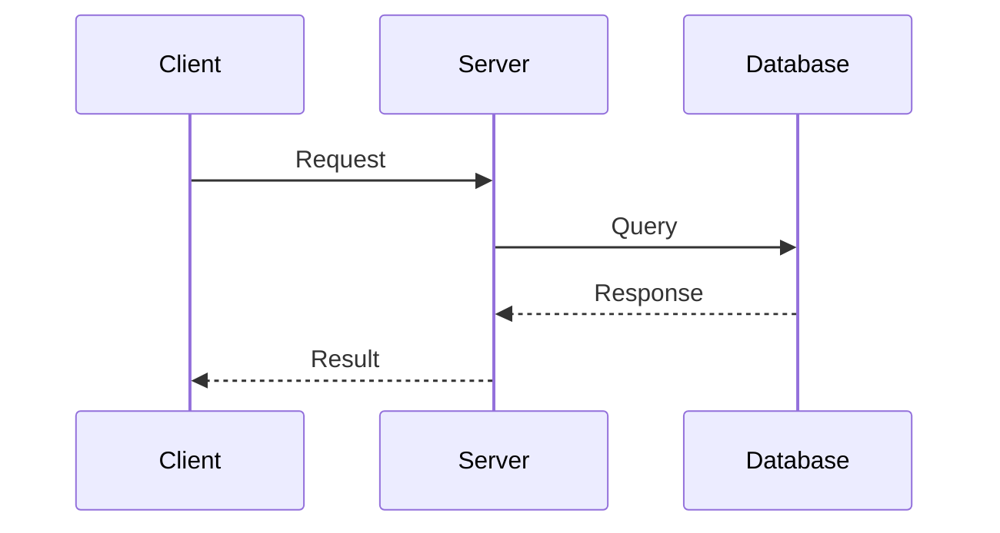

## 3. Gantt Chart

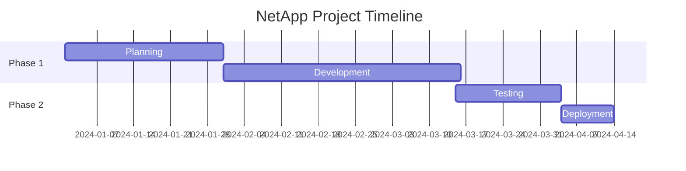

## 4. Class Diagram

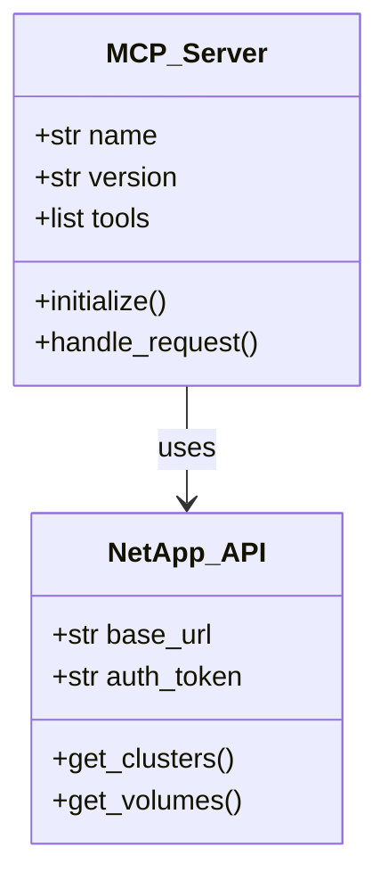

## 5. State Diagram

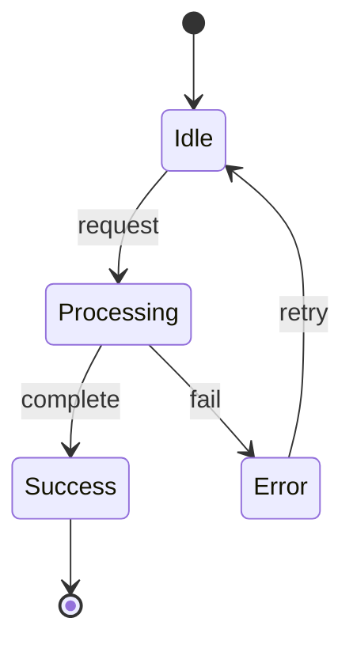

## 6. Entity Relationship Diagram

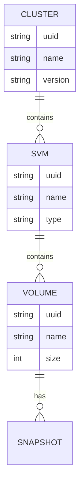

## 7. User Journey

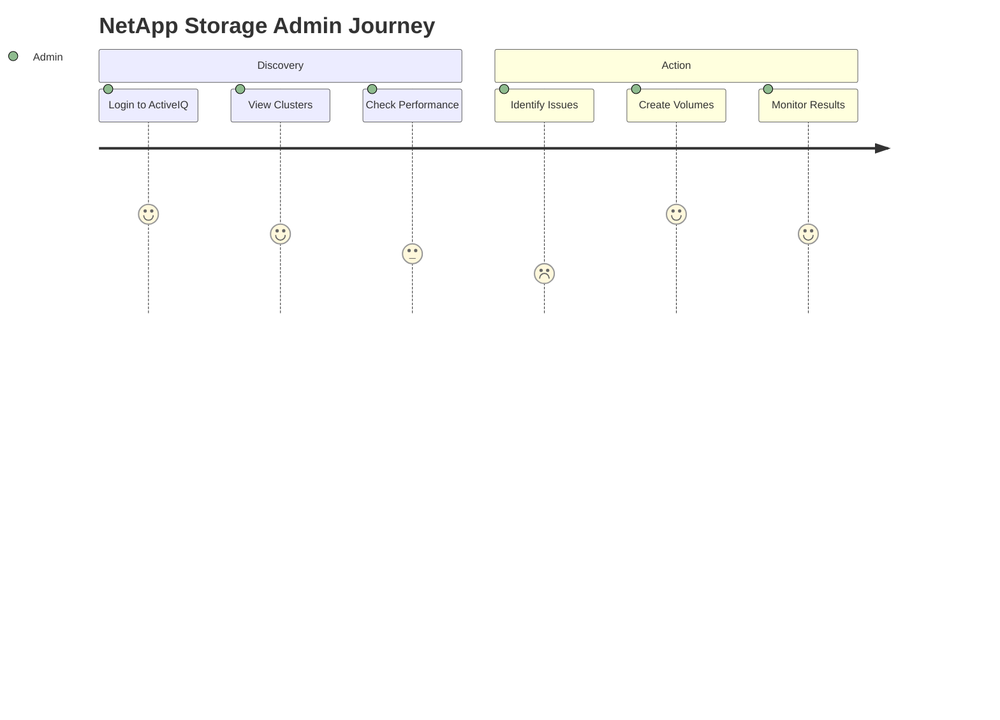

## 8. Git Graph

```mermaid
gitgraph
    commit id: "Initial"
    branch develop
    checkout develop
    commit id: "Feature A"
    commit id: "Feature B"
    checkout main
    merge develop
    commit id: "Release 1.0"
```

## 9. Pie Chart

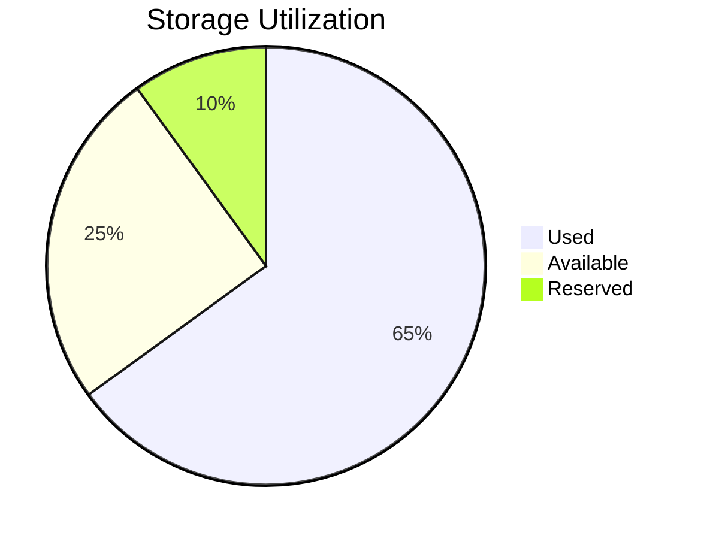

## 10. Flowchart with Subgraphs

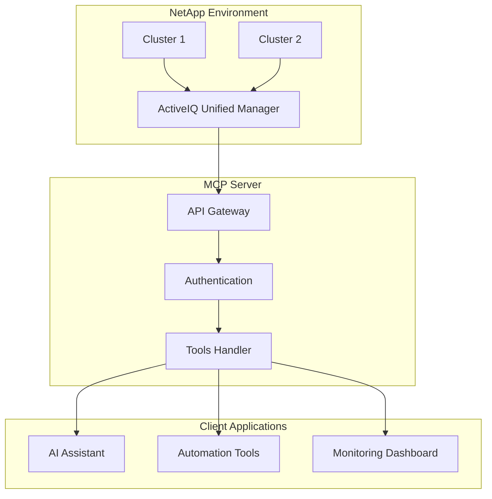

## 11. Complex Sequence with Loops

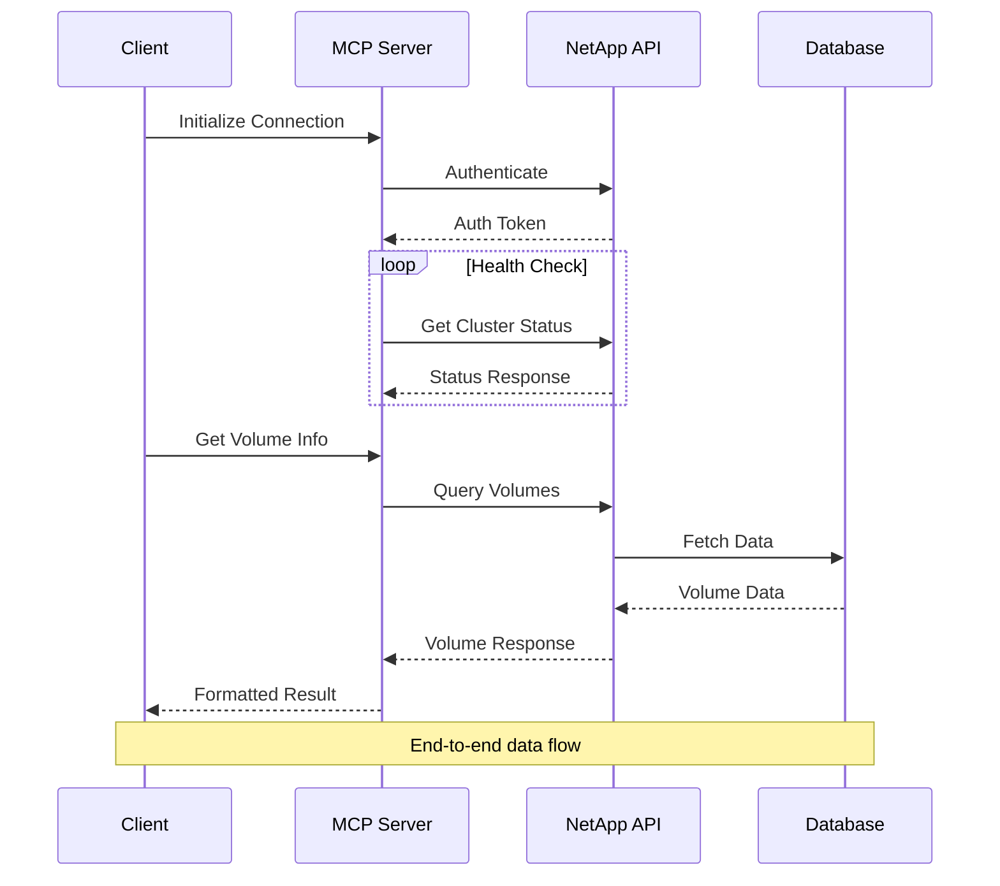

## 12. Advanced Flowchart with Styling

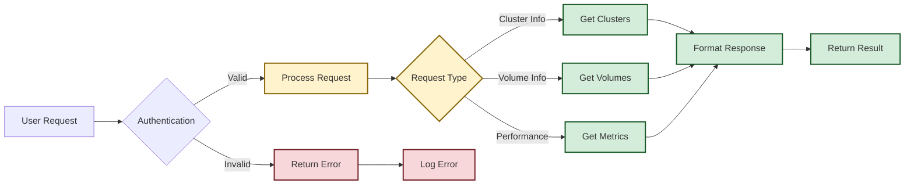

## 13. Timeline

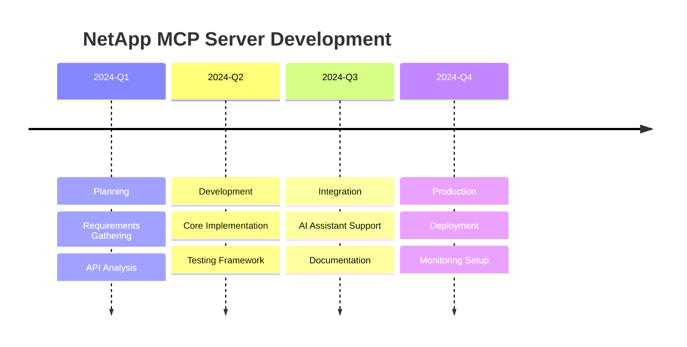

## 14. Mindmap

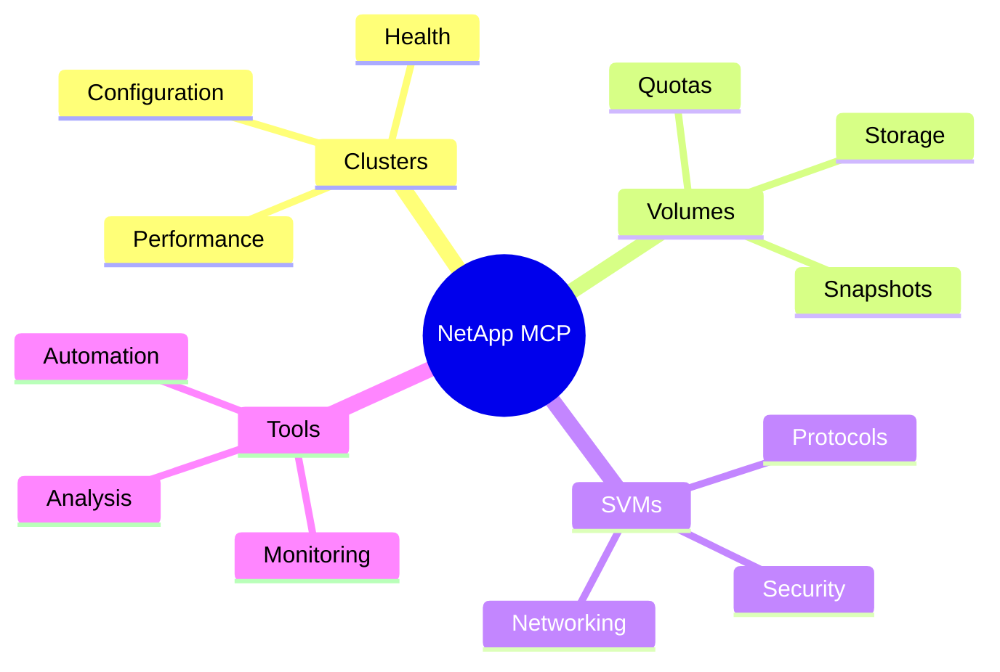

## Test Status

- ✅ Basic diagrams should render correctly
- ✅ Complex diagrams with subgraphs
- ✅ Styling and theming
- ✅ Various diagram types (flowchart, sequence, gantt, etc.)

## Common Issues to Watch For

1. **Arrow syntax**: Ensure `-->` not `--&gt;` or `--\u003e`
2. **Quote escaping**: Proper handling of quotes in labels
3. **Theme compatibility**: Mermaid v11.4.0 theme variables
4. **Plugin configuration**: mermaid2 plugin settings

## Debugging Commands

To test this page locally:

```bash
# Activate virtual environment
source venv-docs/bin/activate

# Serve the documentation
mkdocs serve

# Build for production
mkdocs build
```

## Version Information

- **Mermaid Version**: 11.4.0
- **Plugin**: mkdocs-mermaid2-plugin 1.2.1
- **MkDocs**: 1.6.1
- **Material Theme**: 9.6.14

## Mermaid Configuration Test

Current plugin configuration from mkdocs.yml:

```yaml
- mermaid2:
    version: '11.4.0'
    arguments:
      startOnLoad: true
      theme: 'base'
      themeVariables:
        primaryColor: '#2196f3'
        primaryTextColor: '#000000'
        primaryBorderColor: '#1976d2'
        lineColor: '#333333'
        secondaryColor: '#ff9800'
        tertiaryColor: '#4caf50'
        background: '#ffffff'
        mainBkg: '#ffffff'
        secondBkg: '#f5f5f5'
```
