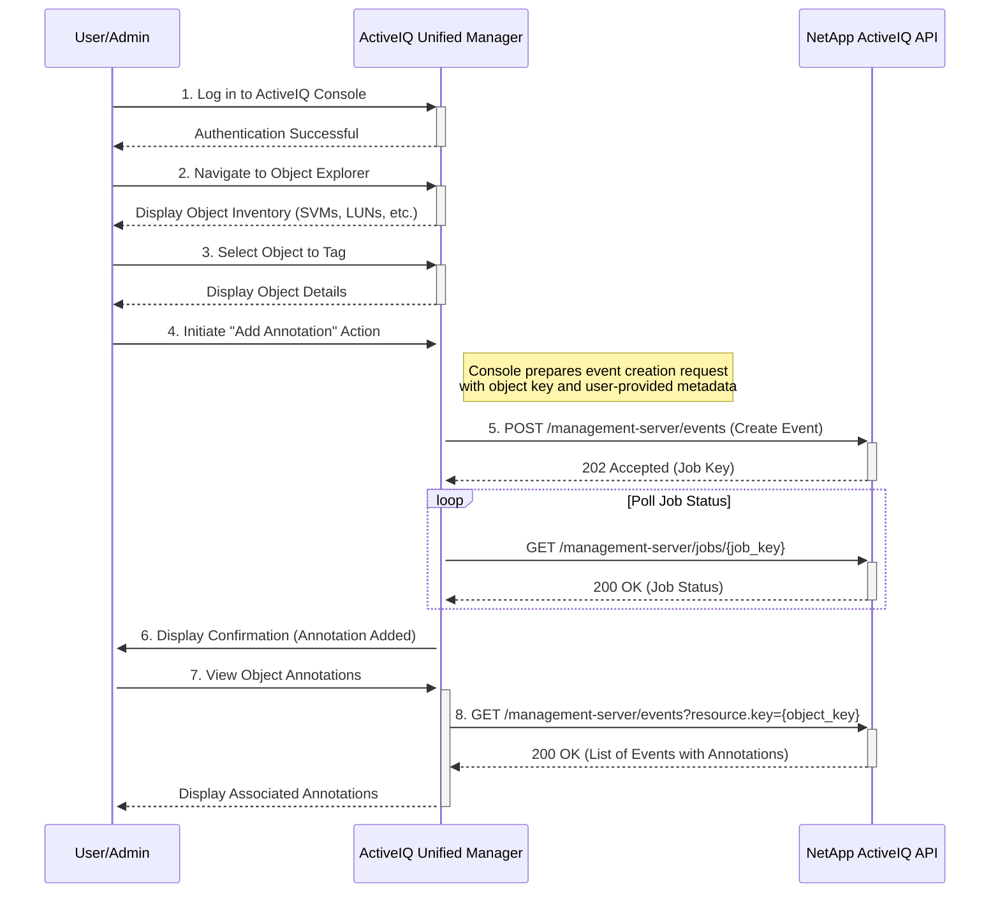

# Use Case: Attaching Metadata to any Object

This sequence diagram illustrates a generic process for attaching metadata to any object (e.g., SVM, LUN, file share) by creating an associated event with a custom annotation.

### Error Handling

- **Object Not Found (404 Not Found)**: If the target object for annotation does not exist, the console should provide a user-friendly error message.
- **Invalid Metadata (400 Bad Request)**: The console should validate the metadata format (e.g., key-value pairs) before submitting the request to the API.
- **Permission Denied (403 Forbidden)**: If the user does not have the necessary permissions to create events or annotate objects, the console should display an access denied message.
- **Job Failure**: If the event creation job fails, the console should provide detailed error information to help the user diagnose the issue.
- **Concurrent Modifications (409 Conflict)**: If the object is being modified by another user, the console should handle the conflict gracefully, perhaps by asking the user to retry.
