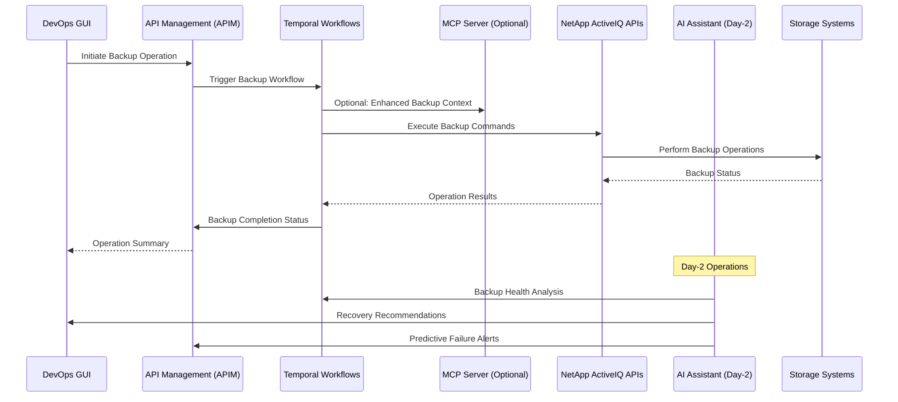

# Backup & Recovery

## Overview

Backup & Recovery is a critical DevOps use case that leverages the NetApp ActiveIQ MCP server through APIM to ensure data protection, disaster recovery, and business continuity. This use case demonstrates how DevOps teams can implement automated, intelligent, and reliable backup and recovery operations through orchestrated workflows and AI-enhanced monitoring.

## Architecture Flow



## Backup & Recovery Categories

### 1. Data Protection Levels

- **Local Snapshots**: Point-in-time copies within the same system
- **Local Replication**: Mirrored copies to local secondary storage
- **Remote Replication**: Copies to geographically distributed sites
- **Cloud Backup**: Long-term retention in cloud storage
- **Archive Storage**: Compliance and long-term retention

### 2. Recovery Types

- **File-Level Recovery**: Individual file restoration
- **Volume Recovery**: Complete volume restoration
- **Database Recovery**: Application-consistent database recovery
- **System Recovery**: Full system restoration
- **Disaster Recovery**: Cross-site failover and recovery

### 3. Protection Policies

- **RPO (Recovery Point Objective)**: Maximum acceptable data loss
- **RTO (Recovery Time Objective)**: Maximum acceptable downtime
- **Retention Policies**: How long backups are retained
- **Compliance Requirements**: Regulatory and industry standards

## APIM-Managed Backup Workflows

### 1. Automated Backup Scheduling

```yaml
workflow_name: scheduled_backup
trigger: cron_schedule
schedules:
  - daily_backup:
      time: "02:00"
      frequency: daily
      retention: 30_days
  - weekly_backup:
      time: "01:00"
      day: sunday
      retention: 12_weeks
  - monthly_backup:
      time: "00:00"
      day: first_sunday
      retention: 12_months
steps:
  - pre_backup_validation:
      check_space: true
      verify_connectivity: true
      validate_snapmirror: true
  - execute_backup:
      type: snapshot
      consistency_group: true
      application_quiesce: true
  - post_backup_verification:
      verify_integrity: true
      update_catalog: true
      send_notifications: true
```

### 2. Disaster Recovery Orchestration

```yaml
workflow_name: disaster_recovery
trigger: manual_or_automated
failover_types:
  - planned_maintenance
  - unplanned_disaster
  - testing_scenario
steps:
  - assessment_phase:
      evaluate_primary_site: true
      check_secondary_readiness: true
      calculate_rpo_rto: true
  - failover_execution:
      break_snapmirror: conditional
      promote_secondary: true
      update_dns_records: true
      restart_applications: true
  - validation_phase:
      verify_data_integrity: true
      test_application_functionality: true
      confirm_user_access: true
  - notification_phase:
      notify_stakeholders: true
      update_monitoring_systems: true
      document_actions_taken: true
```

### 3. Recovery Testing Automation

```yaml
workflow_name: recovery_testing
trigger: scheduled_monthly
test_scenarios:
  - file_recovery_test
  - volume_recovery_test
  - database_recovery_test
  - full_disaster_recovery_test
steps:
  - test_environment_setup:
      clone_production_data: true
      isolate_test_environment: true
      prepare_test_systems: true
  - recovery_simulation:
      execute_recovery_procedures: true
      measure_recovery_times: true
      validate_data_consistency: true
  - test_cleanup:
      remove_test_clones: true
      restore_test_environment: true
      archive_test_results: true
  - reporting:
      generate_test_report: true
      update_rpo_rto_metrics: true
      recommend_improvements: true
```

## DevOps Integration Patterns

### Backup Management Interface

```python
# Example: Backup and recovery integration
from netapp_mcp_client import NetAppMCPClient
from apim_client import APIMClient
from datetime import datetime, timedelta

class BackupRecoveryManager:
    def __init__(self):
        self.apim = APIMClient()
        self.mcp_client = NetAppMCPClient()

    async def schedule_backup(self, volume_id: str, backup_policy: dict):
        """Schedule a backup operation with specified policy"""
        backup_request = {
            "workflow": "schedule_backup",
            "parameters": {
                "volume_id": volume_id,
                "backup_type": backup_policy.get("type", "snapshot"),
                "retention_period": backup_policy.get("retention", "30_days"),
                "consistency_group": backup_policy.get("consistency_group", True),
                "schedule": backup_policy.get("schedule", "daily")
            }
        }

        response = await self.apim.execute_temporal_workflow(backup_request)
        return response.backup_schedule

    async def initiate_recovery(self, recovery_request: dict):
        """Initiate a data recovery operation"""
        recovery_workflow = {
            "workflow": "data_recovery",
            "parameters": {
                "recovery_type": recovery_request["type"],
                "source_backup": recovery_request["backup_id"],
                "target_location": recovery_request["target"],
                "recovery_point": recovery_request.get("point_in_time"),
                "validate_integrity": True,
                "notify_completion": True
            }
        }

        return await self.apim.execute_temporal_workflow(recovery_workflow)

    async def get_backup_status(self, cluster_id: str, timeframe_days: int = 7):
        """Get comprehensive backup status for cluster"""
        status_request = {
            "workflow": "backup_status_report",
            "parameters": {
                "cluster_id": cluster_id,
                "start_date": (datetime.utcnow() - timedelta(days=timeframe_days)).isoformat(),
                "end_date": datetime.utcnow().isoformat(),
                "include_metrics": True,
                "include_failures": True
            }
        }

        response = await self.apim.execute_temporal_workflow(status_request)
        return response.backup_status
```

### Automated Recovery Workflows

```python
class AutomatedRecovery:
    async def setup_recovery_automation(self):
        """Configure automated recovery triggers"""

        # File-level recovery automation
        await self.apim.register_recovery_handler({
            "trigger_type": "file_corruption_detected",
            "recovery_action": "automatic_file_restore",
            "approval_required": False,
            "max_file_size": "1GB",
            "notification_channels": ["slack", "email"]
        })

        # Volume recovery automation
        await self.apim.register_recovery_handler({
            "trigger_type": "volume_failure",
            "recovery_action": "volume_restore_from_snapshot",
            "approval_required": True,
            "approver_role": "storage_admin",
            "escalation_timeout": "15_minutes"
        })

        # Disaster recovery automation
        await self.apim.register_recovery_handler({
            "trigger_type": "site_failure",
            "recovery_action": "disaster_recovery_failover",
            "approval_required": True,
            "approver_role": "disaster_recovery_manager",
            "escalation_chain": ["team_lead", "operations_manager", "cto"]
        })

    async def execute_smart_recovery(self, failure_context):
        """Execute AI-recommended recovery strategy"""
        recovery_analysis = await self.ai_assistant.analyze_failure(
            failure_context=failure_context,
            available_backups=await self.get_available_backups(),
            business_impact=await self.assess_business_impact()
        )

        recommended_strategy = recovery_analysis.recommended_strategy

        if recommended_strategy.confidence_score > 0.8:
            # High confidence - execute automatically
            return await self.apim.execute_temporal_workflow({
                "workflow": recommended_strategy.workflow,
                "parameters": recommended_strategy.parameters,
                "auto_approve": True
            })
        else:
            # Lower confidence - require approval
            return await self.apim.submit_for_approval({
                "workflow": recommended_strategy.workflow,
                "parameters": recommended_strategy.parameters,
                "recommendation_context": recovery_analysis,
                "approver_role": "storage_admin"
            })
```

## AI-Enhanced Day-2 Operations

### Intelligent Backup Optimization

The AI Assistant provides advanced backup and recovery capabilities:

- **Backup Optimization**: Analyze backup patterns to optimize schedules and retention
- **Failure Prediction**: Predict potential backup failures before they occur
- **Recovery Planning**: Generate optimal recovery strategies based on failure scenarios
- **Compliance Monitoring**: Ensure backup policies meet regulatory requirements

### AI Backup Analytics Pipeline

```python
class AIBackupAnalytics:
    async def optimize_backup_strategy(self, cluster_metrics):
        """AI-driven backup strategy optimization"""

        # Analyze current backup performance
        backup_analysis = await self.ai_assistant.analyze_backup_patterns(
            cluster_metrics=cluster_metrics,
            historical_data="90_days",
            include_failures=True
        )

        # Generate optimization recommendations
        optimizations = await self.ai_assistant.generate_backup_optimizations(
            current_analysis=backup_analysis,
            business_requirements=await self.get_business_requirements(),
            compliance_requirements=await self.get_compliance_requirements()
        )

        # Implement approved optimizations
        for optimization in optimizations.approved_recommendations:
            await self.apim.execute_temporal_workflow({
                "workflow": "update_backup_policy",
                "parameters": {
                    "policy_changes": optimization.policy_changes,
                    "effective_date": optimization.implementation_date,
                    "rollback_plan": optimization.rollback_procedure
                }
            })

        return optimizations

    async def predict_backup_failures(self, system_metrics):
        """Predict potential backup failures"""
        failure_prediction = await self.ai_assistant.predict_failures(
            system_metrics=system_metrics,
            backup_history=await self.get_backup_history(),
            environmental_factors=await self.get_system_health()
        )

        # Proactive remediation for high-risk scenarios
        for prediction in failure_prediction.high_risk_scenarios:
            if prediction.confidence_score > 0.75:
                await self.apim.execute_temporal_workflow({
                    "workflow": "preventive_backup_maintenance",
                    "parameters": {
                        "target_system": prediction.affected_system,
                        "remediation_actions": prediction.recommended_actions,
                        "urgency": prediction.urgency_level
                    }
                })

        return failure_prediction
```

### Predictive Recovery Planning

```yaml
predictive_recovery_workflows:
  - name: failure_scenario_modeling
    trigger: weekly
    ai_model: scenario_simulation
    inputs:
      - system_topology
      - backup_inventory
      - business_criticality_matrix
    outputs:
      - recovery_time_estimates
      - resource_requirement_projections
      - risk_mitigation_strategies

  - name: recovery_plan_optimization
    trigger: configuration_change
    ai_model: optimization_engine
    optimization_goals:
      - minimize_rto
      - minimize_rpo
      - optimize_resource_utilization
    constraints:
      - budget_limitations
      - compliance_requirements
      - business_continuity_needs
```

## Backup & Recovery Best Practices

### 1. Backup Strategy Design

- **3-2-1 Rule**: 3 copies of data, 2 different media types, 1 offsite copy
- **Tiered Backup**: Different protection levels based on data criticality
- **Application Consistency**: Ensure backups are application-consistent
- **Regular Testing**: Regularly test backup and recovery procedures

### 2. Recovery Planning

- **RTO/RPO Definition**: Clearly define recovery objectives for each application
- **Recovery Prioritization**: Establish recovery priority based on business impact
- **Automation**: Automate recovery procedures where possible
- **Documentation**: Maintain comprehensive recovery documentation

### 3. Monitoring and Alerting

- **Backup Success Monitoring**: Monitor all backup operations for success/failure
- **Performance Tracking**: Track backup and recovery performance metrics
- **Capacity Planning**: Monitor backup storage capacity and growth trends
- **Compliance Reporting**: Generate reports for compliance and audit purposes

## Compliance and Governance

### Regulatory Compliance

```yaml
compliance_frameworks:
  - framework: SOX
    requirements:
      - backup_retention: 7_years
      - audit_trail: complete
      - recovery_testing: quarterly
      - documentation: comprehensive

  - framework: HIPAA
    requirements:
      - encryption: aes_256
      - access_controls: role_based
      - audit_logging: detailed
      - business_associate_agreements: required

  - framework: GDPR
    requirements:
      - data_minimization: enforced
      - right_to_erasure: supported
      - breach_notification: 72_hours
      - privacy_by_design: implemented
```

### Audit and Reporting

```python
class ComplianceReporting:
    async def generate_compliance_report(self, framework: str, period: str):
        """Generate compliance report for specified framework"""
        report_request = {
            "workflow": "compliance_report_generation",
            "parameters": {
                "compliance_framework": framework,
                "reporting_period": period,
                "include_metrics": True,
                "include_exceptions": True,
                "include_remediation_plans": True
            }
        }

        response = await self.apim.execute_temporal_workflow(report_request)
        return response.compliance_report

    async def audit_backup_policies(self, audit_scope: dict):
        """Audit backup policies for compliance"""
        audit_request = {
            "workflow": "backup_policy_audit",
            "parameters": {
                "audit_scope": audit_scope,
                "compliance_standards": audit_scope.get("standards"),
                "automated_remediation": True,
                "generate_findings_report": True
            }
        }

        return await self.apim.execute_temporal_workflow(audit_request)
```

## Recovery Testing Framework

### Automated Testing Scenarios

```yaml
recovery_test_scenarios:
  - scenario: file_level_recovery
    frequency: weekly
    automation_level: full
    test_cases:
      - single_file_recovery
      - multiple_file_recovery
      - large_file_recovery
      - cross_volume_recovery
    success_criteria:
      - recovery_time: less_than_5_minutes
      - data_integrity: 100%
      - application_functionality: verified

  - scenario: volume_recovery
    frequency: monthly
    automation_level: semi_automated
    test_cases:
      - full_volume_restore
      - partial_volume_restore
      - cross_cluster_restore
    success_criteria:
      - recovery_time: less_than_30_minutes
      - data_consistency: verified
      - application_startup: successful

  - scenario: disaster_recovery
    frequency: quarterly
    automation_level: orchestrated
    test_cases:
      - site_failover
      - application_failover
      - data_center_evacuation
    success_criteria:
      - rto_compliance: verified
      - rpo_compliance: verified
      - business_continuity: maintained
```

## Troubleshooting Guide

### Common Backup Issues

1. **Backup Failures**
   - Check storage space availability
   - Verify network connectivity
   - Review SnapMirror relationships
   - Analyze error logs and messages

2. **Slow Backup Performance**
   - Optimize backup schedules
   - Review network bandwidth
   - Check storage performance
   - Consider backup deduplication

3. **Recovery Issues**
   - Verify backup integrity
   - Check target system capacity
   - Review recovery procedures
   - Validate application dependencies

### Recovery Validation

- **Data Integrity Checks**: Verify restored data matches original
- **Application Testing**: Ensure applications function correctly
- **Performance Validation**: Confirm system performance meets requirements
- **User Acceptance Testing**: Validate user functionality and access

## Success Metrics

- **Backup Success Rate**: Percentage of successful backup operations
- **Recovery Time Objective (RTO)**: Actual vs. target recovery times
- **Recovery Point Objective (RPO)**: Actual vs. target data loss
- **Mean Time to Recovery (MTTR)**: Average time to complete recoveries
- **Backup Storage Efficiency**: Deduplication and compression ratios
- **Compliance Score**: Percentage of compliance requirements met
- **Test Success Rate**: Percentage of successful recovery tests

This comprehensive backup and recovery framework enables DevOps teams to ensure robust data protection, efficient recovery operations, and compliance with business and regulatory requirements through automated, intelligent, and thoroughly tested procedures.
