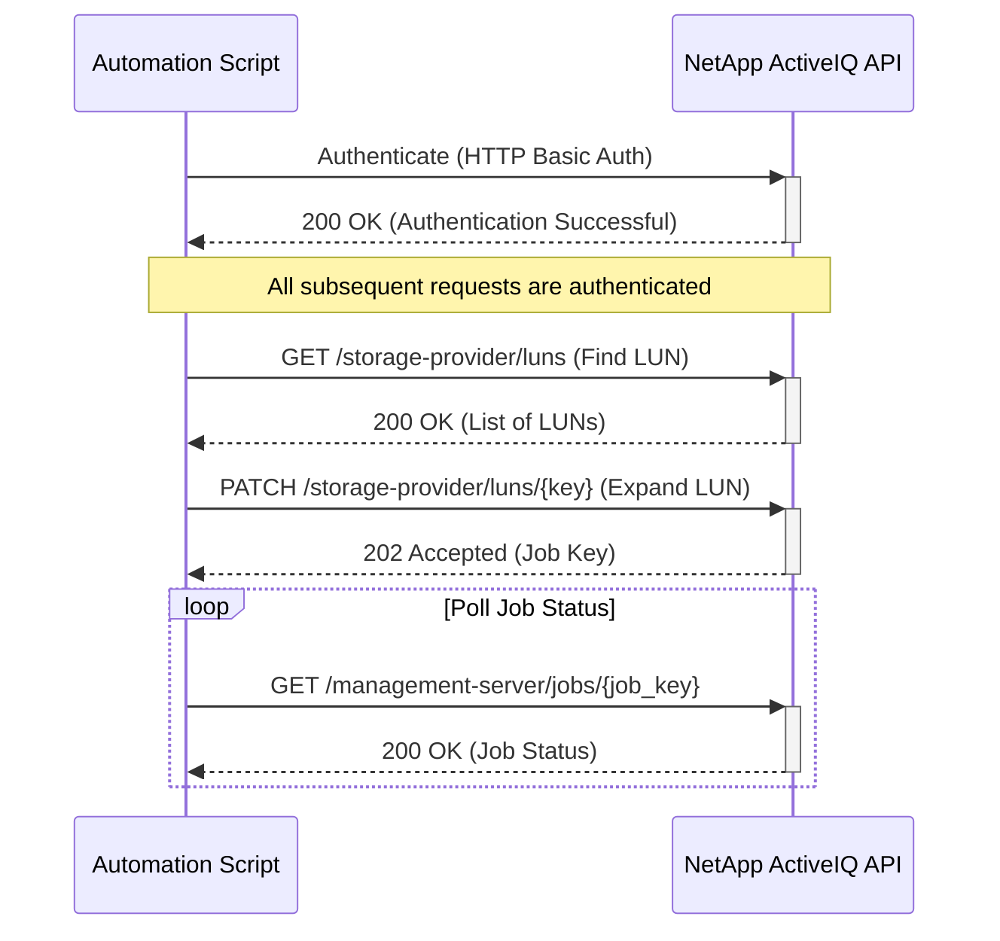

# Use Case: Expanding a LUN

This sequence diagram illustrates how to authenticate, find a LUN, and then expand its size.

### Error Handling

- **Authentication Failure (401 Unauthorized)**: If authentication fails, the script should log the error and terminate. Ensure that the API credentials are correct and have the necessary permissions.
- **LUN Not Found (404 Not Found)**: If the LUN to be expanded is not found, the script should handle the error gracefully. This could involve retrying with different search criteria or logging the error.
- **Insufficient Space (400 Bad Request)**: If there isn't enough free space in the containing aggregate to expand the LUN, the API will return a 400 error. The script should handle this by either finding additional space or notifying the administrator.
- **Invalid Size (400 Bad Request)**: If the requested new size is invalid (e.g., smaller than the current size, exceeds maximum limits), the API will return a 400 error with details. The script should validate the size before making the request.
- **LUN Online/Offline State**: If the LUN is in an inappropriate state for expansion (e.g., offline), the operation may fail. The script should check the LUN state and potentially bring it online before attempting expansion.
- **Job Failure**: The expansion job may fail for various reasons (e.g., storage constraints, system issues). The script should monitor the job status and provide detailed error information if the job fails.
- **Host Connectivity Issues**: After expanding a LUN, the host may need to rescan or extend the filesystem. While this is outside the scope of the API, the script should provide guidance or automation for these post-expansion steps.
- **Network Errors**: Implement retry logic with exponential backoff for transient network errors.
