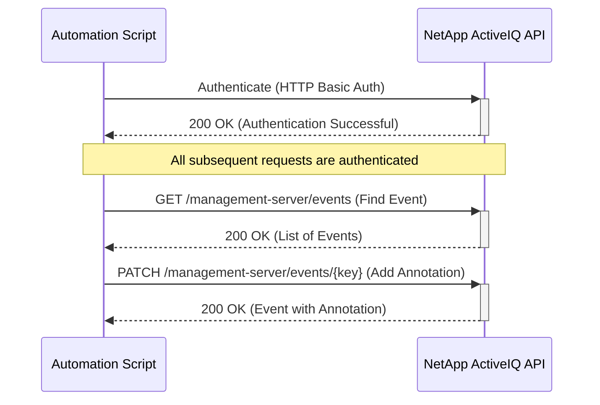
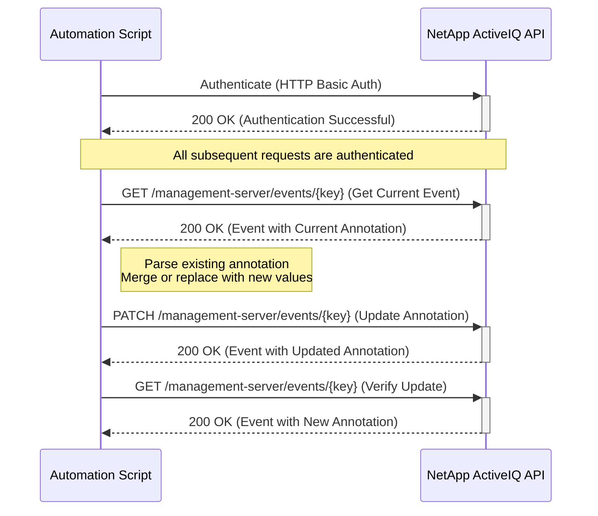

# Use Case: Annotating an Event

This sequence diagram illustrates how to authenticate, find an event, and then add or update an annotation.

## Adding a New Annotation

## Updating an Existing Annotation

### Error Handling

- **Authentication Failure (401 Unauthorized)**: If authentication fails, the script should log the error and terminate. Ensure that the API credentials are correct and have the necessary permissions.
- **Event Not Found (404 Not Found)**: If the event to be annotated is not found, the script should handle the error gracefully. This could involve logging the error and moving on to the next event.
- **Invalid Annotation (400 Bad Request)**: If the annotation format is invalid, the API will return a 400 error. The script should ensure that the annotation is a simple string.
- **Forbidden (403 Forbidden)**: If the user doesn't have permissions to modify the event, the script should log the error and notify the administrator.
- **Conflict (409 Conflict)**: If another process is modifying the same event simultaneously, the API may return a 409 error. The script should implement retry logic with backoff to handle this.
- **Network Errors**: Implement retry logic with exponential backoff for transient network errors.
