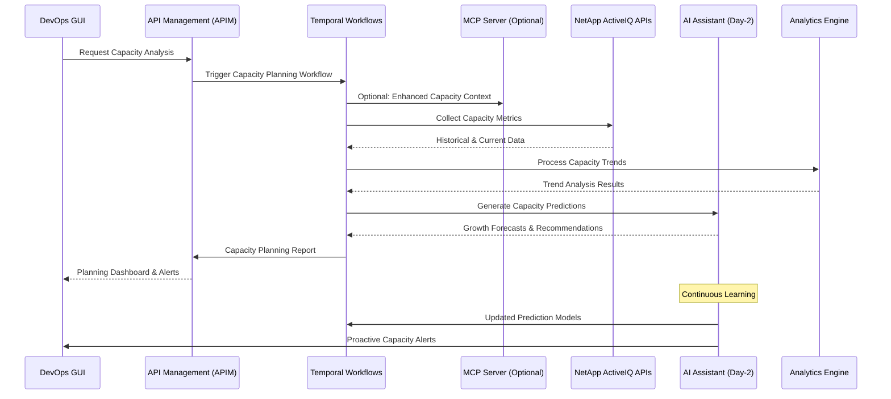

# Capacity Planning

## Overview

Capacity Planning is a strategic DevOps use case that leverages the NetApp ActiveIQ MCP server through APIM to proactively manage storage capacity, predict future growth, and optimize resource allocation. This use case demonstrates how DevOps teams can implement data-driven capacity planning through AI-enhanced analytics, automated monitoring, and predictive modeling.

## Architecture Flow



## Capacity Planning Categories

### 1. Storage Capacity Types

- **Raw Capacity**: Physical storage space available
- **Usable Capacity**: Space available after RAID overhead
- **Allocated Capacity**: Space assigned to volumes and LUNs
- **Used Capacity**: Actual data stored
- **Available Capacity**: Remaining usable space

### 2. Planning Horizons

- **Short-term (1-3 months)**: Immediate capacity needs
- **Medium-term (3-12 months)**: Budget planning and procurement
- **Long-term (1-3 years)**: Strategic capacity roadmap
- **Emergency planning**: Rapid capacity expansion scenarios

### 3. Growth Patterns

- **Linear Growth**: Steady, predictable capacity increase
- **Exponential Growth**: Accelerating capacity consumption
- **Seasonal Growth**: Cyclical capacity usage patterns
- **Event-driven Growth**: Capacity spikes due to specific events

## APIM-Managed Capacity Workflows

### 1. Automated Capacity Monitoring

```yaml
workflow_name: capacity_monitoring
trigger: scheduled
frequency: hourly
scope: all_clusters
steps:
  - data_collection:
      metrics: [used_capacity, available_capacity, growth_rate]
      aggregation_levels: [cluster, svm, volume, lun]
      historical_depth: 90_days
  - trend_analysis:
      growth_rate_calculation: true
      seasonal_pattern_detection: true
      anomaly_identification: true
  - threshold_evaluation:
      warning_threshold: 75%
      critical_threshold: 85%
      emergency_threshold: 95%
  - alert_generation:
      immediate_alerts: critical_thresholds
      forecast_alerts: projected_exhaustion
      trend_alerts: unusual_patterns
```

### 2. Predictive Capacity Analysis

```yaml
workflow_name: predictive_capacity_analysis
trigger: daily
ai_integration: true
prediction_models:
  - linear_regression
  - exponential_smoothing
  - seasonal_decomposition
  - machine_learning_ensemble
steps:
  - feature_engineering:
      time_series_features: true
      external_factors: [business_events, seasonal_patterns]
      growth_acceleration: true
  - model_execution:
      ensemble_prediction: true
      confidence_intervals: true
      scenario_modeling: [best_case, worst_case, most_likely]
  - recommendation_generation:
      procurement_timing: true
      capacity_optimization: true
      cost_analysis: true
```

### 3. Capacity Optimization Workflows

```yaml
workflow_name: capacity_optimization
trigger: weekly
optimization_targets:
  - storage_efficiency
  - cost_optimization
  - performance_balance
steps:
  - efficiency_analysis:
      deduplication_opportunities: true
      compression_benefits: true
      thin_provisioning_optimization: true
  - rebalancing_recommendations:
      volume_migration_suggestions: true
      tier_optimization: true
      aggregate_rebalancing: true
  - cost_optimization:
      license_optimization: true
      hardware_utilization: true
      cloud_tier_opportunities: true
```

## DevOps Integration Patterns

### Capacity Planning Dashboard

```python
# Example: Capacity planning integration
from netapp_mcp_client import NetAppMCPClient
from apim_client import APIMClient
from datetime import datetime, timedelta

class CapacityPlanner:
    def __init__(self):
        self.apim = APIMClient()
        self.mcp_client = NetAppMCPClient()

    async def get_capacity_forecast(self, cluster_id: str, forecast_days: int = 90):
        """Generate capacity forecast for specified timeframe"""
        forecast_request = {
            "workflow": "capacity_forecasting",
            "parameters": {
                "cluster_id": cluster_id,
                "forecast_horizon": f"{forecast_days}_days",
                "prediction_models": ["linear", "exponential", "ml_ensemble"],
                "confidence_level": 95,
                "include_scenarios": True
            }
        }

        response = await self.apim.execute_temporal_workflow(forecast_request)
        return response.capacity_forecast

    async def analyze_capacity_trends(self, timeframe_days: int = 30):
        """Analyze capacity trends across all monitored systems"""
        trend_request = {
            "workflow": "capacity_trend_analysis",
            "parameters": {
                "analysis_period": f"{timeframe_days}_days",
                "aggregation_levels": ["cluster", "svm", "volume"],
                "include_growth_rates": True,
                "detect_anomalies": True,
                "generate_insights": True
            }
        }

        response = await self.apim.execute_temporal_workflow(trend_request)
        return response.trend_analysis

    async def get_optimization_recommendations(self, cluster_id: str):
        """Get AI-powered capacity optimization recommendations"""
        optimization_request = {
            "workflow": "capacity_optimization_analysis",
            "parameters": {
                "cluster_id": cluster_id,
                "optimization_goals": ["efficiency", "cost", "performance"],
                "include_migration_suggestions": True,
                "include_cost_analysis": True,
                "risk_tolerance": "medium"
            }
        }

        response = await self.apim.execute_temporal_workflow(optimization_request)
        return response.optimization_recommendations
```

### Automated Capacity Management

```python
class AutomatedCapacityManager:
    async def setup_capacity_automation(self):
        """Configure automated capacity management"""

        # Automated thin provisioning optimization
        await self.apim.register_capacity_handler({
            "trigger_type": "low_efficiency_detected",
            "action": "thin_provisioning_optimization",
            "auto_execute": True,
            "approval_required": False,
            "notification_channels": ["slack", "email"]
        })

        # Automated volume migration for balance
        await self.apim.register_capacity_handler({
            "trigger_type": "aggregate_imbalance",
            "action": "volume_migration_recommendation",
            "auto_execute": False,
            "approval_required": True,
            "approver_role": "storage_admin"
        })

        # Emergency capacity provisioning
        await self.apim.register_capacity_handler({
            "trigger_type": "critical_capacity_threshold",
            "action": "emergency_capacity_provisioning",
            "auto_execute": True,
            "approval_required": True,
            "approver_role": "capacity_manager",
            "escalation_timeout": "10_minutes"
        })

    async def execute_capacity_expansion(self, expansion_plan):
        """Execute automated capacity expansion"""
        expansion_workflow = {
            "workflow": "capacity_expansion",
            "parameters": {
                "expansion_type": expansion_plan["type"],
                "target_capacity": expansion_plan["target_capacity"],
                "expansion_timeline": expansion_plan["timeline"],
                "validation_checks": True,
                "rollback_plan": expansion_plan.get("rollback_plan")
            }
        }

        return await self.apim.execute_temporal_workflow(expansion_workflow)
```

## AI-Enhanced Day-2 Operations

### Intelligent Capacity Forecasting

The AI Assistant provides advanced capacity planning capabilities:

- **Growth Pattern Recognition**: Automatically identify capacity growth patterns
- **Anomaly Detection**: Detect unusual capacity consumption patterns
- **Predictive Modeling**: Generate accurate capacity forecasts using ML models
- **Optimization Recommendations**: Suggest capacity optimization strategies

### AI Capacity Analytics Pipeline

```python
class AICapacityAnalytics:
    async def predict_capacity_needs(self, cluster_metrics):
        """AI-driven capacity need prediction"""

        # Analyze historical capacity patterns
        capacity_analysis = await self.ai_assistant.analyze_capacity_patterns(
            cluster_metrics=cluster_metrics,
            historical_period="12_months",
            include_seasonal_patterns=True
        )

        # Generate capacity predictions
        predictions = await self.ai_assistant.generate_capacity_predictions(
            capacity_analysis=capacity_analysis,
            prediction_horizons=["30_days", "90_days", "365_days"],
            confidence_levels=[80, 90, 95]
        )

        # Optimize capacity allocation
        optimizations = await self.ai_assistant.optimize_capacity_allocation(
            current_state=cluster_metrics,
            predictions=predictions,
            business_constraints=await self.get_business_constraints()
        )

        # Execute approved optimizations
        for optimization in optimizations.approved_actions:
            await self.apim.execute_temporal_workflow({
                "workflow": optimization.workflow,
                "parameters": optimization.parameters,
                "ai_confidence": optimization.confidence_score
            })

        return {
            "capacity_analysis": capacity_analysis,
            "predictions": predictions,
            "optimizations": optimizations
        }

    async def detect_capacity_anomalies(self, system_metrics):
        """Detect capacity usage anomalies"""
        anomaly_detection = await self.ai_assistant.detect_anomalies(
            metrics=system_metrics,
            detection_algorithms=["statistical", "ml_based", "pattern_matching"],
            sensitivity_level="medium"
        )

        # Investigate detected anomalies
        for anomaly in anomaly_detection.high_priority_anomalies:
            investigation_result = await self.ai_assistant.investigate_anomaly(
                anomaly=anomaly,
                context_data=await self.get_system_context(),
                root_cause_analysis=True
            )

            # Take appropriate action based on investigation
            if investigation_result.requires_immediate_action:
                await self.apim.execute_temporal_workflow({
                    "workflow": "anomaly_response",
                    "parameters": {
                        "anomaly_context": investigation_result,
                        "response_urgency": "high",
                        "auto_approve": investigation_result.confidence > 0.9
                    }
                })

        return anomaly_detection
```

### Predictive Capacity Planning

```yaml
predictive_capacity_workflows:
  - name: growth_pattern_analysis
    trigger: weekly
    ai_model: time_series_decomposition
    features:
      - historical_usage_data
      - business_activity_metrics
      - seasonal_indicators
    outputs:
      - growth_trend_analysis
      - seasonal_pattern_identification
      - anomaly_detection_results

  - name: capacity_demand_forecasting
    trigger: monthly
    ai_model: ensemble_forecasting
    prediction_horizons: [30, 90, 180, 365]
    confidence_levels: [80, 90, 95]
    scenarios: [conservative, optimistic, pessimistic]
    outputs:
      - capacity_demand_forecasts
      - procurement_recommendations
      - budget_planning_data

  - name: optimization_strategy_generation
    trigger: configuration_change
    ai_model: multi_objective_optimization
    objectives:
      - minimize_cost
      - maximize_efficiency
      - maintain_performance
    constraints:
      - budget_limitations
      - hardware_availability
      - business_requirements
```

## Capacity Planning Best Practices

### 1. Data Collection Strategy

- **Comprehensive Monitoring**: Monitor all capacity metrics across all systems
- **Historical Data Retention**: Maintain sufficient historical data for trend analysis
- **Granular Metrics**: Collect data at appropriate granularity levels
- **Real-time Alerting**: Implement real-time capacity threshold monitoring

### 2. Forecasting Methodology

- **Multiple Models**: Use ensemble forecasting with multiple prediction models
- **Scenario Planning**: Consider best-case, worst-case, and most-likely scenarios
- **Regular Model Updates**: Continuously update and retrain prediction models
- **Validation and Calibration**: Regularly validate forecast accuracy

### 3. Optimization Strategies

- **Efficiency Maximization**: Optimize storage efficiency through deduplication and compression
- **Cost Optimization**: Balance capacity costs with performance requirements
- **Performance Considerations**: Ensure capacity planning doesn't compromise performance
- **Scalability Planning**: Plan for both vertical and horizontal scaling options

## Capacity Thresholds and Alerting

### Threshold Configuration

```yaml
capacity_thresholds:
  warning_levels:
    - threshold: 75%
      alert_frequency: daily
      notification_channels: [email]
      recipients: [storage_team]

    - threshold: 80%
      alert_frequency: every_4_hours
      notification_channels: [slack, email]
      recipients: [storage_team, devops_team]

  critical_levels:
    - threshold: 85%
      alert_frequency: hourly
      notification_channels: [pagerduty, slack, email]
      recipients: [oncall_engineer, storage_team]

    - threshold: 90%
      alert_frequency: every_15_minutes
      notification_channels: [pagerduty, phone, slack]
      recipients: [oncall_engineer, storage_manager]

  emergency_levels:
    - threshold: 95%
      alert_frequency: immediate
      notification_channels: [pagerduty, phone, slack, email]
      recipients: [oncall_engineer, storage_manager, it_director]
      auto_actions: [emergency_capacity_provisioning]
```

### Predictive Alerting

```yaml
predictive_alerts:
  - alert_name: capacity_exhaustion_forecast
    trigger: predicted_exhaustion_within_30_days
    confidence_threshold: 80%
    notification:
      channels: [email, slack]
      recipients: [capacity_planning_team]
      escalation: 7_days_no_action

  - alert_name: growth_acceleration_detected
    trigger: growth_rate_increase_above_baseline
    threshold: 50%_increase
    notification:
      channels: [slack, email]
      recipients: [storage_team, business_analysts]

  - alert_name: seasonal_capacity_peak_approaching
    trigger: seasonal_pattern_analysis
    advance_notice: 45_days
    notification:
      channels: [email]
      recipients: [capacity_planning_team, procurement_team]
```

## Cost Optimization Framework

### Cost Analysis Components

```python
class CapacityCostAnalyzer:
    async def analyze_capacity_costs(self, time_period: str = "12_months"):
        """Comprehensive capacity cost analysis"""
        cost_analysis_request = {
            "workflow": "capacity_cost_analysis",
            "parameters": {
                "analysis_period": time_period,
                "cost_components": [
                    "hardware_acquisition",
                    "maintenance_contracts",
                    "power_cooling",
                    "datacenter_space",
                    "management_overhead"
                ],
                "optimization_opportunities": True,
                "roi_calculations": True
            }
        }

        response = await self.apim.execute_temporal_workflow(cost_analysis_request)
        return response.cost_analysis

    async def generate_procurement_plan(self, capacity_forecast):
        """Generate optimal procurement plan based on forecast"""
        procurement_request = {
            "workflow": "procurement_planning",
            "parameters": {
                "capacity_requirements": capacity_forecast,
                "budget_constraints": await self.get_budget_constraints(),
                "vendor_options": await self.get_vendor_catalog(),
                "optimization_criteria": ["cost", "performance", "scalability"],
                "procurement_timing": "optimal"
            }
        }

        return await self.apim.execute_temporal_workflow(procurement_request)
```

### ROI and Business Impact

```yaml
cost_optimization_metrics:
  - metric: cost_per_gb_stored
    calculation: total_storage_cost / total_stored_capacity
    target: minimize
    benchmark: industry_average

  - metric: efficiency_ratio
    calculation: logical_capacity / physical_capacity
    target: maximize
    benchmark: best_practice_ratio

  - metric: capacity_utilization
    calculation: used_capacity / allocated_capacity
    target: optimize_range
    optimal_range: [70%, 85%]

  - metric: growth_cost_efficiency
    calculation: incremental_cost / incremental_capacity
    target: minimize
    trend_monitoring: true
```

## Troubleshooting Guide

### Common Capacity Issues

1. **Rapid Capacity Consumption**

   - Investigate unexpected data growth
   - Check for data duplication opportunities
   - Review application behavior changes
   - Analyze user access patterns

2. **Inefficient Space Utilization**

   - Optimize thin provisioning settings
   - Implement or tune deduplication
   - Review compression configurations
   - Consolidate fragmented volumes

3. **Inaccurate Capacity Forecasts**
   - Validate data collection accuracy
   - Review prediction model parameters
   - Update seasonal pattern definitions
   - Incorporate business change factors

### Capacity Optimization Techniques

- **Storage Efficiency**: Enable and optimize deduplication and compression
- **Thin Provisioning**: Implement efficient thin provisioning strategies
- **Data Tiering**: Optimize data placement across storage tiers
- **Volume Right-sizing**: Regularly review and adjust volume sizes

## Success Metrics

- **Forecast Accuracy**: Percentage accuracy of capacity predictions
- **Capacity Utilization**: Optimal utilization of available storage
- **Cost per GB**: Cost efficiency of storage capacity
- **Planning Lead Time**: Advance notice for capacity planning decisions
- **Storage Efficiency Ratio**: Logical vs. physical capacity efficiency
- **Threshold Breach Frequency**: Number of unexpected capacity threshold breaches
- **Procurement Timing Accuracy**: Accuracy of procurement timing predictions

This comprehensive capacity planning framework enables DevOps teams to proactively manage storage capacity through data-driven forecasting, intelligent optimization, and automated monitoring, ensuring optimal resource utilization and cost efficiency.
