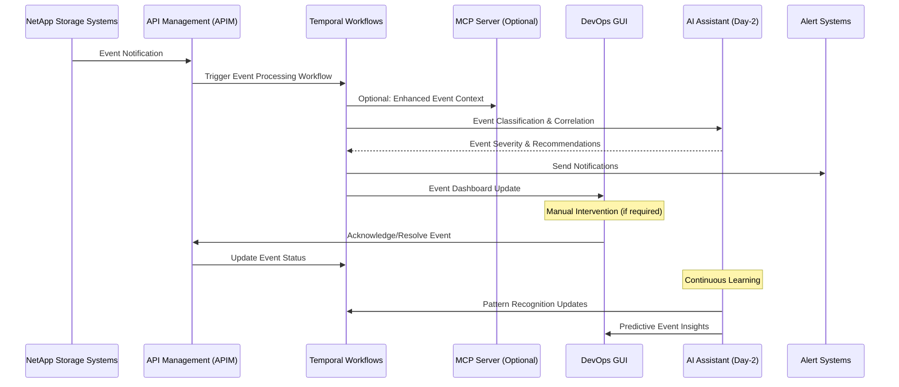

# Event Management

## Overview

Event Management is a cornerstone DevOps use case that leverages the NetApp ActiveIQ MCP server through APIM to monitor, process, and respond to storage system events. This comprehensive approach enables proactive incident management, automated response workflows, and intelligent event correlation through AI-enhanced day-2 operations.

## Architecture Flow



## Event Categories

### 1. Critical Events

- **Hardware Failures**: Disk failures, controller issues, network problems
- **Data Protection Issues**: Backup failures, replication errors
- **Security Events**: Unauthorized access attempts, configuration changes
- **Service Outages**: Complete system unavailability

### 2. Warning Events

- **Performance Degradation**: High latency, reduced throughput
- **Capacity Issues**: Low disk space, approaching limits
- **Configuration Changes**: Unauthorized or risky modifications
- **Maintenance Windows**: Scheduled maintenance notifications

### 3. Informational Events

- **System Status Updates**: Normal operation confirmations
- **Scheduled Tasks**: Backup completions, maintenance tasks
- **Performance Reports**: Regular performance summaries
- **Configuration Backups**: Successful configuration saves

## APIM-Managed Event Workflows

### 1. Event Ingestion and Processing

```yaml
workflow_name: event_processing
trigger: webhook
source: netapp_storage_systems
steps:
  - event_validation:
      schema_validation: true
      event_enrichment: true
  - severity_classification:
      ai_classification: true
      predefined_rules: true
  - correlation_analysis:
      temporal_window: 5_minutes
      pattern_matching: true
  - response_routing:
      immediate_action: critical_events
      scheduled_action: warning_events
      notification_only: informational_events
```

### 2. Automated Response Workflows

```yaml
workflow_name: automated_response
trigger: event_classified
conditions:
  - event_severity: [critical, warning]
  - auto_response_enabled: true
steps:
  - immediate_actions:
      critical:
        - notify_oncall_engineer
        - create_incident_ticket
        - execute_remediation_runbook
      warning:
        - notify_devops_team
        - log_event_details
        - schedule_investigation
  - escalation_paths:
      no_acknowledgment_timeout: 15_minutes
      escalation_levels: [team_lead, manager, director]
```

### 3. Event Correlation and Analysis

```yaml
workflow_name: event_correlation
trigger: multiple_events
ai_integration: true
steps:
  - pattern_recognition:
      temporal_correlation: true
      spatial_correlation: true
      causality_analysis: true
  - root_cause_analysis:
      dependency_mapping: true
      impact_assessment: true
  - predictive_analytics:
      failure_prediction: true
      cascading_effect_analysis: true
  - recommendation_generation:
      preventive_measures: true
      optimization_suggestions: true
```

## DevOps Integration Patterns

### Event Dashboard Integration

```python
# Example: Event management integration
from netapp_mcp_client import NetAppMCPClient
from apim_client import APIMClient
from datetime import datetime, timedelta

class EventManager:
    def __init__(self):
        self.apim = APIMClient()
        self.mcp_client = NetAppMCPClient()

    async def get_active_events(self, severity_filter: list = None):
        """Fetch active events with optional severity filtering"""
        workflow_request = {
            "workflow": "get_active_events",
            "parameters": {
                "severity_filter": severity_filter or ["critical", "warning"],
                "status": "active",
                "include_details": True
            }
        }

        response = await self.apim.execute_temporal_workflow(workflow_request)
        return response.events

    async def acknowledge_event(self, event_id: str, user_id: str, notes: str = None):
        """Acknowledge an event with user context"""
        acknowledgment_request = {
            "workflow": "acknowledge_event",
            "parameters": {
                "event_id": event_id,
                "acknowledged_by": user_id,
                "acknowledgment_time": datetime.utcnow().isoformat(),
                "notes": notes
            }
        }

        return await self.apim.execute_temporal_workflow(acknowledgment_request)

    async def get_event_timeline(self, cluster_id: str, timeframe_hours: int = 24):
        """Get event timeline for specific cluster"""
        timeline_request = {
            "workflow": "event_timeline_analysis",
            "parameters": {
                "cluster_id": cluster_id,
                "start_time": (datetime.utcnow() - timedelta(hours=timeframe_hours)).isoformat(),
                "end_time": datetime.utcnow().isoformat(),
                "include_correlations": True
            }
        }

        response = await self.apim.execute_temporal_workflow(timeline_request)
        return response.timeline_data
```

### Event-Driven Automation

```python
class EventAutomation:
    async def setup_event_handlers(self):
        """Configure automated event response handlers"""

        # Critical event handler
        await self.apim.register_event_handler({
            "event_type": "hardware_failure",
            "severity": "critical",
            "handler": "emergency_response_workflow",
            "auto_execute": True,
            "approval_required": False
        })

        # Warning event handler
        await self.apim.register_event_handler({
            "event_type": "performance_degradation",
            "severity": "warning",
            "handler": "performance_investigation_workflow",
            "auto_execute": True,
            "approval_required": True,
            "approver_role": "devops_lead"
        })

        # Informational event handler
        await self.apim.register_event_handler({
            "event_type": "maintenance_completion",
            "severity": "info",
            "handler": "update_maintenance_log",
            "auto_execute": True,
            "approval_required": False
        })

    async def execute_remediation_runbook(self, event_data):
        """Execute automated remediation based on event type"""
        runbook_mapping = {
            "disk_failure": "disk_replacement_workflow",
            "high_cpu": "cpu_optimization_workflow",
            "network_issue": "network_diagnostics_workflow",
            "backup_failure": "backup_retry_workflow"
        }

        runbook = runbook_mapping.get(event_data.event_type)
        if runbook:
            return await self.apim.execute_temporal_workflow({
                "workflow": runbook,
                "parameters": {
                    "event_context": event_data,
                    "cluster_id": event_data.cluster_id,
                    "auto_approve": event_data.severity == "critical"
                }
            })
```

## AI-Enhanced Day-2 Operations

### Intelligent Event Analysis

The AI Assistant provides advanced event management capabilities:

- **Event Correlation**: Automatically correlate related events across systems
- **Anomaly Detection**: Identify unusual event patterns that may indicate issues
- **Predictive Analytics**: Predict potential failures based on event history
- **Root Cause Analysis**: AI-powered investigation of complex event chains

### AI Event Processing Pipeline

```python
class AIEventProcessor:
    async def process_event_with_ai(self, event_data):
        """AI-enhanced event processing"""

        # Event classification and enrichment
        classified_event = await self.ai_assistant.classify_event(
            event_data=event_data,
            historical_context=True,
            system_topology=True
        )

        # Correlation analysis
        correlations = await self.ai_assistant.find_correlations(
            target_event=classified_event,
            time_window="30_minutes",
            similarity_threshold=0.7
        )

        # Impact assessment
        impact_analysis = await self.ai_assistant.assess_impact(
            event=classified_event,
            correlations=correlations,
            business_context=True
        )

        # Generate recommendations
        recommendations = await self.ai_assistant.generate_recommendations(
            event_analysis=impact_analysis,
            available_actions=self.get_available_actions(),
            risk_tolerance="medium"
        )

        # Execute approved automated responses
        for recommendation in recommendations.auto_approved:
            await self.apim.execute_temporal_workflow({
                "workflow": recommendation.workflow,
                "parameters": recommendation.parameters,
                "ai_confidence": recommendation.confidence_score
            })

        return {
            "processed_event": classified_event,
            "correlations": correlations,
            "impact_analysis": impact_analysis,
            "recommendations": recommendations
        }
```

### Predictive Event Management

```yaml
predictive_workflows:
  - name: failure_prediction
    trigger: daily
    ai_model: time_series_anomaly_detection
    features:
      - hardware_metrics
      - performance_trends
      - event_patterns
    prediction_horizon: 7_days
    actions:
      - preventive_maintenance_scheduling
      - proactive_component_replacement
      - capacity_planning_updates

  - name: cascade_prevention
    trigger: critical_event
    ai_model: dependency_graph_analysis
    analysis:
      - impact_propagation_modeling
      - containment_strategy_generation
      - resource_allocation_optimization
    actions:
      - automated_isolation_procedures
      - backup_system_activation
      - stakeholder_notifications
```

## Event Response Playbooks

### Critical Event Response

```yaml
playbook_name: critical_event_response
trigger_conditions:
  - severity: critical
  - auto_response_enabled: true
immediate_actions:
  - duration: 0-5_minutes
    steps:
      - notify_oncall_engineer: immediate
      - create_incident_ticket: high_priority
      - gather_system_state: comprehensive
      - execute_containment_procedures: automated

short_term_actions:
  - duration: 5-30_minutes
    steps:
      - assess_business_impact: ai_assisted
      - implement_workarounds: temporary_solutions
      - coordinate_response_team: escalation_procedures
      - update_stakeholders: regular_intervals

resolution_actions:
  - duration: 30_minutes+
    steps:
      - execute_permanent_fix: tested_solutions
      - validate_system_recovery: comprehensive_testing
      - conduct_post_incident_review: lessons_learned
      - update_documentation: knowledge_base
```

### Warning Event Response

```yaml
playbook_name: warning_event_response
trigger_conditions:
  - severity: warning
  - investigation_required: true
investigation_workflow:
  - data_collection:
      - system_metrics: last_24_hours
      - event_history: correlated_events
      - performance_data: trend_analysis
  - analysis:
      - root_cause_investigation: ai_assisted
      - impact_assessment: business_context
      - risk_evaluation: probability_matrix
  - response_planning:
      - remediation_options: cost_benefit_analysis
      - implementation_timeline: resource_availability
      - rollback_procedures: risk_mitigation
```

## Monitoring and Alerting Configuration

### Event Monitoring Setup

```yaml
monitoring_configuration:
  event_sources:
    - netapp_clusters: all_production_clusters
    - storage_vms: all_active_svms
    - aggregates: all_data_aggregates
    - volumes: critical_volumes_only

  collection_frequency:
    - critical_events: real_time
    - warning_events: 1_minute
    - informational_events: 5_minutes

  retention_policy:
    - critical_events: 1_year
    - warning_events: 6_months
    - informational_events: 3_months
```

### Alert Notification Rules

```yaml
notification_rules:
  - rule_name: critical_hardware_failure
    conditions:
      - event_type: hardware_failure
      - severity: critical
    notifications:
      - channel: pagerduty
        recipients: oncall_engineer
        escalation: immediate
      - channel: slack
        recipients: devops_team
        escalation: immediate
      - channel: email
        recipients: management_team
        escalation: 5_minutes

  - rule_name: performance_degradation
    conditions:
      - event_type: performance_issue
      - severity: warning
      - duration: 10_minutes
    notifications:
      - channel: slack
        recipients: devops_team
        escalation: immediate
      - channel: email
        recipients: team_leads
        escalation: 15_minutes
```

## Best Practices

### 1. Event Management Strategy

- **Proactive Monitoring**: Implement comprehensive event monitoring across all storage systems
- **Intelligent Filtering**: Use AI-powered classification to reduce alert fatigue
- **Automated Response**: Enable automated responses for well-defined event scenarios
- **Continuous Improvement**: Regularly review and update event handling procedures

### 2. Response Optimization

- **Clear Escalation Paths**: Define clear escalation procedures for different event types
- **Documentation**: Maintain comprehensive runbooks for common event scenarios
- **Training**: Ensure team members are trained on event response procedures
- **Post-Incident Reviews**: Conduct thorough reviews to improve future responses

### 3. AI Integration

- **Model Training**: Continuously train AI models with new event data
- **Feedback Loops**: Implement feedback mechanisms to improve AI accuracy
- **Human Oversight**: Maintain human oversight for critical automated decisions
- **Transparency**: Ensure AI decision processes are auditable and explainable

## Success Metrics

- **Mean Time to Detection (MTTD)**: Average time to detect and classify events
- **Mean Time to Acknowledgment (MTTA)**: Average time for human acknowledgment
- **Mean Time to Resolution (MTTR)**: Average time to resolve events
- **False Positive Rate**: Percentage of incorrectly classified events
- **Automation Success Rate**: Percentage of events successfully handled automatically
- **Escalation Rate**: Percentage of events requiring escalation
- **Customer Impact Reduction**: Decrease in customer-affecting incidents

## Troubleshooting Guide

### Common Event Management Issues

1. **Alert Fatigue**

   - Review and tune event classification rules
   - Implement intelligent event correlation
   - Use AI-powered noise reduction
   - Optimize notification thresholds

2. **Missed Critical Events**

   - Audit event source configurations
   - Review filtering and routing rules
   - Validate notification delivery mechanisms
   - Test escalation procedures

3. **Slow Response Times**
   - Analyze response workflow efficiency
   - Optimize automated response triggers
   - Review team availability and coverage
   - Improve documentation and training

This comprehensive event management framework enables DevOps teams to maintain high availability and performance of NetApp storage systems through intelligent, automated, and proactive event handling.
