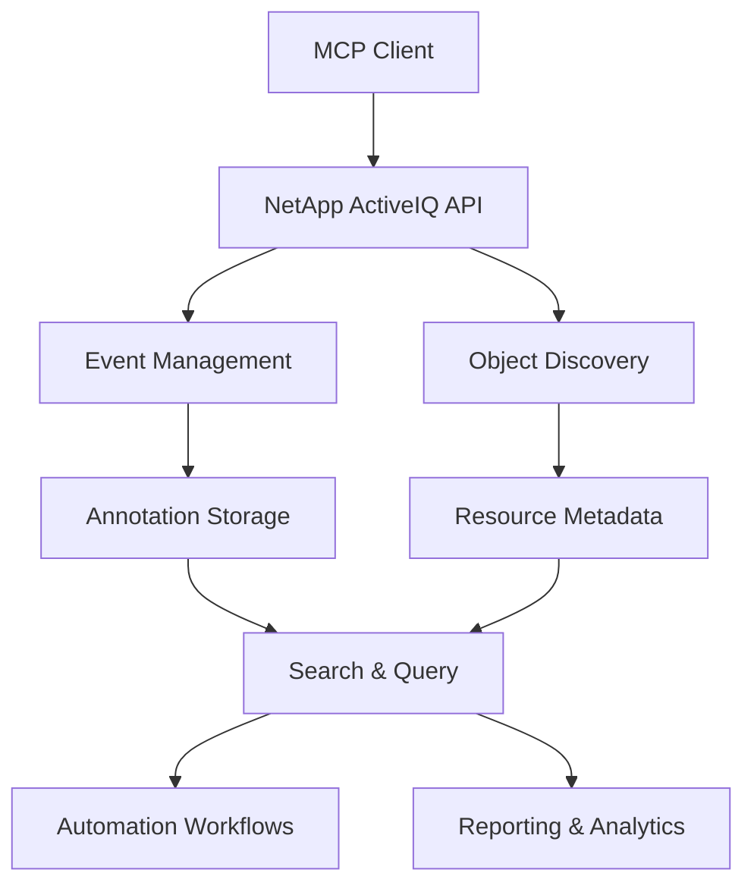

# MCP Tools Use Cases Overview

This section contains use cases specifically designed for **Model Context Protocol (MCP) integration** with NetApp ActiveIQ. These use cases focus on metadata management, tagging, and annotation capabilities that enhance the automation and organization of NetApp storage resources.

## 🎯 Purpose

MCP tools provide a structured way to:
- **Tag and categorize** storage objects (SVMs, volumes, LUNs)
- **Attach custom metadata** for organizational purposes
- **Search and filter** resources based on annotations
- **Automate compliance** and governance workflows
- **Enable cost tracking** and resource allocation

## 📚 Available Use Cases

### 🏷️ Tagging & Annotation

| Use Case | Description | Key Features |
|----------|-------------|--------------|
| [**Annotating an Event**](annotate_event.md) | Add or update annotations on existing events | Event modification, metadata updates |
| [**SVM Event Annotation**](tag_svm_with_event_annotation.md) | Tag SVMs by creating annotated events | SVM identification, custom tagging |
| [**Volume Name Tagging**](tag_volume_with_nametag.md) | Use name tags for consistent volume naming | Naming conventions, volume creation |

### 📎 Metadata Management

| Use Case | Description | Key Features |
|----------|-------------|--------------|
| [**Generic Metadata Attachment**](attach_metadata_to_object.md) | Attach metadata to any ActiveIQ object | Universal tagging, object categorization |
| [**Search by Metadata**](search_object_by_metadata.md) | Find objects using metadata queries | Advanced filtering, bulk operations |

## 🔧 Common MCP Integration Patterns

### 1. Event-Based Metadata
- Create events with custom annotations
- Associate events with storage objects
- Use event annotations as metadata containers

### 2. Search and Discovery
- Query events by annotation content
- Filter objects by multiple metadata criteria
- Aggregate results for reporting

### 3. Automation Workflows
- Implement tagging standards
- Automate compliance checking
- Enable resource lifecycle management

## 🛠️ Technical Architecture



## 🎨 Metadata Schema Examples

### Project-Based Tagging
```json
{
  "project": "quarterly-reporting",
  "owner": "finance-team",
  "environment": "production",
  "cost-center": "IT-001"
}
```

### Compliance Tagging
```json
{
  "compliance": "sox",
  "criticality": "high",
  "data-classification": "confidential",
  "retention": "7-years"
}
```

### Team-Based Organization
```json
{
  "team": "storage-admins",
  "contact": "admin@company.com",
  "backup-schedule": "daily",
  "maintenance-window": "sunday-2am"
}
```

## 🚀 Getting Started

1. **Choose Your Use Case**: Select the most appropriate use case for your needs
2. **Review the Sequence Diagrams**: Understand the API interaction patterns
3. **Implement Authentication**: Set up proper API credentials
4. **Test with Sample Data**: Start with non-production resources
5. **Scale Your Implementation**: Apply to production environments

## 🔗 Related Resources

- [NetApp ActiveIQ API Documentation](../../netapp-activeiq-api-overview.md)
- [MCP Tools Reference](../../api/mcp-tools.md)
- [General NetApp API Use Cases](../netapp-api/overview.md)
- [Architecture Documentation](../../architecture/)

## 📝 Best Practices

- **Consistent Naming**: Use standardized metadata keys and values
- **Error Handling**: Implement robust error handling and retry logic
- **Security**: Follow authentication and authorization best practices
- **Documentation**: Document your metadata schema and conventions
- **Testing**: Test thoroughly in non-production environments first
