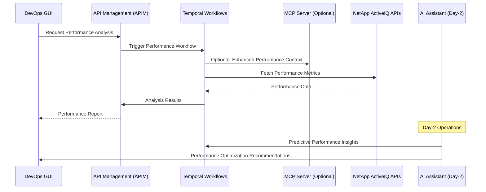

# Performance Analysis

## Overview

Performance analysis is a critical DevOps use case that leverages the NetApp ActiveIQ MCP server through APIM to monitor, analyze, and optimize storage system performance. This use case demonstrates how DevOps teams can proactively identify performance bottlenecks and implement optimizations through automated workflows.

## Architecture Flow



## Key Performance Metrics

### Storage Performance Indicators

- **IOPS (Input/Output Operations Per Second)**

  - Read IOPS
  - Write IOPS
  - Random vs Sequential patterns

- **Latency Metrics**

  - Average response time
  - 95th percentile latency
  - Peak latency periods

- **Throughput Analysis**
  - Data transfer rates
  - Bandwidth utilization
  - Network performance impact

### Resource Utilization

- **CPU Usage**

  - Controller CPU utilization
  - Node-level CPU metrics
  - Process-specific CPU consumption

- **Memory Utilization**

  - Buffer cache efficiency
  - Memory allocation patterns
  - Free memory trends

- **Disk Performance**
  - Disk busy percentage
  - Queue depth analysis
  - Disk service time

## APIM-Managed Workflows

### 1. Real-time Performance Monitoring

```yaml
workflow_name: performance_monitoring
trigger: scheduled
frequency: 5_minutes
steps:
  - collect_metrics:
      api_endpoint: /datacenter/storage/aggregates
      metrics: [iops, latency, throughput]
  - analyze_trends:
      temporal_activity: performance_trend_analysis
  - alert_thresholds:
      cpu_threshold: 80%
      latency_threshold: 10ms
      iops_threshold: 90%_capacity
```

### 2. Performance Baseline Analysis

```yaml
workflow_name: baseline_analysis
trigger: weekly
steps:
  - historical_data_collection:
      timeframe: 30_days
      granularity: hourly
  - baseline_calculation:
      method: statistical_analysis
      percentiles: [50, 75, 90, 95, 99]
  - deviation_analysis:
      alert_on_deviation: 20%
```

### 3. Predictive Performance Analysis

```yaml
workflow_name: predictive_performance
trigger: daily
ai_integration: true
steps:
  - data_preparation:
      features: [iops, latency, cpu, memory, network]
      window_size: 7_days
  - ml_model_inference:
      model_type: time_series_forecasting
      prediction_horizon: 24_hours
  - recommendation_generation:
      optimization_suggestions: true
      capacity_planning: true
```

## DevOps Integration Patterns

### Performance Dashboard Integration

```python
# Example: Performance metrics integration
from netapp_mcp_client import NetAppMCPClient
from apim_client import APIMClient

class PerformanceAnalyzer:
    def __init__(self):
        self.apim = APIMClient()
        self.mcp_client = NetAppMCPClient()

    async def get_cluster_performance(self, cluster_id: str):
        """Fetch comprehensive cluster performance metrics"""
        workflow_request = {
            "workflow": "cluster_performance_analysis",
            "parameters": {
                "cluster_id": cluster_id,
                "metrics": ["iops", "latency", "throughput", "cpu", "memory"],
                "timeframe": "1_hour"
            }
        }

        # Route through APIM for standardized access
        response = await self.apim.execute_temporal_workflow(workflow_request)
        return response.performance_data

    async def analyze_performance_trends(self, svm_id: str):
        """Analyze performance trends for SVM"""
        trend_data = await self.apim.get_performance_trends(
            resource_type="svm",
            resource_id=svm_id,
            analysis_period="7_days"
        )

        return {
            "current_performance": trend_data.current_metrics,
            "trend_analysis": trend_data.trends,
            "predictions": trend_data.ai_predictions,
            "recommendations": trend_data.optimization_suggestions
        }
```

### Alerting and Notification Workflows

```yaml
alert_rules:
  - name: high_latency_alert
    condition: average_latency > 15ms
    duration: 5_minutes
    severity: warning
    actions:
      - temporal_workflow: performance_investigation
      - notification: devops_team

  - name: cpu_utilization_critical
    condition: cpu_usage > 90%
    duration: 2_minutes
    severity: critical
    actions:
      - temporal_workflow: emergency_performance_analysis
      - ai_assistant: performance_optimization_recommendations
      - escalation: on_call_engineer
```

## AI-Enhanced Day-2 Operations

### Intelligent Performance Optimization

The AI Assistant provides enhanced day-2 operations capabilities:

- **Anomaly Detection**: Automatically identify unusual performance patterns
- **Root Cause Analysis**: AI-powered investigation of performance issues
- **Optimization Recommendations**: Intelligent suggestions for performance tuning
- **Capacity Planning**: Predictive analysis for future capacity needs

### Performance Optimization Workflow

```python
class AIPerformanceOptimizer:
    async def optimize_performance(self, cluster_metrics):
        """AI-driven performance optimization"""

        # Analyze current performance state
        performance_state = await self.analyze_current_state(cluster_metrics)

        # Generate optimization recommendations
        optimizations = await self.ai_assistant.generate_optimizations(
            performance_state=performance_state,
            optimization_goals=["latency_reduction", "iops_improvement", "efficiency"]
        )

        # Execute approved optimizations through Temporal workflows
        for optimization in optimizations.approved_recommendations:
            await self.apim.execute_temporal_workflow({
                "workflow": "performance_optimization",
                "parameters": optimization.parameters,
                "approval_required": optimization.requires_approval
            })

        return optimizations
```

## Best Practices

### 1. Performance Monitoring Strategy

- **Continuous Monitoring**: Implement 24/7 performance monitoring
- **Baseline Establishment**: Maintain performance baselines for comparison
- **Threshold Management**: Define and regularly review alert thresholds
- **Trend Analysis**: Focus on performance trends rather than point-in-time metrics

### 2. Optimization Approach

- **Data-Driven Decisions**: Base optimizations on comprehensive performance data
- **Incremental Changes**: Implement changes gradually to measure impact
- **Testing Environment**: Validate optimizations in non-production environments
- **Rollback Procedures**: Maintain ability to quickly revert changes

### 3. DevOps Integration

- **Automated Workflows**: Leverage Temporal workflows for consistent performance analysis
- **API-First Approach**: Use APIM for standardized access to performance data
- **Documentation**: Maintain comprehensive performance analysis documentation
- **Team Collaboration**: Enable cross-team visibility into performance metrics

## Troubleshooting Guide

### Common Performance Issues

1. **High Latency**

   - Check network connectivity
   - Analyze disk performance
   - Review cache utilization
   - Examine workload patterns

2. **Low IOPS**

   - Verify storage configuration
   - Check for bottlenecks
   - Analyze queue depths
   - Review application patterns

3. **CPU Bottlenecks**
   - Analyze process utilization
   - Check for resource contention
   - Review workload distribution
   - Consider scaling options

### Performance Analysis Tools

- **ActiveIQ Unified Manager**: Primary performance monitoring platform
- **Temporal Workflows**: Orchestrated performance analysis processes
- **APIM Dashboard**: Centralized performance metrics visualization
- **AI Assistant**: Intelligent performance insights and recommendations

## Success Metrics

- **Mean Time to Detection (MTTD)**: Average time to identify performance issues
- **Mean Time to Resolution (MTTR)**: Average time to resolve performance problems
- **Performance SLA Compliance**: Percentage of time within performance targets
- **Optimization Success Rate**: Percentage of successful performance improvements
- **Predictive Accuracy**: Accuracy of AI-powered performance predictions

This performance analysis framework enables DevOps teams to maintain optimal storage system performance through automated monitoring, intelligent analysis, and proactive optimization.
