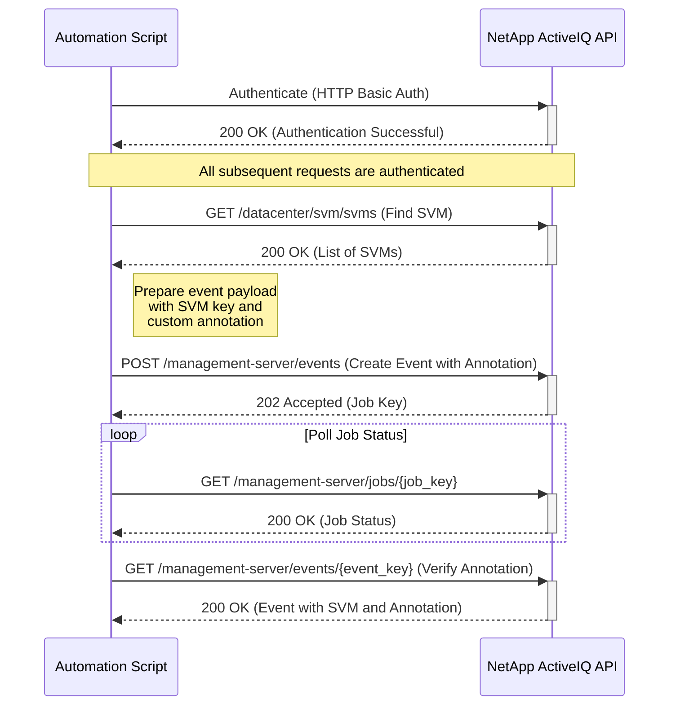

# Use Case: Tagging an SVM via Event Annotation

This sequence diagram illustrates how to tag an SVM by creating a new event and adding a custom annotation to it.

### Error Handling

- **Authentication Failure (401 Unauthorized)**: If authentication fails, the script should log the error and terminate. Ensure that the API credentials are correct and have the necessary permissions.
- **SVM Not Found (404 Not Found)**: If the SVM to be tagged does not exist, the script should handle the error gracefully.
- **Invalid Event Payload (400 Bad Request)**: If the event creation request is invalid (e.g., missing required fields), the API will return a 400 error. The script should validate the payload before sending it.
- **Job Failure**: The event creation job may fail. The script should monitor the job status and provide detailed error information if it fails.
- **Network Errors**: Implement retry logic with exponential backoff for transient network errors.
