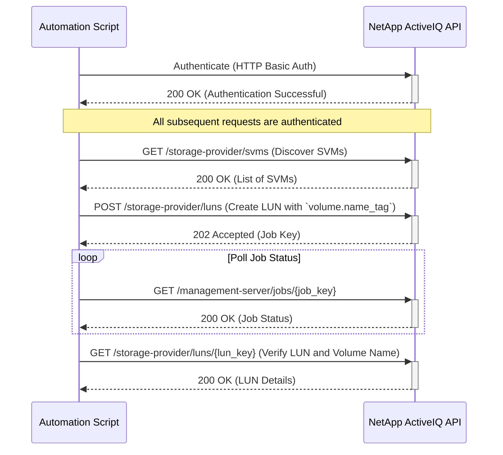

# Use Case: Tagging a Volume with `name_tag`

This sequence diagram illustrates how to authenticate and use a `name_tag` to create a consistently named volume during LUN creation.

### Error Handling

- **Authentication Failure (401 Unauthorized)**: If authentication fails, the script should log the error and terminate. Ensure that the API credentials are correct and have the necessary permissions.
- **Invalid `name_tag` (400 Bad Request)**: If the `name_tag` contains invalid characters or does not meet naming requirements, the API will return a 400 error. The script should validate the `name_tag` before making the request.
- **Volume Name Conflict (400 Bad Request)**: If the volume name derived from the `name_tag` (e.g., `NSLM_<name_tag>`) already exists, the LUN creation will fail. The script should include logic to check for existing volumes or use a unique `name_tag`.
- **Resource Not Found (404 Not Found)**: If the specified SVM for LUN creation does not exist, the API will return a 404 error. The script should validate the SVM key before creating the LUN.
- **Insufficient Space (400 Bad Request)**: If the selected aggregate does not have enough space, the LUN creation job will fail. The script should check for available capacity before initiating the request.
- **Job Failure**: The LUN creation job may fail for other reasons (e.g., system constraints, licensing issues). The script should monitor the job status and retrieve detailed error information if the job fails.
- **Network Errors**: Implement retry logic with exponential backoff for transient network errors.
