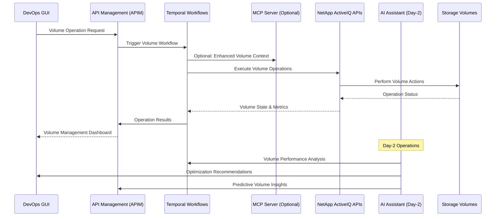

# Volume Operations

## Overview

Volume Operations is a critical DevOps use case that leverages the NetApp ActiveIQ MCP server through APIM to efficiently manage, monitor, and optimize storage volumes. This use case demonstrates how DevOps teams can implement comprehensive volume lifecycle management through automated workflows, intelligent monitoring, and AI-enhanced operational optimization.

## Architecture Flow



## Volume Operations Categories

### 1. Volume Lifecycle Management

- **Volume Creation**: Automated provisioning of new storage volumes
- **Volume Configuration**: Size, performance, and policy configuration
- **Volume Monitoring**: Real-time performance and health monitoring
- **Volume Optimization**: Performance tuning and efficiency optimization
- **Volume Decommissioning**: Secure and controlled volume removal

### 2. Volume Performance Operations

- **Performance Monitoring**: IOPS, throughput, and latency tracking
- **Quality of Service (QoS)**: Performance guarantee management
- **Tiering Management**: Automated data tiering optimization
- **Caching Optimization**: Read and write cache management
- **Workload Analysis**: Application workload pattern analysis

### 3. Volume Data Protection

- **Snapshot Management**: Point-in-time copy creation and management
- **Replication Setup**: SnapMirror and SnapVault configuration
- **Backup Scheduling**: Automated backup policy management
- **Recovery Operations**: Volume restore and recovery procedures
- **Data Deduplication**: Storage efficiency optimization

## APIM-Managed Volume Workflows

### 1. Volume Provisioning Automation

```yaml
workflow_name: volume_provisioning
trigger: api_request
validation_required: true
steps:
  - pre_provisioning_validation:
      check_aggregate_space: true
      validate_naming_conventions: true
      verify_security_policies: true
      confirm_performance_requirements: true
  - volume_creation:
      create_volume: true
      set_size_and_guarantee: true
      configure_security_style: true
      apply_qos_policies: true
  - post_provisioning_setup:
      create_initial_snapshot: true
      configure_data_protection: true
      setup_monitoring_alerts: true
      validate_access_permissions: true
  - documentation_and_notification:
      update_inventory: true
      create_operational_documentation: true
      notify_stakeholders: true
```

### 2. Volume Performance Optimization

```yaml
workflow_name: volume_performance_optimization
trigger: scheduled_or_threshold
frequency: hourly
scope: all_active_volumes
steps:
  - performance_analysis:
      collect_iops_metrics: true
      analyze_latency_patterns: true
      evaluate_throughput_efficiency: true
      assess_cache_hit_ratios: true
  - optimization_recommendations:
      qos_policy_adjustments: ai_recommended
      tiering_optimization: intelligent
      cache_configuration: adaptive
      aggregate_placement: optimal
  - automated_optimizations:
      execute_approved_changes: true
      monitor_impact: continuous
      rollback_on_degradation: automatic
```

### 3. Volume Data Protection Workflows

```yaml
workflow_name: volume_data_protection
trigger: policy_based
protection_levels: [basic, standard, enterprise]
steps:
  - snapshot_management:
      create_scheduled_snapshots: true
      manage_snapshot_retention: policy_based
      monitor_snapshot_space: true
  - replication_setup:
      configure_snapmirror: conditional
      setup_snapvault: backup_required
      validate_replication_health: continuous
  - backup_orchestration:
      coordinate_backup_schedules: true
      monitor_backup_completion: true
      validate_backup_integrity: true
  - recovery_testing:
      automated_recovery_tests: monthly
      validate_rpo_rto_compliance: true
      update_recovery_procedures: true
```

## DevOps Integration Patterns

### Volume Management Interface

```python
# Example: Volume operations integration
from netapp_mcp_client import NetAppMCPClient
from apim_client import APIMClient
from datetime import datetime, timedelta

class VolumeManager:
    def __init__(self):
        self.apim = APIMClient()
        self.mcp_client = NetAppMCPClient()

    async def create_volume(self, volume_config: dict):
        """Create a new volume with specified configuration"""
        provisioning_request = {
            "workflow": "volume_provisioning",
            "parameters": {
                "svm_id": volume_config["svm_id"],
                "volume_name": volume_config["name"],
                "size": volume_config["size"],
                "aggregate": volume_config.get("aggregate", "auto_select"),
                "security_style": volume_config.get("security_style", "unix"),
                "qos_policy": volume_config.get("qos_policy", "default"),
                "data_protection": volume_config.get("data_protection", True)
            }
        }

        response = await self.apim.execute_temporal_workflow(provisioning_request)
        return response.volume_details

    async def get_volume_performance(self, volume_id: str, timeframe_hours: int = 24):
        """Get comprehensive volume performance metrics"""
        performance_request = {
            "workflow": "volume_performance_analysis",
            "parameters": {
                "volume_id": volume_id,
                "analysis_period": f"{timeframe_hours}_hours",
                "metrics": ["iops", "throughput", "latency", "cache_hits"],
                "include_trends": True,
                "include_predictions": True,
                "workload_analysis": True
            }
        }

        response = await self.apim.execute_temporal_workflow(performance_request)
        return response.performance_data

    async def resize_volume(self, volume_id: str, new_size: str, resize_type: str = "auto"):
        """Resize volume with optional auto-shrink capability"""
        resize_request = {
            "workflow": "volume_resize",
            "parameters": {
                "volume_id": volume_id,
                "new_size": new_size,
                "resize_type": resize_type,  # manual, auto, auto_grow
                "validate_space": True,
                "backup_before_resize": True
            }
        }

        return await self.apim.execute_temporal_workflow(resize_request)
```

### Automated Volume Operations

```python
class AutomatedVolumeOperations:
    async def setup_volume_automation(self):
        """Configure automated volume management"""

        # Automated volume resizing
        await self.apim.register_volume_handler({
            "trigger_type": "volume_space_threshold",
            "threshold": "85%_full",
            "action": "auto_volume_resize",
            "resize_increment": "20%",
            "max_size": "1TB",
            "approval_required": False,
            "notification_channels": ["slack", "email"]
        })

        # Automated snapshot management
        await self.apim.register_volume_handler({
            "trigger_type": "snapshot_schedule",
            "schedule": "hourly_daily_weekly",
            "action": "create_snapshots",
            "retention_policy": "7_daily_4_weekly_12_monthly",
            "auto_execute": True,
            "cleanup_old_snapshots": True
        })

        # Automated performance optimization
        await self.apim.register_volume_handler({
            "trigger_type": "performance_degradation",
            "threshold": "latency_increase_30%",
            "action": "volume_performance_optimization",
            "auto_execute": False,
            "approval_required": True,
            "approver_role": "storage_admin"
        })

    async def execute_volume_migration(self, migration_plan):
        """Execute volume migration workflow"""
        migration_workflow = {
            "workflow": "volume_migration",
            "parameters": {
                "source_volume": migration_plan["source_volume_id"],
                "target_aggregate": migration_plan["target_aggregate"],
                "migration_method": migration_plan.get("method", "vol_move"),
                "cutover_window": migration_plan.get("cutover_window", "maintenance"),
                "validation_checks": True,
                "rollback_plan": migration_plan.get("rollback_plan")
            }
        }

        return await self.apim.execute_temporal_workflow(migration_workflow)
```

## AI-Enhanced Day-2 Operations

### Intelligent Volume Optimization

The AI Assistant provides advanced volume management capabilities:

- **Performance Prediction**: Predict volume performance bottlenecks before they occur
- **Capacity Forecasting**: Intelligent capacity growth prediction and planning
- **Workload Analysis**: Analyze application workload patterns for optimization
- **Automated Tiering**: AI-driven data placement across storage tiers

### AI Volume Analytics Pipeline

```python
class AIVolumeAnalytics:
    async def optimize_volume_performance(self, volume_metrics):
        """AI-driven volume performance optimization"""

        # Analyze current volume performance
        performance_analysis = await self.ai_assistant.analyze_volume_performance(
            volume_metrics=volume_metrics,
            historical_data="30_days",
            include_workload_patterns=True
        )

        # Generate optimization recommendations
        optimizations = await self.ai_assistant.generate_volume_optimizations(
            performance_analysis=performance_analysis,
            application_requirements=await self.get_application_requirements(),
            storage_constraints=await self.get_storage_constraints()
        )

        # Execute approved optimizations
        for optimization in optimizations.approved_recommendations:
            await self.apim.execute_temporal_workflow({
                "workflow": optimization.workflow,
                "parameters": optimization.parameters,
                "ai_confidence": optimization.confidence_score
            })

        return optimizations

    async def predict_volume_capacity_needs(self, volume_metrics):
        """Predict volume capacity requirements"""
        capacity_prediction = await self.ai_assistant.predict_capacity_needs(
            current_metrics=volume_metrics,
            growth_patterns=await self.get_growth_patterns(),
            business_forecasts=await self.get_business_forecasts()
        )

        # Proactive capacity management for high-confidence predictions
        for prediction in capacity_prediction.high_confidence_predictions:
            if prediction.confidence_score > 0.85:
                await self.apim.execute_temporal_workflow({
                    "workflow": "proactive_volume_expansion",
                    "parameters": {
                        "volume_id": prediction.volume_id,
                        "expansion_size": prediction.recommended_size,
                        "timing": prediction.optimal_timing
                    }
                })

        return capacity_prediction
```

### Predictive Volume Management

```yaml
predictive_volume_workflows:
  - name: volume_performance_forecasting
    trigger: daily
    ai_model: time_series_analysis
    features:
      - historical_performance_data
      - application_workload_patterns
      - storage_utilization_trends
    predictions:
      - performance_bottlenecks
      - capacity_exhaustion_timeline
      - optimization_opportunities

  - name: volume_workload_analysis
    trigger: continuous
    ai_model: workload_classification
    analysis:
      - io_pattern_recognition
      - application_behavior_modeling
      - performance_correlation_analysis
    outputs:
      - workload_classification
      - optimization_recommendations
      - tiering_suggestions

  - name: volume_anomaly_detection
    trigger: real_time
    ai_model: anomaly_detection
    monitoring:
      - performance_metrics
      - usage_patterns
      - error_rates
    actions:
      - immediate_alerting
      - automatic_diagnostics
      - preventive_measures
```

## Volume Performance Management

### Quality of Service (QoS) Configuration

```yaml
qos_policies:
  high_performance:
    min_iops: 1000
    max_iops: 10000
    min_throughput: 100_mbps
    max_throughput: 1_gbps
    latency_target: 2_ms

  standard_performance:
    min_iops: 100
    max_iops: 5000
    min_throughput: 10_mbps
    max_throughput: 500_mbps
    latency_target: 10_ms

  basic_performance:
    min_iops: 10
    max_iops: 1000
    min_throughput: 1_mbps
    max_throughput: 100_mbps
    latency_target: 50_ms
```

### Performance Monitoring and Alerting

```python
class VolumePerformanceMonitor:
    async def monitor_volume_performance(self, volume_id: str):
        """Monitor comprehensive volume performance metrics"""
        monitoring_request = {
            "workflow": "volume_performance_monitoring",
            "parameters": {
                "volume_id": volume_id,
                "metrics": ["iops", "throughput", "latency", "queue_depth"],
                "sampling_frequency": "1_minute",
                "alert_thresholds": {
                    "latency_warning": "10_ms",
                    "latency_critical": "50_ms",
                    "iops_utilization": "90%",
                    "throughput_utilization": "85%"
                }
            }
        }

        response = await self.apim.execute_temporal_workflow(monitoring_request)
        return response.performance_metrics

    async def analyze_workload_patterns(self, volume_id: str, analysis_period: str = "7_days"):
        """Analyze volume workload patterns for optimization"""
        analysis_request = {
            "workflow": "workload_pattern_analysis",
            "parameters": {
                "volume_id": volume_id,
                "analysis_period": analysis_period,
                "pattern_types": ["io_size", "access_patterns", "temporal_patterns"],
                "correlation_analysis": True,
                "optimization_suggestions": True
            }
        }

        return await self.apim.execute_temporal_workflow(analysis_request)
```

## Volume Data Protection and Backup

### Snapshot Management

```yaml
snapshot_policies:
  frequent_snapshots:
    schedule: every_4_hours
    retention: 24_snapshots
    prefix: "frequent"

  daily_snapshots:
    schedule: daily_at_midnight
    retention: 30_snapshots
    prefix: "daily"

  weekly_snapshots:
    schedule: weekly_sunday
    retention: 12_snapshots
    prefix: "weekly"

  monthly_snapshots:
    schedule: monthly_first_sunday
    retention: 12_snapshots
    prefix: "monthly"
```

### Backup and Recovery Operations

```python
class VolumeBackupManager:
    async def create_snapshot(self, volume_id: str, snapshot_name: str = None):
        """Create manual snapshot of volume"""
        snapshot_request = {
            "workflow": "create_volume_snapshot",
            "parameters": {
                "volume_id": volume_id,
                "snapshot_name": snapshot_name or f"manual_{datetime.now().strftime('%Y%m%d_%H%M%S')}",
                "validate_consistency": True,
                "update_catalog": True
            }
        }

        return await self.apim.execute_temporal_workflow(snapshot_request)

    async def restore_from_snapshot(self, volume_id: str, snapshot_name: str, restore_type: str = "in_place"):
        """Restore volume from snapshot"""
        restore_request = {
            "workflow": "volume_snapshot_restore",
            "parameters": {
                "volume_id": volume_id,
                "snapshot_name": snapshot_name,
                "restore_type": restore_type,  # in_place, clone, new_volume
                "validation_checks": True,
                "backup_current_state": True
            }
        }

        return await self.apim.execute_temporal_workflow(restore_request)

    async def setup_replication(self, source_volume: str, destination_cluster: str, policy: str = "MirrorAndVault"):
        """Setup SnapMirror replication for volume"""
        replication_request = {
            "workflow": "setup_volume_replication",
            "parameters": {
                "source_volume": source_volume,
                "destination_cluster": destination_cluster,
                "policy": policy,
                "schedule": "hourly",
                "initialize_immediately": True
            }
        }

        return await self.apim.execute_temporal_workflow(replication_request)
```

## Volume Efficiency and Optimization

### Storage Efficiency Features

```yaml
efficiency_policies:
  maximum_efficiency:
    deduplication: enabled
    compression: enabled
    compaction: enabled
    temperature_sensitive_storage: enabled
    inline_efficiency: true

  balanced_efficiency:
    deduplication: enabled
    compression: enabled
    compaction: disabled
    temperature_sensitive_storage: disabled
    inline_efficiency: false

  performance_optimized:
    deduplication: background_only
    compression: disabled
    compaction: disabled
    temperature_sensitive_storage: disabled
    inline_efficiency: false
```

### Automated Efficiency Management

```python
class VolumeEfficiencyManager:
    async def optimize_volume_efficiency(self, volume_id: str):
        """Optimize volume storage efficiency"""
        efficiency_request = {
            "workflow": "volume_efficiency_optimization",
            "parameters": {
                "volume_id": volume_id,
                "efficiency_features": ["deduplication", "compression", "compaction"],
                "performance_impact_threshold": "5%_latency_increase",
                "space_savings_target": "20%",
                "schedule_optimization": "low_usage_hours"
            }
        }

        return await self.apim.execute_temporal_workflow(efficiency_request)

    async def analyze_efficiency_opportunities(self, cluster_id: str):
        """Analyze storage efficiency opportunities across volumes"""
        analysis_request = {
            "workflow": "cluster_efficiency_analysis",
            "parameters": {
                "cluster_id": cluster_id,
                "analysis_scope": "all_volumes",
                "efficiency_metrics": ["dedup_ratio", "compression_ratio", "space_savings"],
                "recommendations": True,
                "cost_benefit_analysis": True
            }
        }

        return await self.apim.execute_temporal_workflow(analysis_request)
```

## Volume Best Practices

### 1. Volume Design Principles

- **Right-sizing**: Provision volumes with appropriate initial sizes
- **Performance Requirements**: Match volume configuration to application needs
- **Data Protection**: Implement appropriate backup and replication strategies
- **Efficiency Optimization**: Enable storage efficiency features when appropriate

### 2. Performance Optimization

- **QoS Policies**: Implement Quality of Service policies for performance guarantees
- **Aggregate Placement**: Optimize volume placement across aggregates
- **Workload Separation**: Separate different workload types onto different volumes
- **Cache Optimization**: Leverage read and write caching effectively

### 3. Operational Excellence

- **Monitoring and Alerting**: Implement comprehensive volume monitoring
- **Automation**: Automate routine volume management tasks
- **Documentation**: Maintain accurate volume inventory and documentation
- **Regular Reviews**: Conduct regular volume performance and efficiency reviews

## Troubleshooting Guide

### Common Volume Issues

1. **Performance Problems**

   - Check QoS policy limits and utilization
   - Analyze workload patterns and access methods
   - Review aggregate performance and capacity
   - Investigate network and client-side issues

2. **Capacity Issues**

   - Monitor volume space utilization and growth
   - Check snapshot space consumption
   - Analyze storage efficiency opportunities
   - Review capacity planning and forecasts

3. **Data Protection Issues**
   - Verify snapshot schedules and retention
   - Check replication health and lag times
   - Validate backup completion and integrity
   - Test recovery procedures regularly

### Volume Optimization Techniques

- **Performance Tuning**: Adjust QoS policies and aggregate placement
- **Efficiency Optimization**: Enable and tune deduplication and compression
- **Capacity Management**: Implement auto-grow and space monitoring
- **Workload Optimization**: Analyze and optimize application access patterns

## Success Metrics

- **Volume Availability**: Percentage uptime of storage volumes
- **Performance SLA Compliance**: Meeting volume performance requirements
- **Storage Efficiency**: Deduplication and compression space savings
- **Backup Success Rate**: Percentage of successful backup operations
- **Recovery Time Objectives**: Meeting RTO requirements for volume recovery
- **Automation Success Rate**: Percentage of successful automated volume operations
- **Cost Efficiency**: Cost per GB of storage with optimization benefits

This comprehensive volume operations framework enables DevOps teams to efficiently manage storage volumes through automated provisioning, intelligent monitoring, AI-enhanced optimization, and robust data protection, ensuring optimal performance, efficiency, and reliability.
