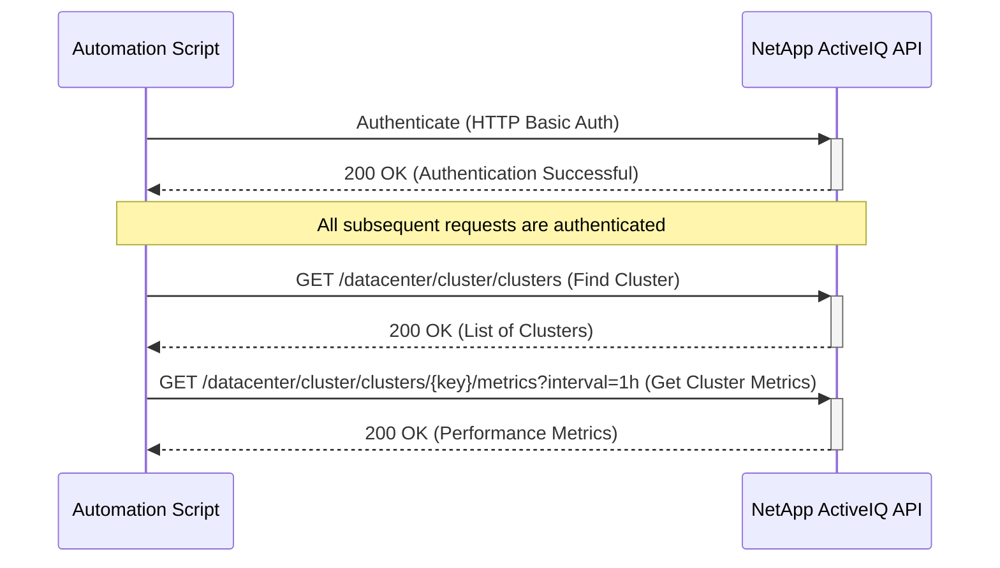

# Use Case: Monitoring Cluster Performance

This sequence diagram shows how to authenticate and then retrieve performance metrics for a specific cluster.

### Error Handling

- **Authentication Failure (401 Unauthorized)**: If authentication fails, the script should log the error and terminate. Ensure that the API credentials are correct and have the necessary permissions.
- **Cluster Not Found (404 Not Found)**: If the specified cluster is not found, the script should handle the error gracefully. This could involve checking if the cluster name or key is correct, or if the cluster has been removed from management.
- **Invalid Interval Parameter (400 Bad Request)**: If an invalid interval is specified (e.g., unsupported time range), the API will return a 400 error. The script should validate the interval parameter against supported values (1h, 12h, 1d, 2d, 3d, 15d, 1w, 1m, 2m, 3m, 6m).
- **Metrics Not Available (404 Not Found)**: If performance metrics are not available for the specified cluster and time range, the API may return a 404 error. The script should handle this by trying a different time range or notifying that metrics are not available.
- **Rate Limiting (429 Too Many Requests)**: If the script makes too many requests in a short period, the API may return a 429 error. Implement rate limiting and backoff strategies.
- **Internal Server Error (500 Internal Server Error)**: If the API experiences internal issues while retrieving metrics, the script should implement retry logic with exponential backoff.
- **Data Processing Errors**: The script should validate the returned metrics data and handle cases where the data might be incomplete or malformed.
- **Network Errors**: Implement retry logic with exponential backoff for transient network errors.
- **Monitoring Loop Failures**: If this is part of a continuous monitoring loop, implement circuit breaker patterns to prevent cascading failures.
