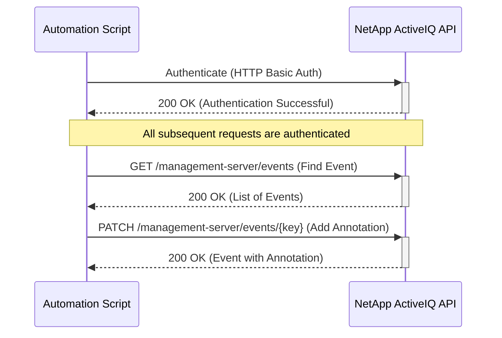
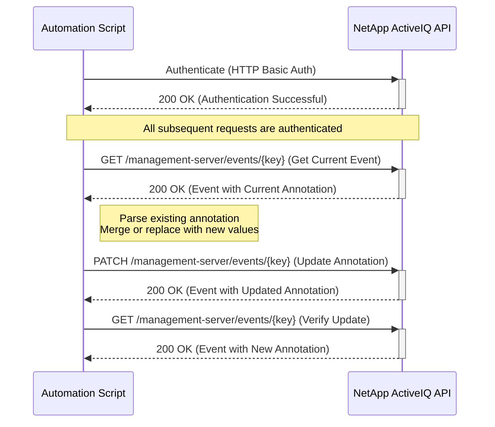

# Use Case: Annotating an Event

This sequence diagram illustrates how to authenticate, find an event, and then add or update an annotation.

## Adding a New Annotation



## Updating an Existing Annotation



## Inputs

### Authentication

- **Username**: NetApp ActiveIQ API username with event management privileges
- **Password**: Corresponding password for API authentication
- **Base URL**: NetApp ActiveIQ Unified Manager base URL (e.g., `https://aiq-um.example.com`)

### Event Identification

- **Event Key**: Unique identifier for the event to be annotated (e.g., `1234-abcd-5678-efgh`)
- **Search Criteria** (alternative to Event Key):
  - **Event Type**: Filter by event type (e.g., `volume.space.full`, `node.down`)
  - **Severity**: Filter by severity level (`critical`, `error`, `warning`, `information`)
  - **Resource Type**: Filter by resource type (`cluster`, `node`, `volume`, `svm`)
  - **Time Range**: Filter by event occurrence time

### Annotation Data

- **Annotation Text**: The metadata/annotation to attach to the event
  - **Type**: String
  - **Max Length**: 256 characters
  - **Format**: Plain text (no HTML or special formatting)
  - **Examples**:
    - `"Issue escalated to team lead."`
    - `"Resolved by increasing storage capacity."`
    - `"Scheduled maintenance - expected behavior."`
    - `"Requires immediate attention - critical system."`

### Request Parameters (for GET /management-server/events)

- **offset**: Starting index for pagination (default: 0)
- **max_records**: Maximum number of records to return (default: 20)
- **order_by**: Sort field and direction (e.g., `timestamp desc`)
- **severity**: Filter by event severity
- **state**: Filter by event state (`new`, `acknowledged`, `resolved`)
- **resource.key**: Filter by specific resource identifier

### PATCH Request Body Example

```json
{
  "annotation": "Issue escalated to team lead."
}
```

### Input Validation Requirements

- Event key must be a valid UUID format
- Annotation text must not exceed 256 characters
- Authentication credentials must have `event-admin` or `application-admin` privileges
- Target event must exist and be accessible to the authenticated user

## Output

### Successful Response Examples

#### Adding a New Annotation (200 OK)

```json
{
  "event": {
    "key": "1234-abcd-5678-efgh",
    "annotation": "Issue escalated to team lead."
  },
  "status": "Annotation added successfully."
}
```

#### Updating an Existing Annotation (200 OK)

```json
{
  "event": {
    "key": "1234-abcd-5678-efgh",
    "annotation": "Previously escalated, now assigned to triage."
  },
  "status": "Annotation updated successfully."
}
```

### Error Response Examples

#### Authentication Failure (401 Unauthorized)

```json
{
  "error": {
    "code": "401",
    "message": "Invalid credentials provided for API access.",
    "target": "authentication"
  }
}
```

#### Event Not Found (404 Not Found)

```json
{
  "error": {
    "code": "404",
    "message": "Event with key '1234-abcd-5678-efgh' not found.",
    "target": "event.key"
  }
}
```

#### Invalid Annotation Format (400 Bad Request)

```json
{
  "error": {
    "code": "400",
    "message": "Annotation must be a simple string not exceeding 256 characters.",
    "target": "annotation"
  }
}
```

#### Insufficient Permissions (403 Forbidden)

```json
{
  "error": {
    "code": "403",
    "message": "You do not have permission to modify this event.",
    "target": "authorization"
  }
}
```

#### Conflict Error (409 Conflict)

```json
{
  "error": {
    "code": "409",
    "message": "Event modification conflict. Try again later.",
    "target": "event.key"
  }
}
```

### Error Handling

- **Authentication Failure (401 Unauthorized)**: If authentication fails, the script should log the error and terminate. Ensure that the API credentials are correct and have the necessary permissions.
- **Event Not Found (404 Not Found)**: If the event to be annotated is not found, the script should handle the error gracefully. This could involve logging the error and moving on to the next event.
- **Invalid Annotation (400 Bad Request)**: If the annotation format is invalid, the API will return a 400 error. The script should ensure that the annotation is a simple string.
- **Forbidden (403 Forbidden)**: If the user doesn't have permissions to modify the event, the script should log the error and notify the administrator.
- **Conflict (409 Conflict)**: If another process is modifying the same event simultaneously, the API may return a 409 error. The script should implement retry logic with backoff to handle this.
- **Network Errors**: Implement retry logic with exponential backoff for transient network errors.
