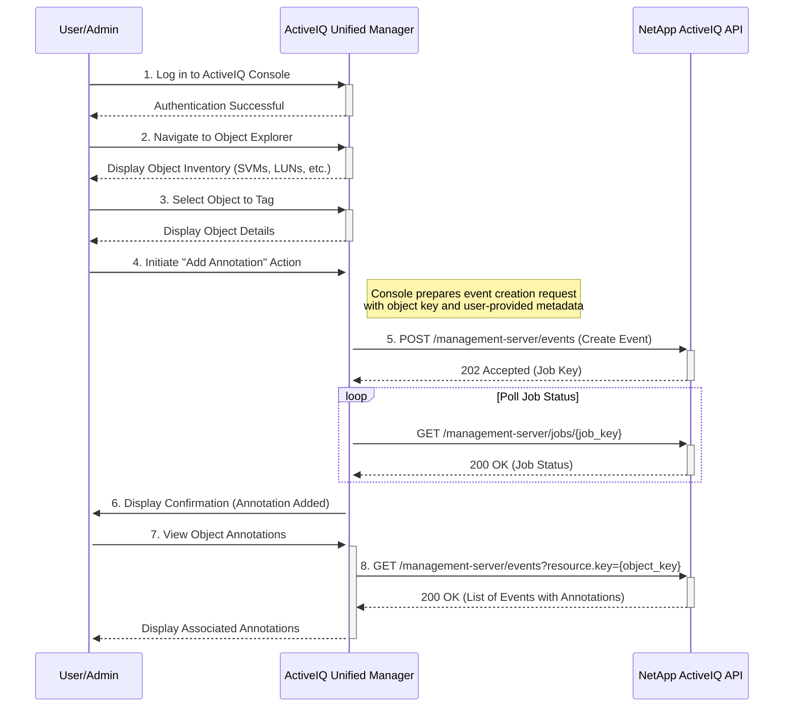

# Use Case: Attaching Metadata to any Object

This sequence diagram illustrates a generic process for attaching metadata to any object (e.g., SVM, LUN, file share) by creating an associated event with a custom annotation.



## Inputs

### Authentication

- **Username**: NetApp ActiveIQ Unified Manager username with appropriate privileges
- **Password**: Corresponding password for console/API authentication
- **Base URL**: ActiveIQ Unified Manager console URL (e.g., `https://aiq-um.example.com`)

### Object Identification

- **Object Type**: Type of object to annotate (`svm`, `lun`, `volume`, `cluster`, `node`, `fileshare`)
- **Object Key**: Unique identifier for the target object (e.g., UUID or composite key)
- **Object Name**: Human-readable name of the object (alternative identifier)
- **SVM Context**: Storage Virtual Machine context (if applicable)

### Search/Filter Criteria (for Object Explorer)

- **Resource Type Filter**: Filter objects by type
- **Status Filter**: Filter by operational status (`online`, `offline`, `degraded`)
- **Location Filter**: Filter by cluster, node, or SVM location
- **Size Range**: Filter by capacity or size ranges
- **Performance Thresholds**: Filter by performance metrics

### Metadata/Annotation Information

- **Annotation Key**: Metadata key/label (e.g., `environment`, `business_unit`, `criticality`)
- **Annotation Value**: Metadata value (e.g., `production`, `finance`, `high`)
- **Annotation Type**: Type of metadata (`tag`, `label`, `comment`, `custom_field`)
- **Multiple Tags**: Array of key-value pairs for bulk annotation

### Event Creation Parameters (for API)

- **Event Type**: Custom event type for metadata annotation
- **Severity**: Event severity level (`information`, `warning`)
- **Message**: Descriptive message for the annotation event
- **Resource Association**: Link between event and target object

### Console UI Inputs

- **Navigation Path**: Steps to reach the target object in the UI
- **Action Menu Selection**: UI menu option for adding annotations
- **Form Fields**: Input fields in the annotation dialog
- **Confirmation Actions**: UI confirmation steps

### API Request Body Example

```json
{
  "name": "metadata_annotation_event",
  "message": {
    "text": "Object tagged with metadata"
  },
  "severity": "information",
  "resource": {
    "key": "1d1c3198-fc57-11e8-99ca-00a098d38e12",
    "type": "svm"
  },
  "annotation": {
    "environment": "production",
    "business_unit": "finance",
    "criticality": "high"
  }
}
```

### Input Validation Requirements

- Object must exist and be accessible to the authenticated user
- Annotation keys must follow naming conventions (alphanumeric, underscores)
- Annotation values must not exceed character limits
- User must have appropriate permissions for object modification
- Metadata format must be valid JSON or key-value pairs

### Error Handling

- **Object Not Found (404 Not Found)**: If the target object for annotation does not exist, the console should provide a user-friendly error message.
- **Invalid Metadata (400 Bad Request)**: The console should validate the metadata format (e.g., key-value pairs) before submitting the request to the API.
- **Permission Denied (403 Forbidden)**: If the user does not have the necessary permissions to create events or annotate objects, the console should display an access denied message.
- **Job Failure**: If the event creation job fails, the console should provide detailed error information to help the user diagnose the issue.
- **Concurrent Modifications (409 Conflict)**: If the object is being modified by another user, the console should handle the conflict gracefully, perhaps by asking the user to retry.
