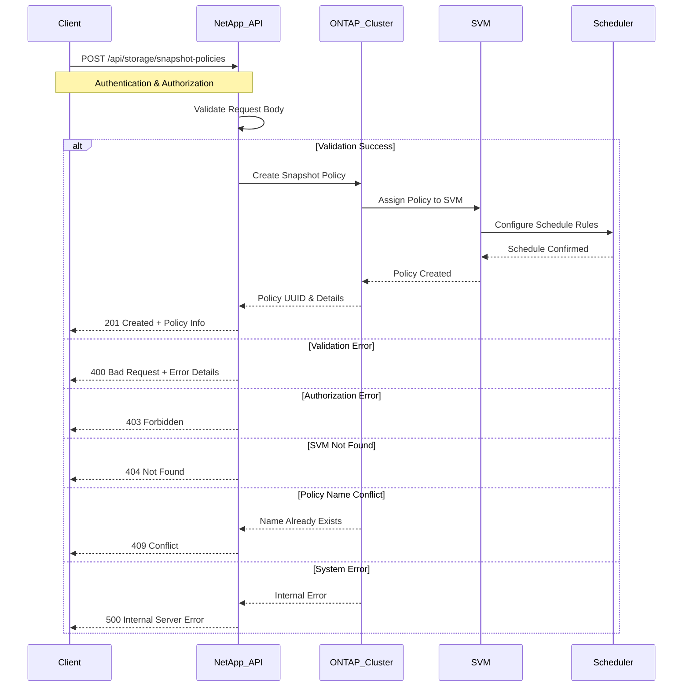

# Use Case: Create a Snapshot Policy

## Overview

This use case describes how to create a new Snapshot policy for a cluster using the NetApp API. Snapshot policies define the schedule and retention for Volume Snapshots, enabling automated data protection.

## API Endpoint

- **POST** `/api/storage/snapshot-policies`
- **Permissions**: `cluster-admin`
- **Content-Type**: `application/json`
- **Response Format**: JSON

## Sequence Diagram



## Inputs

### Authentication

- **Username**: NetApp ONTAP API username with `cluster-admin` privileges
- **Password**: Corresponding password for API authentication
- **Base URL**: NetApp ONTAP cluster management IP or FQDN (e.g., `https://cluster1.example.com`)

### Snapshot Policy Configuration

- **Policy Name**: Unique name for the snapshot policy (e.g., `Daily_and_Weekly_Snapshots`)
  - **Type**: String
  - **Requirements**: Must be unique within the SVM
  - **Format**: Alphanumeric characters, underscores, and hyphens allowed
- **Comment**: Descriptive comment explaining the policy purpose
  - **Type**: String
  - **Max Length**: 255 characters
  - **Example**: `"Policy for daily and weekly snapshots with different retention."`

### SVM Information

- **SVM Name**: Storage Virtual Machine name where the policy will be created
- **SVM UUID**: Unique identifier of the target SVM (alternative to SVM name)

### Schedule Configuration

- **Schedules Array**: One or more schedule definitions
  - **Schedule Name**: Name of existing ONTAP schedule (e.g., `daily`, `weekly`, `hourly`)
  - **Count**: Number of snapshots to retain for this schedule
  - **Prefix**: Optional prefix for snapshot names (auto-generated if not specified)
  - **SnapMirror Label**: Label for SnapMirror replication (optional)

### Schedule Examples

```json
[
  {
    "schedule": {
      "name": "daily"
    },
    "count": 5,
    "prefix": "daily",
    "snapmirror_label": "daily"
  },
  {
    "schedule": {
      "name": "weekly"
    },
    "count": 4,
    "prefix": "weekly",
    "snapmirror_label": "weekly"
  }
]
```

### Request Body

The request body must include the policy name, a comment, and at least one schedule.

```json
{
  "name": "Daily_and_Weekly_Snapshots",
  "comment": "Policy for daily and weekly snapshots with different retention.",
  "svm": {
    "name": "svm1"
  },
  "schedules": [
    {
      "schedule": {
        "name": "daily"
      },
      "count": 5
    },
    {
      "schedule": {
        "name": "weekly"
      },
      "count": 4
    }
  ]
}
```

## Example with `curl`

Here's how you can create a Snapshot policy using `curl`:

```bash
curl -X POST "https://<netapp-ip>/api/storage/snapshot-policies" \
     -H "Authorization: Basic <base64_auth_token>" \
     -H "Content-Type: application/json" \
     -d '{
       "name": "Daily_and_Weekly_Snapshots",
       "comment": "Policy for daily and weekly snapshots with different retention.",
       "svm": {
         "name": "svm1"
       },
       "schedules": [
         {
           "schedule": {
             "name": "daily"
           },
           "count": 5
         },
         {
           "schedule": {
             "name": "weekly"
           },
           "count": 4
         }
       ]
     }'
```

## Output

### Successful Response (201 Created)

```json
{
  "_links": {
    "self": {
      "href": "/api/storage/snapshot-policies/12345678-1234-1234-1234-123456789012"
    }
  },
  "uuid": "12345678-1234-1234-1234-123456789012",
  "name": "Daily_and_Weekly_Snapshots",
  "comment": "Policy for daily and weekly snapshots with different retention.",
  "enabled": true,
  "svm": {
    "_links": {
      "self": {
        "href": "/api/svm/svms/1d1c3198-fc57-11e8-99ca-00a098d38e12"
      }
    },
    "name": "svm1",
    "uuid": "1d1c3198-fc57-11e8-99ca-00a098d38e12"
  },
  "schedules": [
    {
      "schedule": {
        "name": "daily",
        "uuid": "87654321-4321-4321-4321-210987654321"
      },
      "count": 5,
      "prefix": "daily",
      "snapmirror_label": "daily"
    },
    {
      "schedule": {
        "name": "weekly",
        "uuid": "11111111-2222-3333-4444-555555555555"
      },
      "count": 4,
      "prefix": "weekly",
      "snapmirror_label": "weekly"
    }
  ],
  "copies": [
    {
      "count": 5,
      "schedule": {
        "name": "daily"
      }
    },
    {
      "count": 4,
      "schedule": {
        "name": "weekly"
      }
    }
  ]
}
```

### Error Response Examples

#### Validation Error (400 Bad Request)

```json
{
  "error": {
    "code": "400",
    "message": "Missing required field 'name' in request body.",
    "target": "name"
  }
}
```

#### Authorization Error (403 Forbidden)

```json
{
  "error": {
    "code": "403",
    "message": "Insufficient privileges to create snapshot policy. Required privilege: cluster-admin.",
    "target": "authorization"
  }
}
```

#### SVM Not Found (404 Not Found)

```json
{
  "error": {
    "code": "404",
    "message": "SVM with name 'svm1' not found.",
    "target": "svm.name"
  }
}
```

#### Policy Name Conflict (409 Conflict)

```json
{
  "error": {
    "code": "409",
    "message": "Snapshot policy with name 'Daily_and_Weekly_Snapshots' already exists in SVM 'svm1'.",
    "target": "name"
  }
}
```

#### System Error (500 Internal Server Error)

```json
{
  "error": {
    "code": "500",
    "message": "Internal server error occurred while creating snapshot policy.",
    "target": "system"
  }
}
```

## Best Practices

- Use a descriptive name for the policy.
- Add a comment to explain the policy's purpose.
- Ensure that the schedules are aligned with your RPO/RTO objectives.
