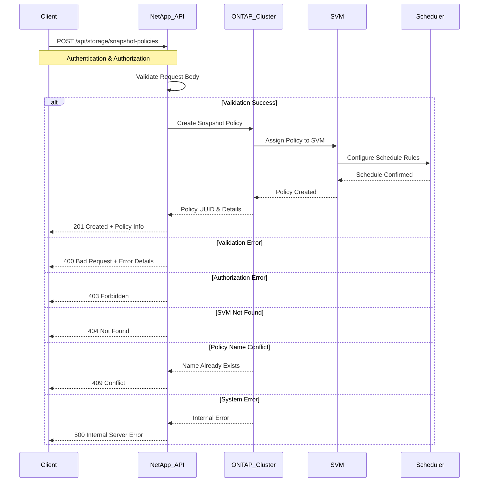

# Use Case: Create a Snapshot Policy

## Overview

This use case describes how to create a new Snapshot policy for a cluster using the NetApp API. Snapshot policies define the schedule and retention for Volume Snapshots, enabling automated data protection.

## API Endpoint

- **POST** `/api/storage/snapshot-policies`
- **Permissions**: `cluster-admin`
- **Content-Type**: `application/json`
- **Response Format**: JSON

## Sequence Diagram



## Request Body

The request body must include the policy name, a comment, and at least one schedule.

```json
{
  "name": "Daily_and_Weekly_Snapshots",
  "comment": "Policy for daily and weekly snapshots with different retention.",
  "svm": {
    "name": "svm1"
  },
  "schedules": [
    {
      "schedule": {
        "name": "daily"
      },
      "count": 5
    },
    {
      "schedule": {
        "name": "weekly"
      },
      "count": 4
    }
  ]
}
```

## Example with `curl`

Here's how you can create a Snapshot policy using `curl`:

```bash
curl -X POST "https://<netapp-ip>/api/storage/snapshot-policies" \
     -H "Authorization: Basic <base64_auth_token>" \
     -H "Content-Type: application/json" \
     -d '{
       "name": "Daily_and_Weekly_Snapshots",
       "comment": "Policy for daily and weekly snapshots with different retention.",
       "svm": {
         "name": "svm1"
       },
       "schedules": [
         {
           "schedule": {
             "name": "daily"
           },
           "count": 5
         },
         {
           "schedule": {
             "name": "weekly"
           },
           "count": 4
         }
       ]
     }'
```

## Best Practices

- Use a descriptive name for the policy.
- Add a comment to explain the policy's purpose.
- Ensure that the schedules are aligned with your RPO/RTO objectives.
