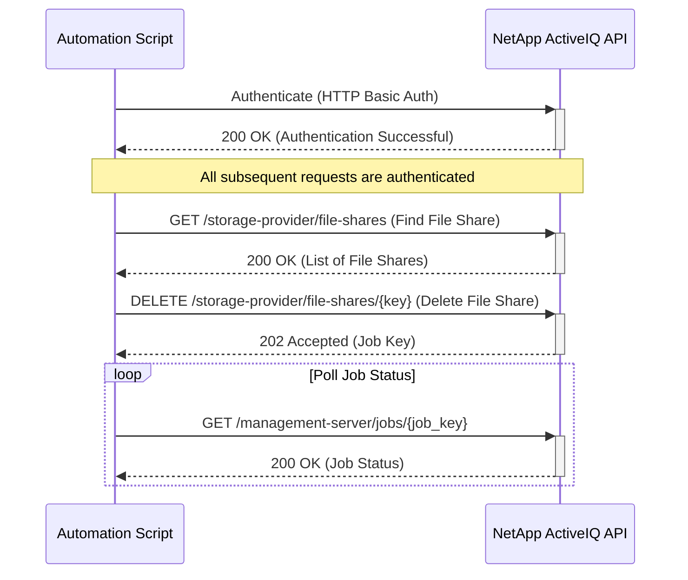

# Use Case: Decommissioning a File Share

This sequence diagram shows the process of authenticating, finding a file share, and then deleting it.

### Error Handling

- **Authentication Failure (401 Unauthorized)**: If authentication fails, the script should log the error and terminate. Ensure that the API credentials are correct and have the necessary permissions.
- **File Share Not Found (404 Not Found)**: If the file share to be deleted is not found, the script should handle the error appropriately. This could mean the file share has already been deleted, which may be acceptable depending on the use case.
- **Forbidden (403 Forbidden)**: If the user doesn't have permissions to delete the file share, the script should log the error and notify the administrator.
- **File Share In Use (400 Bad Request)**: If the file share is currently in use (e.g., has active connections), the API may return a 400 error. The script should handle this by either forcing the deletion (if appropriate) or notifying the user to disconnect clients first.
- **Job Failure**: The deletion job may fail for various reasons (e.g., dependencies, system constraints). The script should monitor the job status and provide detailed error information if the job fails.
- **Network Errors**: Implement retry logic with exponential backoff for transient network errors.
