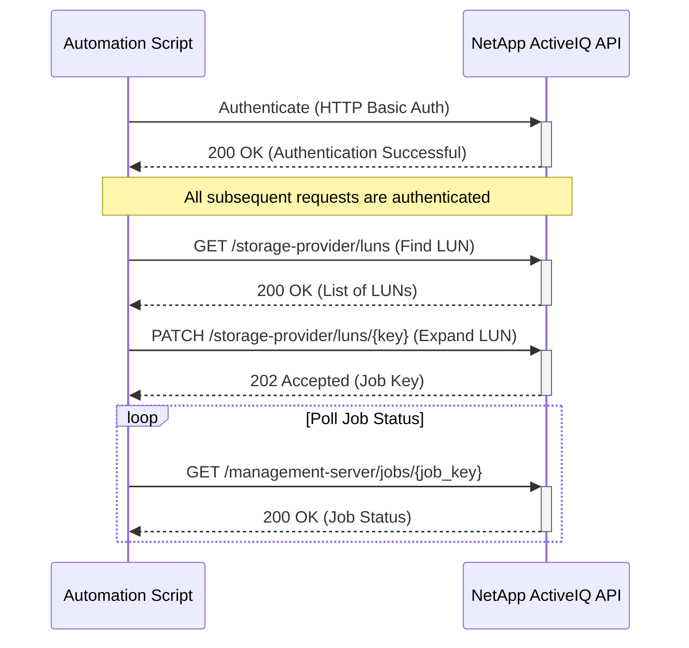

# Use Case: Expanding a LUN

This sequence diagram illustrates how to authenticate, find a LUN, and then expand its size.



## Inputs

### Authentication

- **Username**: NetApp ActiveIQ API username with `storage-admin` or `lun-admin` privileges
- **Password**: Corresponding password for API authentication
- **Base URL**: NetApp ActiveIQ Unified Manager base URL (e.g., `https://aiq-um.example.com`)

### LUN Identification

- **LUN Key**: Unique composite key for the LUN (e.g., `cbd1757b-0580-11e8-bd9d-00a098d39e12:type=lun,uuid=d208cc7d-80a3-4755-93d4-5db2c38f55a6`)
- **LUN Name**: Human-readable name of the LUN (e.g., `lun001`)
- **LUN UUID**: UUID component of the LUN identifier
- **SVM Context**: Storage Virtual Machine where the LUN resides

### Search/Filter Parameters (for GET /storage-provider/luns)

- **name**: Filter LUNs by name
- **svm.name**: Filter by SVM name
- **svm.uuid**: Filter by SVM UUID
- **status.state**: Filter by LUN state (`online`, `offline`, `mixed`)
- **status.mapped**: Filter by mapping status (true/false)
- **max_records**: Maximum number of records to return (default: 20)
- **order_by**: Sort results by specified field (e.g., `name`, `size`, `creation_time`)

### Expansion Configuration

- **New Size**: Target size for the expanded LUN
  - **Type**: Integer (bytes)
  - **Requirements**: Must be larger than current size
  - **Examples**:
    - 42949672960 (40GB)
    - 107374182400 (100GB)
    - 1073741824000 (1TB)
- **Size Unit**: Optional unit specification (if using human-readable format)
  - **Options**: `bytes`, `KB`, `MB`, `GB`, `TB`

### PATCH Request Body

```json
{
  "space": {
    "size": 42949672960
  }
}
```

### Alternative Request Body (with validation)

```json
{
  "space": {
    "size": 42949672960
  },
  "validate_only": false,
  "force": false
}
```

### Input Validation Requirements

- LUN must exist and be accessible
- New size must be greater than current size
- Sufficient space must be available in the containing aggregate
- LUN must be in an online state (typically)
- User must have appropriate privileges (`storage-admin` or `lun-admin`)
- Host connectivity should be considered for post-expansion tasks

### Pre-Expansion Checks

- **Current LUN Size**: Verify current size before expansion
- **Available Space**: Check aggregate free space
- **LUN State**: Ensure LUN is online and accessible
- **Host Mapping**: Verify LUN mapping to hosts
- **SnapShot Impact**: Consider impact on existing snapshots

## Output

### Successful Response Examples

#### 1. Authentication Success (200 OK)

```json
{
  "message": "Authentication successful"
}
```

#### 2. LUN Discovery (200 OK)

```json
{
  "_links": {
    "self": {
      "href": "/api/storage-provider/luns"
    }
  },
  "num_records": 1,
  "records": [
    {
      "key": "cbd1757b-0580-11e8-bd9d-00a098d39e12:type=lun,uuid=d208cc7d-80a3-4755-93d4-5db2c38f55a6",
      "name": "lun001",
      "uuid": "d208cc7d-80a3-4755-93d4-5db2c38f55a6",
      "size": 21474836480,
      "space": {
        "size": 21474836480,
        "used": 10737418240
      },
      "svm": {
        "name": "svm1",
        "uuid": "1d1c3198-fc57-11e8-99ca-00a098d38e12"
      },
      "status": {
        "state": "online",
        "mapped": true
      }
    }
  ],
  "total_records": 1
}
```

#### 3. LUN Expansion Job (202 Accepted)

```json
{
  "job": {
    "_links": {
      "self": {
        "href": "/api/management-server/jobs/78b542774a960362:-4405f3a8:16e686b7083:-7abc"
      }
    },
    "key": "78b542774a960362:-4405f3a8:16e686b7083:-7abc"
  }
}
```

#### 4. Job Status Polling (200 OK)

```json
{
  "key": "78b542774a960362:-4405f3a8:16e686b7083:-7abc",
  "name": "Expand LUN",
  "description": "Expanding LUN lun001 from 20GB to 40GB",
  "state": "success",
  "status": "normal",
  "progress": 100,
  "submit_time": "2024-01-15T14:20:00.000Z",
  "start_time": "2024-01-15T14:20:05.000Z",
  "end_time": "2024-01-15T14:21:30.000Z",
  "task_reports": [
    {
      "name": "expand_lun_task",
      "description": "Successfully expanded LUN to new size",
      "state": "completed",
      "status": "normal"
    }
  ]
}
```

### Error Response Examples

#### Authentication Failure (401 Unauthorized)

```json
{
  "error": {
    "code": "401",
    "message": "Authentication failed. Invalid credentials.",
    "target": "authentication"
  }
}
```

#### LUN Not Found (404 Not Found)

```json
{
  "error": {
    "code": "404",
    "message": "LUN with key 'cbd1757b-0580-11e8-bd9d-00a098d39e12:type=lun,uuid=d208cc7d-80a3-4755-93d4-5db2c38f55a6' not found.",
    "target": "lun.key"
  }
}
```

#### Insufficient Space (400 Bad Request)

```json
{
  "error": {
    "code": "400",
    "message": "Insufficient space in aggregate 'aggr1'. Available: 50GB, Required: 100GB.",
    "target": "size"
  }
}
```

#### Invalid Size (400 Bad Request)

```json
{
  "error": {
    "code": "400",
    "message": "Invalid size specified. New size (10GB) must be greater than current size (20GB).",
    "target": "size"
  }
}
```

#### Job Failure Example

```json
{
  "key": "78b542774a960362:-4405f3a8:16e686b7083:-7abc",
  "name": "Expand LUN",
  "description": "Expanding LUN lun001 from 20GB to 40GB",
  "state": "failure",
  "status": "error",
  "progress": 0,
  "submit_time": "2024-01-15T14:20:00.000Z",
  "start_time": "2024-01-15T14:20:05.000Z",
  "end_time": "2024-01-15T14:20:15.000Z",
  "task_reports": [
    {
      "name": "expand_lun_task",
      "description": "Failed to expand LUN",
      "state": "failure",
      "status": "error",
      "failure_reason": "Volume containing LUN is offline. Bring volume online before expanding LUN."
    }
  ]
}
```

### Error Handling

- **Authentication Failure (401 Unauthorized)**: If authentication fails, the script should log the error and terminate. Ensure that the API credentials are correct and have the necessary permissions.
- **LUN Not Found (404 Not Found)**: If the LUN to be expanded is not found, the script should handle the error gracefully. This could involve retrying with different search criteria or logging the error.
- **Insufficient Space (400 Bad Request)**: If there isn't enough free space in the containing aggregate to expand the LUN, the API will return a 400 error. The script should handle this by either finding additional space or notifying the administrator.
- **Invalid Size (400 Bad Request)**: If the requested new size is invalid (e.g., smaller than the current size, exceeds maximum limits), the API will return a 400 error with details. The script should validate the size before making the request.
- **LUN Online/Offline State**: If the LUN is in an inappropriate state for expansion (e.g., offline), the operation may fail. The script should check the LUN state and potentially bring it online before attempting expansion.
- **Job Failure**: The expansion job may fail for various reasons (e.g., storage constraints, system issues). The script should monitor the job status and provide detailed error information if the job fails.
- **Host Connectivity Issues**: After expanding a LUN, the host may need to rescan or extend the filesystem. While this is outside the scope of the API, the script should provide guidance or automation for these post-expansion steps.
- **Network Errors**: Implement retry logic with exponential backoff for transient network errors.
