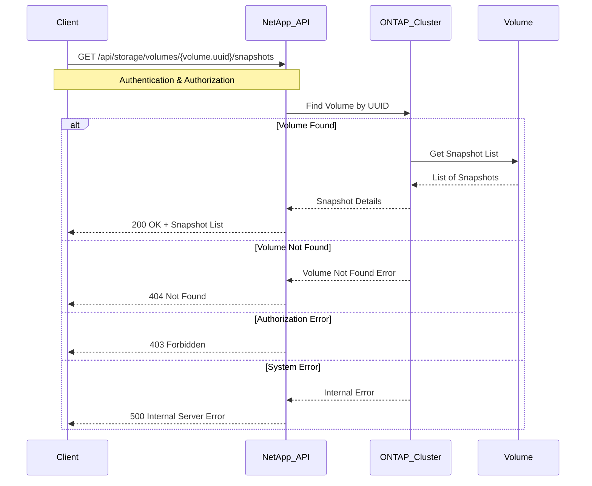

# Use Case: List Available Snapshots for a Volume

## Overview

This use case describes how to retrieve a list of all available Snapshot copies for a specific volume using the NetApp API. This is useful for backup verification, restore operations, and monitoring.

## API Endpoint

-   **GET** `/api/storage/volumes/{volume.uuid}/snapshots`
-   **Permissions**: `cluster-admin` or `volume-admin`
-   **Response Format**: JSON

## Sequence Diagram



## Example `curl` Request

Here's how you can list all snapshots for a given volume UUID using `curl`:

```bash
# Replace {volume.uuid} with the actual UUID of the volume
VOLUME_UUID="a1b2c3d4-e5f6-a7b8-c9d0-e1f2a3b4c5d6"

curl -X GET "https://<netapp-ip>/api/storage/volumes/${VOLUME_UUID}/snapshots" \
     -H "Authorization: Basic <base64_auth_token>" \
     -H "Content-Type: application/json"
```

## Example JSON Response

The API returns a list of snapshot objects with their details.

```json
{
  "records": [
    {
      "svm": {
        "uuid": "f1g2h3i4-j5k6-l7m8-n9o0-p1q2r3s4t5u6",
        "name": "svm1"
      },
      "uuid": "a1b2c3d4-1111-2222-3333-e1f2a3b4c5d6",
      "name": "daily.2025-07-30_0010",
      "create_time": "2025-07-30T00:10:00Z"
    },
    {
      "svm": {
        "uuid": "f1g2h3i4-j5k6-l7m8-n9o0-p1q2r3s4t5u6",
        "name": "svm1"
      },
      "uuid": "a1b2c3d4-4444-5555-6666-e1f2a3b4c5d6",
      "name": "weekly.2025-07-28_0200",
      "create_time": "2025-07-28T02:00:00Z"
    }
  ],
  "num_records": 2
}
```

## Advanced Query Parameters

You can use various query parameters to filter and paginate the results:

```bash
# Get snapshots with pagination
curl -X GET "https://<netapp-ip>/api/storage/volumes/${VOLUME_UUID}/snapshots?max_records=10&order_by=create_time desc" \
     -H "Authorization: Basic <base64_auth_token>" \
     -H "Content-Type: application/json"

# Filter snapshots by name pattern
curl -X GET "https://<netapp-ip>/api/storage/volumes/${VOLUME_UUID}/snapshots?name=daily*" \
     -H "Authorization: Basic <base64_auth_token>" \
     -H "Content-Type: application/json"

# Get snapshots created after a specific date
curl -X GET "https://<netapp-ip>/api/storage/volumes/${VOLUME_UUID}/snapshots?create_time=>2025-07-01" \
     -H "Authorization: Basic <base64_auth_token>" \
     -H "Content-Type: application/json"
```

## Complete Script Example

Here's a comprehensive bash script that finds a volume by name and lists its snapshots:

```bash
#!/bin/bash

NETAPP_IP="your-netapp-cluster-ip"
AUTH_TOKEN="your-base64-auth-token"
VOLUME_NAME="volume_prod_data"

# Function to handle API errors
handle_error() {
    local response="$1"
    local http_code="$2"
    
    case $http_code in
        404)
            echo "Error: Volume or resource not found"
            echo "Response: $response"
            exit 1
            ;;
        403)
            echo "Error: Insufficient permissions"
            echo "Response: $response"
            exit 1
            ;;
        500)
            echo "Error: Internal server error"
            echo "Response: $response"
            exit 1
            ;;
        *)
            if [ $http_code -ge 400 ]; then
                echo "Error: HTTP $http_code"
                echo "Response: $response"
                exit 1
            fi
            ;;
    esac
}

# Get volume UUID
echo "Looking up volume: $VOLUME_NAME"
volume_response=$(curl -s -w "\n%{http_code}" -X GET "https://${NETAPP_IP}/api/storage/volumes?name=${VOLUME_NAME}" \
  -H "Authorization: Basic ${AUTH_TOKEN}" \
  -H "Content-Type: application/json")

http_code=$(echo "$volume_response" | tail -n1)
response_body=$(echo "$volume_response" | head -n -1)

handle_error "$response_body" "$http_code"

VOLUME_UUID=$(echo "$response_body" | jq -r '.records[0].uuid')

if [ "$VOLUME_UUID" = "null" ] || [ -z "$VOLUME_UUID" ]; then
    echo "Volume $VOLUME_NAME not found"
    exit 1
fi

echo "Found volume UUID: $VOLUME_UUID"

# List snapshots for the volume
echo "Retrieving snapshots for volume: $VOLUME_NAME"
snapshot_response=$(curl -s -w "\n%{http_code}" -X GET "https://${NETAPP_IP}/api/storage/volumes/${VOLUME_UUID}/snapshots?order_by=create_time desc" \
  -H "Authorization: Basic ${AUTH_TOKEN}" \
  -H "Content-Type: application/json")

http_code=$(echo "$snapshot_response" | tail -n1)
response_body=$(echo "$snapshot_response" | head -n -1)

handle_error "$response_body" "$http_code"

# Parse and display snapshots
num_records=$(echo "$response_body" | jq -r '.num_records')
echo "Found $num_records snapshots for volume $VOLUME_NAME:"
echo

# Display snapshot details in a formatted table
echo "Snapshot Name                    | Created                | UUID"
echo "--------------------------------|------------------------|--------------------------------------"

echo "$response_body" | jq -r '.records[] | "\(.name) | \(.create_time) | \(.uuid)"' | \
while IFS='|' read -r name created uuid; do
    printf "%-30s | %-20s | %s\n" "$name" "$created" "$uuid"
done

echo
echo "Total snapshots: $num_records"
```

## Response Fields Explanation

| Field | Description | Example |
|-------|-------------|----------|
| `uuid` | Unique identifier for the snapshot | `a1b2c3d4-1111-2222-3333-e1f2a3b4c5d6` |
| `name` | Snapshot name (usually includes timestamp) | `daily.2025-07-30_0010` |
| `create_time` | ISO 8601 timestamp of snapshot creation | `2025-07-30T00:10:00Z` |
| `svm.uuid` | UUID of the Storage Virtual Machine | `f1g2h3i4-j5k6-l7m8-n9o0-p1q2r3s4t5u6` |
| `svm.name` | Name of the Storage Virtual Machine | `svm1` |
| `size` | Size of the snapshot in bytes | `1073741824` |
| `state` | Current state of the snapshot | `valid` |

## Best Practices

-   **Use Volume UUID**: Always use the volume UUID to avoid ambiguity with volume names
-   **Implement Pagination**: For volumes with many snapshots, use `max_records` and `next_href` for pagination
-   **Filter Appropriately**: Use name patterns and date filters to limit results to relevant snapshots
-   **Handle Errors Gracefully**: Implement proper error handling for network issues and API errors
-   **Sort Results**: Use `order_by` parameter to sort by creation time or name
-   **Cache Volume UUIDs**: Store volume UUIDs locally to avoid repeated lookups

## Error Handling

Common error scenarios when listing snapshots:

-   **404 Not Found**: The specified `volume.uuid` does not exist or has been deleted
-   **403 Forbidden**: Insufficient permissions to access the volume or its snapshots
-   **400 Bad Request**: Invalid query parameters or malformed UUID
-   **500 Internal Server Error**: An unexpected error occurred on the ONTAP cluster
-   **503 Service Unavailable**: The API service is temporarily unavailable

Always check the API response for error details and implement appropriate retry logic for transient errors.
