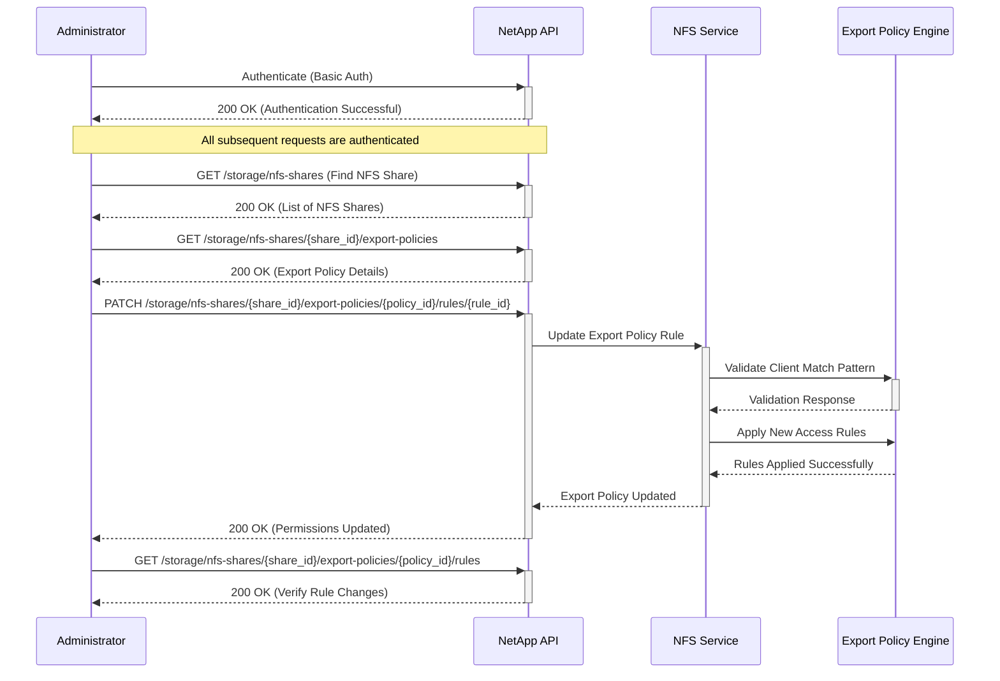

# Use Case: Manage Rights on NFS Share

This use case describes how to manage access rights on an NFS share using the NetApp API. It includes adding, modifying, and removing export policy rules to control access to file shares.

## Overview

By managing NFS share permissions, administrators can control which hosts have access to file shares and what type of access they have (read-only, read/write).

## API Endpoint

- **PATCH** `/api/storage/nfs-shares/{share_id}/export-policies/{policy_id}/rules/{rule_id}`
- **Permissions**: `storage-admin`

## Sequence Diagram



## Inputs

### Authentication

- **Username**: NetApp API username with NFS management privileges
- **Password**: Corresponding password for API authentication
- **Base URL**: NetApp Unified Manager URL (e.g., `https://netapp.example.com`)

### NFS Share Identification

- **Share ID**: Unique identifier of the NFS share
- **Policy ID**: Identifier of the export policy applied to the share
- **Rule ID**: Unique identifier for the rule being modified

### Permissions Configuration

- **Access Type**: Type of access to grant (`read-only`, `read-write`)
- **Client Match**: Clients allowed access (CIDR notation)
- **Permissions Example**:
  ```json
  {
    "client_match": "192.168.1.0/24",
    "access": "read-write"
  }
  ```

### Input Validation Requirements

- Ensure all identifiers are valid and correspond to existing resources
- User must have storage admin privileges

## Example with `curl`

```bash
curl -X PATCH "https://netapp.example.com/api/storage/nfs-shares/{share_id}/export-policies/{policy_id}/rules/{rule_id}" \
     -H "Authorization: Basic <base64_auth_token>" \
     -H "Content-Type: application/json" \
     -d '{
       "client_match": "192.168.1.0/24",
       "access": "read-write"
     }'
```

## Output

### Successful Response Example

```json
{
  "status": "Success",
  "message": "Export policy rule updated successfully."
}
```

### Error Response Examples

#### Authentication Failure (401 Unauthorized)

```json
{
  "error": {
    "code": "401",
    "message": "Invalid credentials provided.",
    "target": "authentication"
  }
}
```

#### Invalid Authorization (403 Forbidden)

```json
{
  "error": {
    "code": "403",
    "message": "Insufficient permissions to modify NFS share access rights.",
    "target": "authorization"
  }
}
```

#### Rule Not Found (404 Not Found)

```json
{
  "error": {
    "code": "404",
    "message": "Export policy rule not found.",
    "target": "rule_id"
  }
}
```

## Best Practices

- Regularly review access rules to ensure they meet security policies
- Use CIDR notation for flexibility in defining client access
- Apply the principle of least privilege by default
- Document all permission changes for audit purposes
