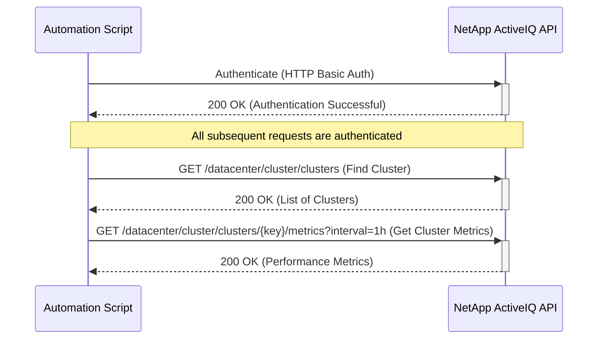

# Use Case: Monitoring Cluster Performance

This sequence diagram shows how to authenticate and then retrieve performance metrics for a specific cluster.



## Inputs

### Authentication

- **Username**: NetApp ActiveIQ API username with cluster monitoring privileges
- **Password**: Corresponding password for API authentication
- **Base URL**: NetApp ActiveIQ Unified Manager base URL (e.g., `https://aiq-um.example.com`)

### Cluster Identification

- **Cluster Key**: Unique key for the cluster (e.g., `4ea7a442-86d1-11e0-ae1c-123478563412:type=cluster,uuid=4ea7a442-86d1-11e0-ae1c-123478563412`)
- **Cluster Name**: Human-readable name of the cluster (e.g., `cluster1`)
- **Cluster UUID**: UUID component of the cluster identifier

### Performance Metrics Parameters

- **Interval**: Time interval for metric aggregation
  - **Supported Values**: `1h`, `12h`, `1d`, `2d`, `3d`, `15d`, `1w`, `1m`, `2m`, `3m`, `6m`
  - **Default**: `1h`
  - **Example**: `interval=1h`
- **Time Range**: Optional time range for historical data
  - **Start Time**: ISO 8601 timestamp (e.g., `2024-01-15T00:00:00Z`)
  - **End Time**: ISO 8601 timestamp (e.g., `2024-01-15T23:59:59Z`)

### Search/Filter Parameters (for GET /datacenter/cluster/clusters)

- **name**: Filter clusters by name
- **status.state**: Filter by cluster state (`up`, `down`, `partial`)
- **max_records**: Maximum number of records to return (default: 20)
- **order_by**: Sort results by specified field

### Metrics Collection Configuration

- **Metric Types**: Specify which metrics to collect
  - **IOPS**: Input/Output operations per second (read, write, total)
  - **Latency**: Response time metrics (read, write, total, other)
  - **Throughput**: Data transfer rates (read, write, total)
  - **CPU Utilization**: Processor usage statistics
  - **Memory Utilization**: Memory usage statistics
- **Statistical Aggregation**: Choose aggregation methods
  - **Average**: Mean values over the interval
  - **Maximum**: Peak values during the interval
  - **Minimum**: Lowest values during the interval
  - **95th Percentile**: 95th percentile values

### Query Examples

```bash
# Basic cluster metrics
GET /api/datacenter/cluster/clusters/{key}/metrics?interval=1h

# Historical metrics with specific time range
GET /api/datacenter/cluster/clusters/{key}/metrics?interval=1d&start_time=2024-01-15T00:00:00Z&end_time=2024-01-16T00:00:00Z

# Extended interval for trend analysis
GET /api/datacenter/cluster/clusters/{key}/metrics?interval=1w
```

### Input Validation Requirements

- Cluster must exist and be accessible to the authenticated user
- Interval parameter must be one of the supported values
- Time range parameters must be valid ISO 8601 timestamps
- User must have appropriate permissions for cluster monitoring
- API endpoints must be reachable and responsive

## Output

### Successful Response Examples

#### 1. Authentication Success (200 OK)

```json
{
  "message": "Authentication successful"
}
```

#### 2. Cluster Discovery (200 OK)

```json
{
  "_links": {
    "self": {
      "href": "/api/datacenter/cluster/clusters"
    }
  },
  "num_records": 1,
  "records": [
    {
      "key": "4ea7a442-86d1-11e0-ae1c-123478563412:type=cluster,uuid=4ea7a442-86d1-11e0-ae1c-123478563412",
      "name": "cluster1",
      "uuid": "4ea7a442-86d1-11e0-ae1c-123478563412",
      "version": {
        "full": "NetApp Release 9.8P1",
        "generation": 9,
        "major": 8,
        "minor": 0
      },
      "status": {
        "state": "up"
      }
    }
  ],
  "total_records": 1
}
```

#### 3. Cluster Performance Metrics (200 OK)

```json
{
  "_links": {
    "self": {
      "href": "/api/datacenter/cluster/clusters/4ea7a442-86d1-11e0-ae1c-123478563412:type=cluster,uuid=4ea7a442-86d1-11e0-ae1c-123478563412/metrics?interval=1h"
    }
  },
  "cluster": {
    "key": "4ea7a442-86d1-11e0-ae1c-123478563412:type=cluster,uuid=4ea7a442-86d1-11e0-ae1c-123478563412",
    "name": "cluster1",
    "uuid": "4ea7a442-86d1-11e0-ae1c-123478563412"
  },
  "interval": "1h",
  "timestamp": "2024-01-15T15:00:00Z",
  "duration": "PT1H",
  "metrics": {
    "iops": {
      "read": {
        "avg": 1250.5,
        "max": 2100.0,
        "min": 800.0,
        "95th_percentile": 1850.0
      },
      "write": {
        "avg": 650.3,
        "max": 1200.0,
        "min": 300.0,
        "95th_percentile": 950.0
      },
      "total": {
        "avg": 1900.8,
        "max": 3300.0,
        "min": 1100.0,
        "95th_percentile": 2800.0
      }
    },
    "latency": {
      "read": 2.5,
      "write": 3.2,
      "total": 2.8,
      "other": 1.1
    },
    "throughput": {
      "read": {
        "avg": 125.7,
        "max": 200.0,
        "min": 80.0,
        "95th_percentile": 175.0
      },
      "write": {
        "avg": 85.4,
        "max": 150.0,
        "min": 40.0,
        "95th_percentile": 120.0
      },
      "total": {
        "avg": 211.1,
        "max": 350.0,
        "min": 120.0,
        "95th_percentile": 295.0
      }
    },
    "cpu_utilization": {
      "avg": 45.2,
      "max": 78.5,
      "min": 20.1,
      "95th_percentile": 65.8
    },
    "memory_utilization": {
      "avg": 62.1,
      "max": 85.3,
      "min": 45.7,
      "95th_percentile": 78.9
    }
  }
}
```

### Error Response Examples

#### Authentication Failure (401 Unauthorized)

```json
{
  "error": {
    "code": "401",
    "message": "Authentication failed. Invalid credentials.",
    "target": "authentication"
  }
}
```

#### Cluster Not Found (404 Not Found)

```json
{
  "error": {
    "code": "404",
    "message": "Cluster with key '4ea7a442-86d1-11e0-ae1c-123478563412:type=cluster,uuid=4ea7a442-86d1-11e0-ae1c-123478563412' not found.",
    "target": "cluster.key"
  }
}
```

#### Invalid Interval Parameter (400 Bad Request)

```json
{
  "error": {
    "code": "400",
    "message": "Invalid interval '30m'. Supported intervals: 1h, 12h, 1d, 2d, 3d, 15d, 1w, 1m, 2m, 3m, 6m.",
    "target": "interval"
  }
}
```

#### Metrics Not Available (404 Not Found)

```json
{
  "error": {
    "code": "404",
    "message": "Performance metrics not available for the specified cluster and time range.",
    "target": "metrics"
  }
}
```

#### Rate Limiting (429 Too Many Requests)

```json
{
  "error": {
    "code": "429",
    "message": "Too many requests. Rate limit exceeded. Please retry after 60 seconds.",
    "target": "rate_limit"
  }
}
```

### Error Handling

- **Authentication Failure (401 Unauthorized)**: If authentication fails, the script should log the error and terminate. Ensure that the API credentials are correct and have the necessary permissions.
- **Cluster Not Found (404 Not Found)**: If the specified cluster is not found, the script should handle the error gracefully. This could involve checking if the cluster name or key is correct, or if the cluster has been removed from management.
- **Invalid Interval Parameter (400 Bad Request)**: If an invalid interval is specified (e.g., unsupported time range), the API will return a 400 error. The script should validate the interval parameter against supported values (1h, 12h, 1d, 2d, 3d, 15d, 1w, 1m, 2m, 3m, 6m).
- **Metrics Not Available (404 Not Found)**: If performance metrics are not available for the specified cluster and time range, the API may return a 404 error. The script should handle this by trying a different time range or notifying that metrics are not available.
- **Rate Limiting (429 Too Many Requests)**: If the script makes too many requests in a short period, the API may return a 429 error. Implement rate limiting and backoff strategies.
- **Internal Server Error (500 Internal Server Error)**: If the API experiences internal issues while retrieving metrics, the script should implement retry logic with exponential backoff.
- **Data Processing Errors**: The script should validate the returned metrics data and handle cases where the data might be incomplete or malformed.
- **Network Errors**: Implement retry logic with exponential backoff for transient network errors.
- **Monitoring Loop Failures**: If this is part of a continuous monitoring loop, implement circuit breaker patterns to prevent cascading failures.
