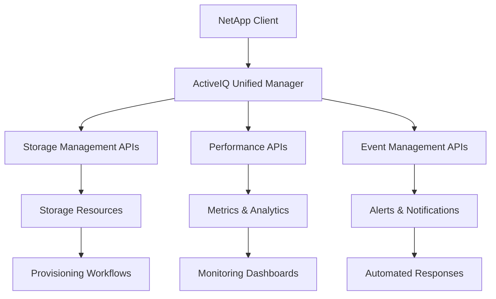

# NetApp API Use Cases Overview

This section contains use cases for **standard NetApp ActiveIQ API operations**. These use cases cover core storage management, monitoring, and administrative tasks that form the foundation of NetApp automation workflows.

## 🎯 Purpose

NetApp API use cases provide structured approaches to:

- **Manage storage resources** (volumes, LUNs, file shares)
- **Monitor performance** and capacity metrics
- **Automate provisioning** and decommissioning
- **Implement backup** and recovery procedures
- **Maintain infrastructure** health and compliance

## 📚 Available Use Cases

### 💾 Storage Provisioning

| Use Case                                                   | Description                          | Key Features                            |
| ---------------------------------------------------------- | ------------------------------------ | --------------------------------------- |
| [**Provision NFS File Share**](provision_nfs_fileshare.md) | Create and configure NFS file shares | NFS setup, export policies, permissions |
| [**Expand a LUN**](expand_lun.md)                          | Increase LUN capacity                | Capacity expansion, space allocation    |

### 📸 Snapshot Management

| Use Case                                                                  | Description                                 | Key Features                                        |
| ------------------------------------------------------------------------- | ------------------------------------------- | --------------------------------------------------- |
| [**Create Snapshot Policy**](create_snapshot_policy.md)                   | Create automated snapshot policies          | Schedule configuration, retention rules, automation |
| [**Apply Snapshot Policy to Volume**](apply_snapshot_policy_to_volume.md) | Apply existing snapshot policies to volumes | Policy assignment, volume protection, automation    |
| [**List Available Snapshots**](list_available_snapshots.md)               | Retrieve list of snapshots for a volume    | Snapshot discovery, filtering, pagination, monitoring |

### 🗑️ Resource Management

| Use Case                                                 | Description               | Key Features                          |
| -------------------------------------------------------- | ------------------------- | ------------------------------------- |
| [**Decommission File Share**](decommission_fileshare.md) | Safely remove file shares | Cleanup procedures, dependency checks |

### 📊 Monitoring & Analytics

| Use Case                                                          | Description                      | Key Features                     |
| ----------------------------------------------------------------- | -------------------------------- | -------------------------------- |
| [**Monitor Cluster Performance**](monitor_cluster_performance.md) | Track cluster metrics and health | Performance monitoring, alerting |

### 🏷️ Tagging & Annotation

| Use Case                                                     | Description                                  | Key Features                         |
| ------------------------------------------------------------ | -------------------------------------------- | ------------------------------------ |
| [**Annotating an Event**](annotate_event.md)                 | Add or update annotations on existing events | Event modification, metadata updates |
| [**SVM Event Annotation**](tag_svm_with_event_annotation.md) | Tag SVMs by creating annotated events        | SVM identification, custom tagging   |
| [**Volume Name Tagging**](tag_volume_with_nametag.md)        | Use name tags for consistent volume naming   | Naming conventions, volume creation  |

### 📎 Metadata Management

| Use Case                                                        | Description                            | Key Features                             |
| --------------------------------------------------------------- | -------------------------------------- | ---------------------------------------- |
| [**Generic Metadata Attachment**](attach_metadata_to_object.md) | Attach metadata to any ActiveIQ object | Universal tagging, object categorization |
| [**Search by Metadata**](search_object_by_metadata.md)          | Find objects using metadata queries    | Advanced filtering, bulk operations      |

### 🏗️ Infrastructure Operations

| Use Case                                                               | Description                            | Key Features                            |
| ---------------------------------------------------------------------- | -------------------------------------- | --------------------------------------- |
| [**Infrastructure Management**](../other/infrastructure-management.md) | Manage infrastructure components       | Hardware monitoring, system maintenance |
| [**Storage Monitoring**](../other/storage-monitoring.md)               | Monitor storage utilization and health | Capacity tracking, health checks        |

## 🔧 Common API Integration Patterns

### 1. CRUD Operations

- **Create**: Provision new storage resources
- **Read**: Retrieve configuration and status information
- **Update**: Modify existing resource settings
- **Delete**: Safely decommission resources

### 2. Monitoring Workflows

- Collect performance metrics
- Analyze trends and patterns
- Generate alerts and notifications
- Create reports and dashboards

### 3. Automation Sequences

- Multi-step provisioning workflows
- Automated scaling operations
- Scheduled maintenance tasks
- Compliance validation procedures

## 🛠️ Technical Architecture



## 📈 Performance Metrics Examples

### Cluster Performance

```json
{
  "cluster_utilization": "75%",
  "iops": 15000,
  "throughput_mbps": 1200,
  "latency_ms": 2.5,
  "cpu_usage": "45%",
  "memory_usage": "68%"
}
```

### Volume Analytics

```json
{
  "volume_size_gb": 1024,
  "used_capacity_gb": 768,
  "available_capacity_gb": 256,
  "utilization_percent": 75,
  "snapshot_count": 12,
  "snapshot_size_gb": 64
}
```

## 🚀 Getting Started

1. **Identify Your Needs**: Determine which storage operations you need to automate
2. **Review Use Cases**: Study the relevant use case documentation
3. **Set Up Authentication**: Configure API access credentials
4. **Start with Read Operations**: Begin with monitoring and discovery
5. **Implement Write Operations**: Add provisioning and management capabilities
6. **Add Error Handling**: Implement robust error handling and logging

## 📋 Common Error Scenarios

### Authentication Issues

- Invalid credentials (401 Unauthorized)
- Insufficient permissions (403 Forbidden)
- Token expiration

### Resource Conflicts

- Naming conflicts (409 Conflict)
- Resource not found (404 Not Found)
- Capacity constraints (400 Bad Request)

### Network Issues

- Connection timeouts
- Service unavailable (503)
- Rate limiting (429 Too Many Requests)

## 🔗 Related Resources

- [NetApp ActiveIQ API Documentation](../../netapp-activeiq-api-overview.md)
- [Data Models](../../data-models.md)
- [API Endpoints](../../api-endpoints.md)
- [MCP Tools Use Cases](../mcp-tools/overview.md)
- [Architecture Documentation](../../architecture/)

## 📝 Best Practices

### Security

- Use HTTPS for all API communications
- Implement proper authentication and authorization
- Rotate API credentials regularly
- Follow principle of least privilege

### Performance

- Implement connection pooling
- Use appropriate timeout values
- Handle rate limiting gracefully
- Cache frequently accessed data

### Reliability

- Implement retry logic with exponential backoff
- Validate inputs before making API calls
- Monitor API health and availability
- Maintain audit logs for all operations

### Monitoring

- Track API response times
- Monitor error rates and types
- Set up alerts for critical failures
- Generate regular health reports
