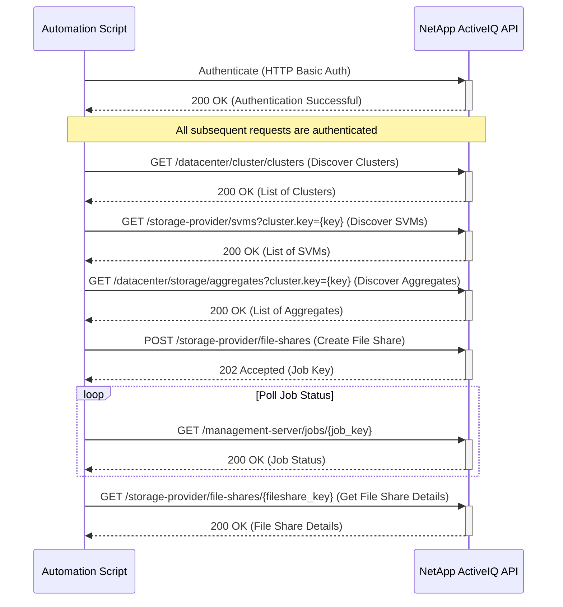

# Use Case: Provisioning a New NFS File Share

This sequence diagram illustrates the process of authenticating, discovering resources, provisioning a new NFS file share, and monitoring the creation job.



## Inputs

### Authentication

- **Username**: NetApp ActiveIQ API username with storage provisioning privileges
- **Password**: Corresponding password for API authentication
- **Base URL**: NetApp ActiveIQ Unified Manager base URL (e.g., `https://aiq-um.example.com`)

### Resource Discovery Parameters

- **Cluster Selection**: Target cluster for file share creation
  - **Cluster Key**: Unique cluster identifier
  - **Cluster Name**: Human-readable cluster name
- **SVM Selection**: Storage Virtual Machine for the file share
  - **SVM Key**: Unique SVM identifier
  - **SVM Name**: Human-readable SVM name
- **Aggregate Selection**: Storage aggregate for the underlying volume
  - **Aggregate Key**: Unique aggregate identifier
  - **Aggregate Name**: Human-readable aggregate name

### File Share Configuration

- **Name**: Name for the new NFS file share
  - **Type**: String
  - **Requirements**: Must be unique within the SVM
  - **Example**: `nfs_share_001`
- **Size**: Size of the file share in bytes
  - **Type**: Integer
  - **Minimum**: 1073741824 (1GB)
  - **Example**: 107374182400 (100GB)
- **Path**: Export path for the NFS share
  - **Type**: String
  - **Format**: Unix-style path starting with `/`
  - **Example**: `/nfs_share_001`

### NFS-Specific Parameters

- **Export Policy**: NFS export policy to apply
  - **Name**: Name of existing export policy (e.g., `default`)
  - **Rules**: Access rules for NFS clients (if creating new policy)
- **Protocol**: File sharing protocol
  - **Value**: `nfs` (for this use case)
- **Security Style**: File system security style
  - **Options**: `unix`, `ntfs`, `mixed`
  - **Default**: `unix`

### POST Request Body Example

```json
{
  "name": "nfs_share_001",
  "size": 107374182400,
  "path": "/nfs_share_001",
  "protocol": "nfs",
  "svm": {
    "key": "1d1c3198-fc57-11e8-99ca-00a098d38e12:type=vserver,uuid=1d1c3198-fc57-11e8-99ca-00a098d38e12"
  },
  "aggregate": {
    "key": "cbd1757b-0580-11e8-bd9d-00a098d39e12:type=aggregate,uuid=f3063d27-2c71-44e5-9a69-a3927c19c8fc"
  },
  "export_policy": {
    "name": "default"
  },
  "security_style": "unix"
}
```

### Discovery Query Parameters

- **cluster.key**: Filter resources by cluster
- **max_records**: Maximum records to return per request
- **fields**: Specify which fields to include in response
- **filter**: Additional filtering criteria

### Input Validation Requirements

- All resource keys must exist and be accessible
- File share name must be unique within the SVM
- Size must meet minimum requirements (1GB)
- Export path must be valid Unix path format
- User must have storage provisioning privileges
- Target resources must have sufficient capacity

### Pre-Provisioning Checks

- **Capacity Verification**: Ensure sufficient space in target aggregate
- **Network Configuration**: Verify NFS services are enabled on SVM
- **Security Policies**: Confirm appropriate export policies exist
- **Resource Availability**: Check that target resources are online

## Output

### Successful Response Examples

#### 1. Authentication Success (200 OK)

```json
{
  "message": "Authentication successful"
}
```

#### 2. Cluster Discovery (200 OK)

```json
{
  "_links": {
    "self": {
      "href": "/api/datacenter/cluster/clusters"
    }
  },
  "num_records": 2,
  "records": [
    {
      "key": "4ea7a442-86d1-11e0-ae1c-123478563412:type=cluster,uuid=4ea7a442-86d1-11e0-ae1c-123478563412",
      "name": "cluster1",
      "uuid": "4ea7a442-86d1-11e0-ae1c-123478563412",
      "version": {
        "full": "NetApp Release 9.8P1",
        "generation": 9,
        "major": 8,
        "minor": 0
      }
    }
  ],
  "total_records": 2
}
```

#### 3. File Share Creation Job (202 Accepted)

```json
{
  "job": {
    "_links": {
      "self": {
        "href": "/api/management-server/jobs/85b642774a960362:-4405f3a8:16e686b7083:-6fac"
      }
    },
    "key": "85b642774a960362:-4405f3a8:16e686b7083:-6fac"
  }
}
```

#### 4. Job Status Polling (200 OK)

```json
{
  "key": "85b642774a960362:-4405f3a8:16e686b7083:-6fac",
  "name": "Create NFS File Share",
  "description": "Creating NFS file share on SVM svm1",
  "state": "success",
  "status": "normal",
  "progress": 100,
  "submit_time": "2024-01-15T10:30:00.000Z",
  "start_time": "2024-01-15T10:30:05.000Z",
  "end_time": "2024-01-15T10:32:15.000Z"
}
```

#### 5. File Share Details (200 OK)

```json
{
  "key": "cbd1757b-0580-11e8-bd9d-00a098d39e12:type=volume,uuid=f3063d27-2c71-44e5-9a69-a3927c19c8fc",
  "name": "nfs_share_001",
  "size": 107374182400,
  "path": "/nfs_share_001",
  "export_policy": {
    "name": "default"
  },
  "svm": {
    "name": "svm1",
    "uuid": "1d1c3198-fc57-11e8-99ca-00a098d38e12"
  },
  "state": "online",
  "protocol": "nfs"
}
```

### Error Response Examples

#### Authentication Failure (401 Unauthorized)

```json
{
  "error": {
    "code": "401",
    "message": "Authentication failed. Invalid credentials.",
    "target": "authentication"
  }
}
```

#### Resource Not Found (404 Not Found)

```json
{
  "error": {
    "code": "404",
    "message": "Cluster with key '4ea7a442-86d1-11e0-ae1c-123478563412' not found.",
    "target": "cluster.key"
  }
}
```

#### Invalid Request (400 Bad Request)

```json
{
  "error": {
    "code": "400",
    "message": "Invalid file share size. Size must be at least 1GB.",
    "target": "size"
  }
}
```

### Error Handling

- **Authentication Failure (401 Unauthorized)**: If authentication fails, the script should log the error and terminate. Ensure that the API credentials are correct and have the necessary permissions.
- **Resource Not Found (404 Not Found)**: If a cluster, SVM, or aggregate is not found, the script should handle the error gracefully. This could involve trying a different resource or logging the error and exiting.
- **Invalid Request (400 Bad Request)**: If the `POST` request to create the file share is invalid, the API will return a 400 error with a descriptive message. The script should parse the error message and provide feedback to the user.
- **Job Failure**: The job to create the file share may fail for various reasons (e.g., insufficient space, configuration error). The script should monitor the job status and, if it fails, retrieve the job's error message to diagnose the problem.
- **Network Errors**: Implement retry logic with exponential backoff for transient network errors (e.g., timeouts, connection errors).
