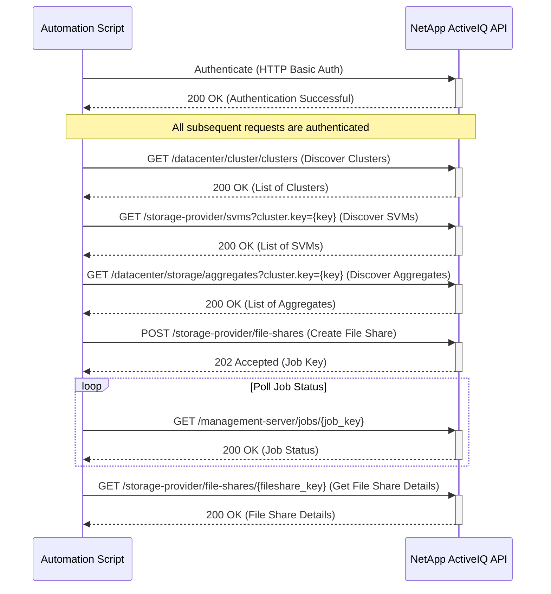

# Use Case: Provisioning a New NFS File Share

This sequence diagram illustrates the process of authenticating, discovering resources, provisioning a new NFS file share, and monitoring the creation job.

### Error Handling

- **Authentication Failure (401 Unauthorized)**: If authentication fails, the script should log the error and terminate. Ensure that the API credentials are correct and have the necessary permissions.
- **Resource Not Found (404 Not Found)**: If a cluster, SVM, or aggregate is not found, the script should handle the error gracefully. This could involve trying a different resource or logging the error and exiting.
- **Invalid Request (400 Bad Request)**: If the `POST` request to create the file share is invalid, the API will return a 400 error with a descriptive message. The script should parse the error message and provide feedback to the user.
- **Job Failure**: The job to create the file share may fail for various reasons (e.g., insufficient space, configuration error). The script should monitor the job status and, if it fails, retrieve the job's error message to diagnose the problem.
- **Network Errors**: Implement retry logic with exponential backoff for transient network errors (e.g., timeouts, connection errors).
