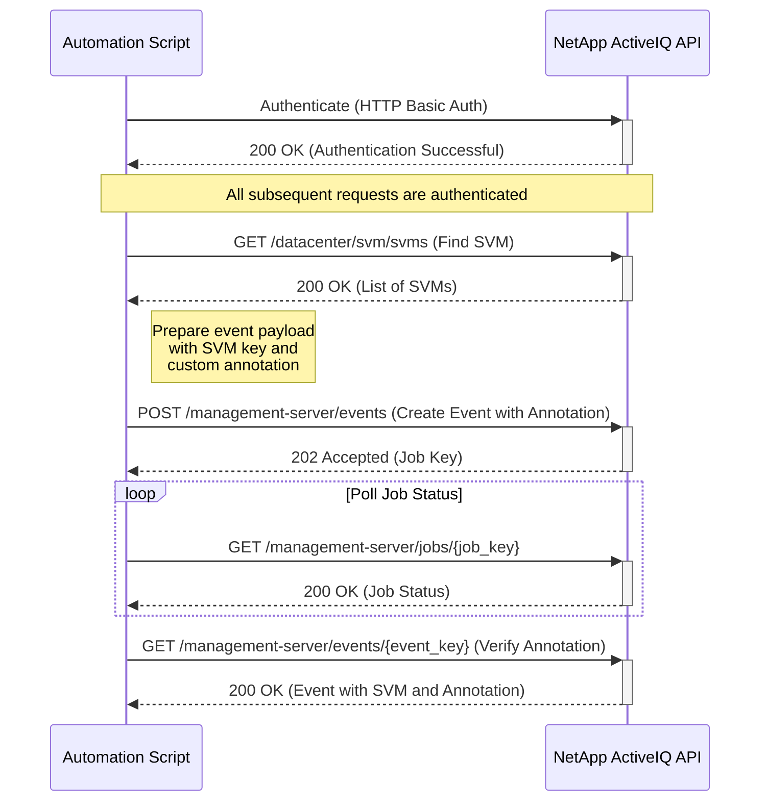

# Use Case: Tagging an SVM via Event Annotation

This sequence diagram illustrates how to tag an SVM by creating a new event and adding a custom annotation to it.



## Inputs

### Authentication

- **Username**: NetApp ActiveIQ API username with SVM management privileges
- **Password**: Corresponding password for API authentication
- **Base URL**: NetApp ActiveIQ Unified Manager base URL (e.g., `https://aiq-um.example.com`)

### SVM Identification

- **SVM Key**: Unique identifier for the target SVM (e.g., `4ea7a442-86d1-11e0-ae1c-123478563412:type=svm,uuid=4ea7a442-86d1-11e0-ae1c-123478563412`)
- **SVM Name**: Human-readable name of the SVM (alternative to key)
- **SVM UUID**: UUID component of the SVM identifier

### Event Creation Parameters

- **Event Name**: Descriptive name for the annotation event
  - **Type**: String
  - **Example**: `svm_tagging_event`
- **Event Message**: Human-readable message describing the annotation
  - **Type**: String
  - **Example**: `"SVM tagged with project and compliance information"`
- **Severity**: Event severity level
  - **Options**: `information`, `warning`, `error`, `critical`
  - **Default**: `information`

### Annotation Metadata

- **Annotation Key-Value Pairs**: Metadata to tag the SVM with
  - **Type**: Object containing key-value pairs
  - **Examples**:
    - `project`: `AIQ_Enhancement`
    - `environment`: `production`
    - `compliance`: `ISO27001`
    - `owner`: `storage_team`
    - `cost_center`: `IT-001`

### POST Request Body Example

```json
{
  "name": "svm_tagging_event",
  "message": {
    "text": "SVM tagged with project and compliance information"
  },
  "severity": "information",
  "resource": {
    "key": "4ea7a442-86d1-11e0-ae1c-123478563412:type=svm,uuid=4ea7a442-86d1-11e0-ae1c-123478563412",
    "type": "svm"
  },
  "annotation": {
    "project": "AIQ_Enhancement",
    "environment": "production",
    "compliance": "ISO27001",
    "owner": "storage_team"
  }
}
```

### Search Parameters (for GET /datacenter/svm/svms)

- **name**: Filter SVMs by name
- **cluster.name**: Filter by cluster name
- **max_records**: Maximum number of records to return
- **order_by**: Sort results by specified field
- **fields**: Specify which fields to include in response

### Input Validation Requirements

- SVM must exist and be accessible to the authenticated user
- Event payload must contain all required fields (name, message, resource)
- Annotation keys and values must follow naming conventions
- User must have appropriate privileges for SVM management and event creation
- Resource key must be in the correct format for SVM objects

### Pre-Tagging Checks

- **SVM Status**: Ensure SVM is online and manageable
- **Existing Annotations**: Review current annotations to avoid duplicates
- **Compliance Requirements**: Verify that metadata meets organizational policies
- **Permission Verification**: Confirm user has necessary privileges

### Error Handling

- **Authentication Failure (401 Unauthorized)**: If authentication fails, the script should log the error and terminate. Ensure that the API credentials are correct and have the necessary permissions.
- **SVM Not Found (404 Not Found)**: If the SVM to be tagged does not exist, the script should handle the error gracefully.
- **Invalid Event Payload (400 Bad Request)**: If the event creation request is invalid (e.g., missing required fields), the API will return a 400 error. The script should validate the payload before sending it.
- **Job Failure**: The event creation job may fail. The script should monitor the job status and provide detailed error information if it fails.
- **Network Errors**: Implement retry logic with exponential backoff for transient network errors.
