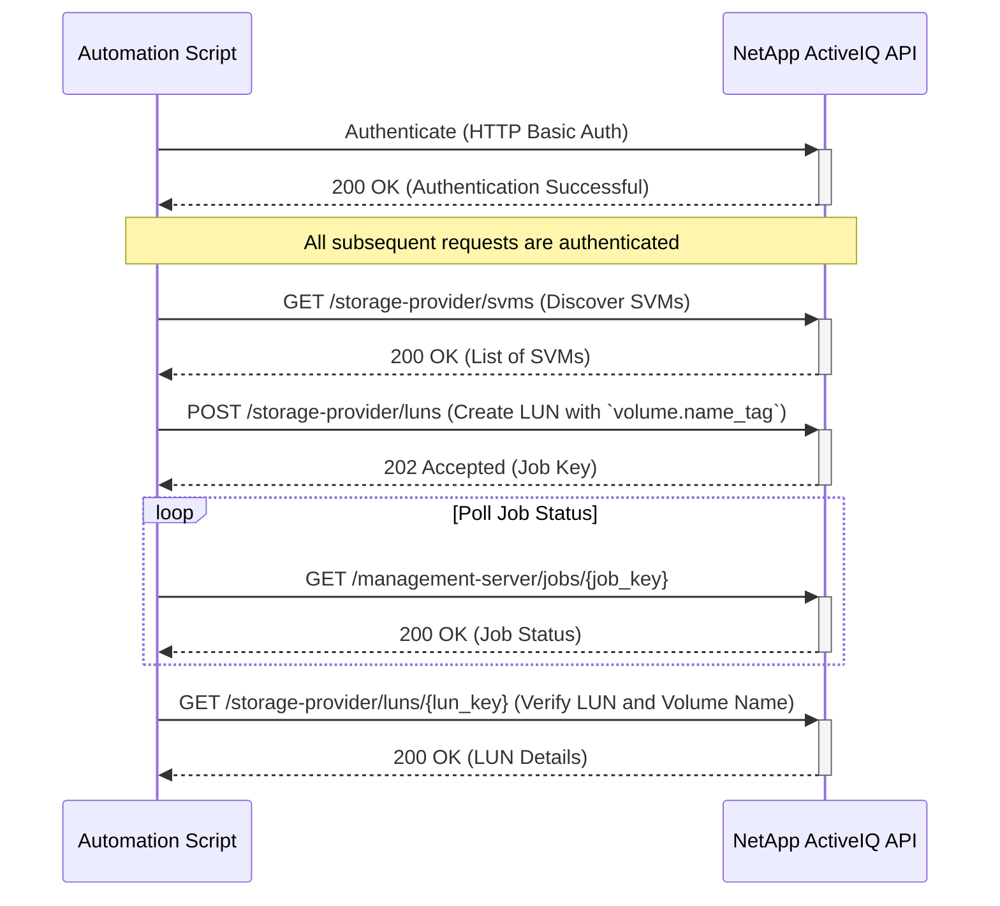

# Use Case: Tagging a Volume with `name_tag`

This sequence diagram illustrates how to authenticate and use a `name_tag` to create a consistently named volume during LUN creation.



## Inputs

### Authentication

- **Username**: NetApp ActiveIQ API username with LUN provisioning privileges
- **Password**: Corresponding password for API authentication
- **Base URL**: NetApp ActiveIQ Unified Manager base URL (e.g., `https://aiq-um.example.com`)

### LUN Configuration

- **Name Tag**: Base name for volume creation using the `name_tag` parameter
  - **Type**: String
  - **Format**: Alphanumeric characters, underscores, and hyphens
  - **Example**: `ProjectX_LUN`, `DB_Backup_Vol`
  - **Generated Volume Name**: `NSLM_{name_tag}` (NetApp Storage Lifecycle Management prefix)
- **LUN Name**: Name for the LUN itself
  - **Type**: String
  - **Example**: `lun_001`
- **Size**: Size of the LUN in bytes
  - **Type**: Integer
  - **Minimum**: 1073741824 (1GB)
  - **Example**: 21474836480 (20GB)

### Resource Selection

- **SVM Information**:
  - **SVM Key**: Unique identifier for the SVM
  - **SVM Name**: Human-readable name of the SVM
  - **SVM UUID**: UUID component of the SVM identifier
- **Aggregate Information**:
  - **Aggregate Key**: Unique identifier for the storage aggregate
  - **Aggregate Name**: Human-readable name of the aggregate
  - **Available Space**: Ensure sufficient capacity for the LUN

### POST Request Body Example

```json
{
  "name": "lun_001",
  "size": 21474836480,
  "svm": {
    "key": "1d1c3198-fc57-11e8-99ca-00a098d38e12:type=vserver,uuid=1d1c3198-fc57-11e8-99ca-00a098d38e12"
  },
  "volume": {
    "name_tag": "ProjectX_LUN"
  },
  "aggregate": {
    "key": "cbd1757b-0580-11e8-bd9d-00a098d39e12:type=aggregate,uuid=f3063d27-2c71-44e5-9a69-a3927c19c8fc"
  },
  "os_type": "linux",
  "space_guarantee": "volume"
}
```

### Discovery Parameters

- **Search Filters** (for GET /storage-provider/svms):
  - **cluster.name**: Filter SVMs by cluster
  - **state**: Filter by SVM state (`running`, `stopped`)
  - **max_records**: Maximum records to return
  - **order_by**: Sort results by specified field

### Volume Naming Convention

- **Automatic Naming**: The system will create a volume named `NSLM_{name_tag}`
- **Uniqueness**: The `name_tag` must result in a unique volume name within the SVM
- **Character Restrictions**: Must comply with ONTAP volume naming rules

### Input Validation Requirements

- `name_tag` must be unique within the target SVM
- SVM and aggregate must exist and be accessible
- Sufficient space must be available in the selected aggregate
- User must have LUN provisioning privileges
- `name_tag` must comply with ONTAP naming conventions

### Pre-Provisioning Checks

- **Capacity Verification**: Confirm adequate free space in target aggregate
- **Name Conflict Detection**: Ensure no existing volume with derived name exists
- **Resource Availability**: Verify SVM and aggregate are online
- **Permission Validation**: Confirm user has necessary provisioning rights
- **Compliance**: Ensure configuration meets storage policies

### Error Handling

- **Authentication Failure (401 Unauthorized)**: If authentication fails, the script should log the error and terminate. Ensure that the API credentials are correct and have the necessary permissions.
- **Invalid `name_tag` (400 Bad Request)**: If the `name_tag` contains invalid characters or does not meet naming requirements, the API will return a 400 error. The script should validate the `name_tag` before making the request.
- **Volume Name Conflict (400 Bad Request)**: If the volume name derived from the `name_tag` (e.g., `NSLM_<name_tag>`) already exists, the LUN creation will fail. The script should include logic to check for existing volumes or use a unique `name_tag`.
- **Resource Not Found (404 Not Found)**: If the specified SVM for LUN creation does not exist, the API will return a 404 error. The script should validate the SVM key before creating the LUN.
- **Insufficient Space (400 Bad Request)**: If the selected aggregate does not have enough space, the LUN creation job will fail. The script should check for available capacity before initiating the request.
- **Job Failure**: The LUN creation job may fail for other reasons (e.g., system constraints, licensing issues). The script should monitor the job status and retrieve detailed error information if the job fails.
- **Network Errors**: Implement retry logic with exponential backoff for transient network errors.
