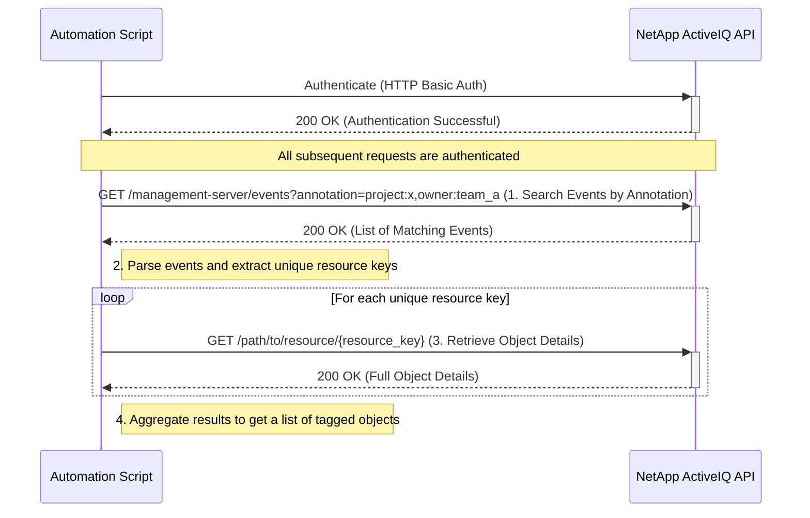
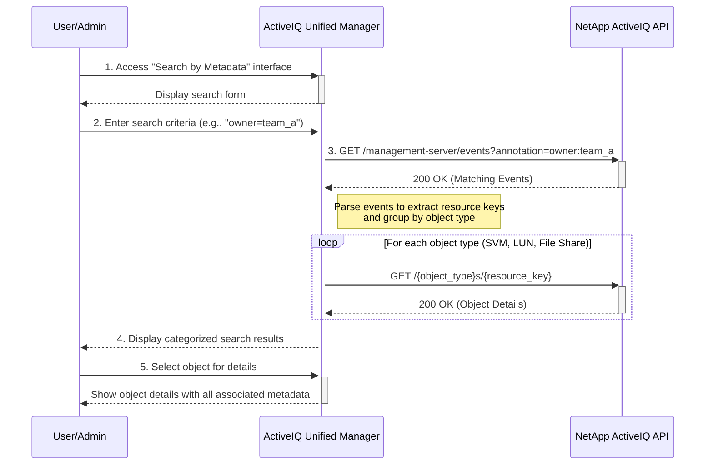

# Use Case: Searching for Objects by Metadata

This sequence diagram illustrates how to find all objects (e.g., SVMs, LUNs) that have been tagged with specific metadata using event annotations.



## Console-Based Search Interface



## Search Patterns and Examples

### Basic Search Patterns

1. **Single Tag Search**:

   ```
   GET /management-server/events?annotation=environment:production
   ```

   Find all objects tagged as production environment.

2. **Multiple Tag Search (AND logic)**:

   ```
   GET /management-server/events?annotation=environment:production,owner:team_database
   ```

   Find objects that are both production AND owned by database team.

3. **Owner-Based Search**:

   ```
   GET /management-server/events?annotation=owner:john.doe
   ```

   Find all objects assigned to a specific owner.

4. **Project-Based Search**:
   ```
   GET /management-server/events?annotation=project:quarterly-reporting
   ```
   Find all objects associated with a specific project.

### Advanced Search Scenarios

1. **Cost Center Reporting**:

   ```
   GET /management-server/events?annotation=cost-center:IT-001
   ```

   Find all objects for budget allocation and cost tracking.

2. **Compliance Audit**:

   ```
   GET /management-server/events?annotation=compliance:sox,criticality:high
   ```

   Find high-criticality objects subject to SOX compliance.

3. **Environment Management**:

   ```
   GET /management-server/events?annotation=environment:development
   GET /management-server/events?annotation=environment:testing
   GET /management-server/events?annotation=environment:production
   ```

   Separate searches for different environment types.

4. **Team Resource Allocation**:
   ```
   GET /management-server/events?annotation=team:storage-admins
   ```
   Find all resources managed by a specific team.

### Search Result Processing

1. **Group by Object Type**: Categorize results as SVMs, LUNs, File Shares, etc.
2. **Aggregate Metadata**: Collect all annotations for each found object
3. **Generate Reports**: Create summary reports showing resource distribution
4. **Export Results**: Generate CSV or Excel reports for further analysis

### Error Handling

- **Authentication Failure (401 Unauthorized)**: If authentication fails, the script should log the error and terminate.
- **No Matching Events (200 OK with empty list)**: If no events match the search criteria, the API will return an empty list. The script should handle this gracefully, informing the user that no objects with the specified metadata were found.
- **Invalid Search Syntax (400 Bad Request)**: If the annotation search string is malformed, the API will return a 400 error. The script should validate the search query before sending it.
- **Resource Deleted (404 Not Found)**: It is possible that an event's annotation refers to an object that has since been deleted. The script should handle the 404 error when retrieving the object details and either log it or exclude it from the final result set.
- **Network Errors**: Implement retry logic with exponential backoff for transient network errors.
- **Pagination**: For large result sets, the script must handle pagination using the `_links.next` field in the API response to retrieve all matching events.
