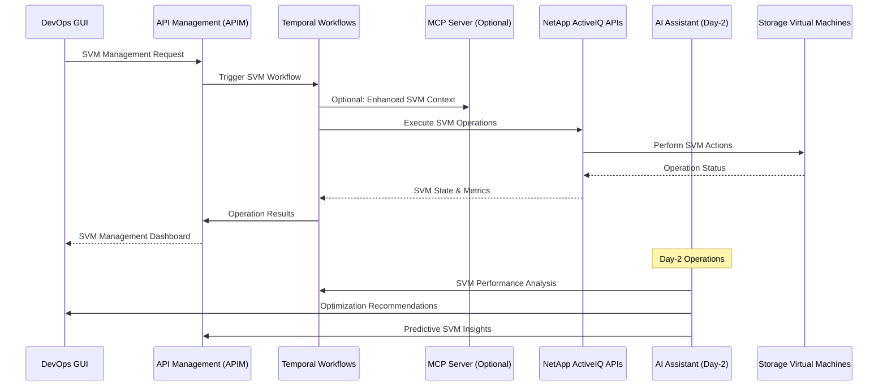

# SVM Management

## Overview

Storage Virtual Machine (SVM) Management is a fundamental DevOps use case that leverages the NetApp ActiveIQ MCP server through APIM to efficiently manage, monitor, and optimize Storage Virtual Machines. This use case demonstrates how DevOps teams can implement comprehensive SVM lifecycle management through automated workflows, intelligent monitoring, and AI-enhanced operational optimization.

## Architecture Flow



## SVM Management Categories

### 1. SVM Lifecycle Operations

- **SVM Creation**: Automated provisioning of new Storage Virtual Machines
- **SVM Configuration**: Network, protocol, and service configuration
- **SVM Monitoring**: Real-time performance and health monitoring
- **SVM Optimization**: Performance tuning and resource optimization
- **SVM Decommissioning**: Secure and controlled SVM removal

### 2. Protocol Management

- **NFS Configuration**: Network File System setup and optimization
- **CIFS/SMB Setup**: Windows file sharing protocol management
- **iSCSI Management**: Block-level storage protocol configuration
- **FC Protocol**: Fibre Channel configuration and monitoring
- **NVMe Management**: Non-Volatile Memory Express protocol support

### 3. Security and Access Control

- **User Authentication**: LDAP, Active Directory, and local user management
- **Access Permissions**: Role-based access control (RBAC)
- **Network Security**: Firewall rules and security policies
- **Data Encryption**: In-transit and at-rest encryption configuration
- **Audit and Compliance**: Security audit trails and compliance reporting

## APIM-Managed SVM Workflows

### 1. SVM Provisioning Automation

```yaml
workflow_name: svm_provisioning
trigger: api_request
validation_required: true
steps:
  - pre_provisioning_validation:
      check_cluster_resources: true
      validate_network_config: true
      verify_naming_standards: true
      confirm_security_policies: true
  - svm_creation:
      create_svm: true
      configure_protocols: [nfs, cifs, iscsi]
      setup_network_interfaces: true
      apply_security_policies: true
  - post_provisioning_setup:
      create_default_volumes: true
      configure_data_protection: true
      setup_monitoring: true
      validate_connectivity: true
  - documentation_update:
      update_cmdb: true
      create_operational_docs: true
      notify_stakeholders: true
```

### 2. SVM Performance Monitoring

```yaml
workflow_name: svm_performance_monitoring
trigger: scheduled
frequency: 5_minutes
scope: all_active_svms
steps:
  - metrics_collection:
      performance_metrics: [iops, throughput, latency]
      resource_utilization: [cpu, memory, network]
      protocol_statistics: [nfs, cifs, iscsi, fc]
      client_connections: true
  - analysis_and_alerting:
      threshold_evaluation: true
      trend_analysis: true
      anomaly_detection: ai_enabled
      alert_generation: conditional
  - optimization_recommendations:
      performance_tuning: ai_suggested
      resource_reallocation: predictive
      protocol_optimization: intelligent
```

### 3. SVM Disaster Recovery

```yaml
workflow_name: svm_disaster_recovery
trigger: manual_or_automated
dr_scenarios: [planned_failover, unplanned_disaster, testing]
steps:
  - dr_assessment:
      evaluate_primary_svm: true
      check_secondary_readiness: true
      validate_snapmirror_relationships: true
  - failover_execution:
      break_snapmirror_relationships: conditional
      promote_secondary_svm: true
      update_dns_records: true
      reconfigure_client_access: true
  - validation_and_testing:
      verify_data_integrity: true
      test_protocol_access: true
      validate_performance: true
      confirm_client_connectivity: true
```

## DevOps Integration Patterns

### SVM Management Interface

```python
# Example: SVM management integration
from netapp_mcp_client import NetAppMCPClient
from apim_client import APIMClient
from datetime import datetime

class SVMManager:
    def __init__(self):
        self.apim = APIMClient()
        self.mcp_client = NetAppMCPClient()

    async def create_svm(self, svm_config: dict):
        """Create a new SVM with specified configuration"""
        provisioning_request = {
            "workflow": "svm_provisioning",
            "parameters": {
                "cluster_id": svm_config["cluster_id"],
                "svm_name": svm_config["name"],
                "protocols": svm_config.get("protocols", ["nfs", "cifs"]),
                "network_config": svm_config["network"],
                "security_policy": svm_config.get("security_policy", "default"),
                "data_protection": svm_config.get("data_protection", True)
            }
        }

        response = await self.apim.execute_temporal_workflow(provisioning_request)
        return response.svm_details

    async def get_svm_performance(self, svm_id: str, timeframe_hours: int = 24):
        """Get comprehensive SVM performance metrics"""
        performance_request = {
            "workflow": "svm_performance_analysis",
            "parameters": {
                "svm_id": svm_id,
                "analysis_period": f"{timeframe_hours}_hours",
                "metrics": ["iops", "throughput", "latency", "cpu", "memory"],
                "include_trends": True,
                "include_predictions": True
            }
        }

        response = await self.apim.execute_temporal_workflow(performance_request)
        return response.performance_data

    async def optimize_svm_configuration(self, svm_id: str):
        """Get AI-powered SVM optimization recommendations"""
        optimization_request = {
            "workflow": "svm_optimization_analysis",
            "parameters": {
                "svm_id": svm_id,
                "optimization_goals": ["performance", "efficiency", "security"],
                "include_protocol_tuning": True,
                "include_resource_optimization": True,
                "risk_tolerance": "medium"
            }
        }

        response = await self.apim.execute_temporal_workflow(optimization_request)
        return response.optimization_recommendations
```

### Automated SVM Operations

```python
class AutomatedSVMOperations:
    async def setup_svm_automation(self):
        """Configure automated SVM management"""

        # Automated SVM scaling
        await self.apim.register_svm_handler({
            "trigger_type": "resource_utilization_high",
            "threshold": "80%_cpu_or_memory",
            "action": "svm_resource_scaling",
            "auto_execute": True,
            "approval_required": False,
            "notification_channels": ["slack", "email"]
        })

        # Automated protocol optimization
        await self.apim.register_svm_handler({
            "trigger_type": "protocol_performance_degradation",
            "threshold": "latency_increase_20%",
            "action": "protocol_optimization_workflow",
            "auto_execute": False,
            "approval_required": True,
            "approver_role": "storage_admin"
        })

        # Automated failover for disaster recovery
        await self.apim.register_svm_handler({
            "trigger_type": "svm_unavailability",
            "detection_time": "5_minutes",
            "action": "automated_svm_failover",
            "auto_execute": True,
            "approval_required": True,
            "approver_role": "dr_manager",
            "escalation_timeout": "10_minutes"
        })

    async def execute_svm_migration(self, migration_plan):
        """Execute SVM migration workflow"""
        migration_workflow = {
            "workflow": "svm_migration",
            "parameters": {
                "source_svm": migration_plan["source_svm_id"],
                "target_cluster": migration_plan["target_cluster_id"],
                "migration_type": migration_plan["type"],  # online, offline, cutover
                "data_transfer_method": migration_plan.get("transfer_method", "snapmirror"),
                "validation_checks": True,
                "rollback_plan": migration_plan.get("rollback_plan")
            }
        }

        return await self.apim.execute_temporal_workflow(migration_workflow)
```

## AI-Enhanced Day-2 Operations

### Intelligent SVM Optimization

The AI Assistant provides advanced SVM management capabilities:

- **Performance Optimization**: Analyze SVM performance patterns and suggest optimizations
- **Resource Allocation**: Intelligent resource allocation based on workload patterns
- **Protocol Tuning**: AI-driven protocol configuration optimization
- **Predictive Scaling**: Predict resource needs and proactively scale SVMs

### AI SVM Analytics Pipeline

```python
class AISVMAnalytics:
    async def optimize_svm_performance(self, svm_metrics):
        """AI-driven SVM performance optimization"""

        # Analyze current SVM performance
        performance_analysis = await self.ai_assistant.analyze_svm_performance(
            svm_metrics=svm_metrics,
            historical_data="30_days",
            include_protocol_analysis=True
        )

        # Generate optimization recommendations
        optimizations = await self.ai_assistant.generate_svm_optimizations(
            performance_analysis=performance_analysis,
            workload_patterns=await self.get_workload_patterns(),
            resource_constraints=await self.get_resource_constraints()
        )

        # Execute approved optimizations
        for optimization in optimizations.approved_recommendations:
            await self.apim.execute_temporal_workflow({
                "workflow": optimization.workflow,
                "parameters": optimization.parameters,
                "ai_confidence": optimization.confidence_score
            })

        return optimizations

    async def predict_svm_scaling_needs(self, svm_metrics):
        """Predict SVM scaling requirements"""
        scaling_prediction = await self.ai_assistant.predict_scaling_needs(
            current_metrics=svm_metrics,
            growth_patterns=await self.get_growth_patterns(),
            business_forecasts=await self.get_business_forecasts()
        )

        # Proactive scaling for high-confidence predictions
        for prediction in scaling_prediction.high_confidence_predictions:
            if prediction.confidence_score > 0.85:
                await self.apim.execute_temporal_workflow({
                    "workflow": "proactive_svm_scaling",
                    "parameters": {
                        "svm_id": prediction.svm_id,
                        "scaling_action": prediction.recommended_action,
                        "timing": prediction.optimal_timing
                    }
                })

        return scaling_prediction
```

### Predictive SVM Management

```yaml
predictive_svm_workflows:
  - name: svm_performance_forecasting
    trigger: daily
    ai_model: time_series_prediction
    features:
      - historical_performance_metrics
      - workload_patterns
      - resource_utilization_trends
    predictions:
      - performance_bottlenecks
      - resource_exhaustion_points
      - optimization_opportunities

  - name: svm_capacity_planning
    trigger: weekly
    ai_model: capacity_forecasting
    inputs:
      - svm_growth_history
      - business_projections
      - seasonal_patterns
    outputs:
      - capacity_requirements
      - scaling_timeline
      - resource_allocation_plan

  - name: svm_health_prediction
    trigger: continuous
    ai_model: anomaly_detection
    monitoring:
      - performance_metrics
      - error_rates
      - resource_utilization
    actions:
      - predictive_maintenance
      - proactive_optimization
      - early_warning_alerts
```

## SVM Security and Compliance

### Security Configuration Management

```yaml
svm_security_policies:
  authentication:
    - method: ldap
      server: corporate_ldap
      encryption: tls
    - method: active_directory
      domain: corporate_domain
      secure_channel: true

  access_control:
    - rbac_enabled: true
    - default_permissions: restrictive
    - audit_logging: comprehensive
    - session_timeout: 30_minutes

  network_security:
    - firewall_rules: enabled
    - allowed_protocols: [nfs, cifs, iscsi]
    - encryption_in_transit: mandatory
    - ip_whitelisting: enabled

  data_protection:
    - encryption_at_rest: aes_256
    - key_management: external_kmip
    - backup_encryption: enabled
    - compliance_reporting: automated
```

### Compliance Monitoring

```python
class SVMComplianceManager:
    async def audit_svm_compliance(self, compliance_framework: str):
        """Audit SVM compliance with specified framework"""
        audit_request = {
            "workflow": "svm_compliance_audit",
            "parameters": {
                "compliance_framework": compliance_framework,
                "audit_scope": "all_active_svms",
                "include_remediation": True,
                "generate_report": True
            }
        }

        response = await self.apim.execute_temporal_workflow(audit_request)
        return response.compliance_report

    async def enforce_security_policies(self, policy_updates):
        """Enforce updated security policies across SVMs"""
        enforcement_request = {
            "workflow": "security_policy_enforcement",
            "parameters": {
                "policy_updates": policy_updates,
                "enforcement_scope": "all_svms",
                "validation_required": True,
                "rollback_on_failure": True
            }
        }

        return await self.apim.execute_temporal_workflow(enforcement_request)
```

## SVM Protocol Management

### Protocol Configuration and Optimization

```yaml
protocol_management:
  nfs:
    - version: [v3, v4, v4.1]
    - security: [sys, krb5, krb5i, krb5p]
    - performance_tuning: auto_tuned
    - caching: enabled

  cifs:
    - smb_versions: [2.1, 3.0, 3.1.1]
    - authentication: [ntlm, kerberos]
    - encryption: smb3_encryption
    - oplocks: enabled

  iscsi:
    - authentication: chap
    - multipathing: alua
    - target_discovery: isns
    - performance_optimization: enabled

  nvme:
    - transport: [tcp, rdma]
    - namespace_management: automatic
    - multipathing: ana
    - performance_monitoring: continuous
```

### Protocol Performance Monitoring

```python
class ProtocolPerformanceMonitor:
    async def monitor_protocol_performance(self, svm_id: str):
        """Monitor protocol-specific performance metrics"""
        monitoring_request = {
            "workflow": "protocol_performance_monitoring",
            "parameters": {
                "svm_id": svm_id,
                "protocols": ["nfs", "cifs", "iscsi", "nvme"],
                "metrics": ["iops", "throughput", "latency", "errors"],
                "aggregation_period": "5_minutes",
                "alert_thresholds": True
            }
        }

        response = await self.apim.execute_temporal_workflow(monitoring_request)
        return response.protocol_metrics

    async def optimize_protocol_configuration(self, optimization_targets):
        """Optimize protocol configurations based on workload analysis"""
        optimization_request = {
            "workflow": "protocol_optimization",
            "parameters": {
                "optimization_targets": optimization_targets,
                "performance_goals": ["latency_reduction", "throughput_increase"],
                "ai_recommendations": True,
                "validation_testing": True
            }
        }

        return await self.apim.execute_temporal_workflow(optimization_request)
```

## SVM Best Practices

### 1. SVM Design Principles

- **Single Protocol per SVM**: Optimize performance by dedicating SVMs to specific protocols
- **Resource Isolation**: Ensure proper resource isolation between workloads
- **Network Segmentation**: Implement appropriate network segmentation for security
- **Naming Conventions**: Establish consistent SVM naming standards

### 2. Performance Optimization

- **Protocol Tuning**: Optimize protocol-specific settings for workload requirements
- **Resource Allocation**: Properly size CPU, memory, and network resources
- **Load Balancing**: Distribute workloads across multiple SVMs when appropriate
- **Monitoring and Alerting**: Implement comprehensive monitoring and alerting

### 3. Security and Compliance

- **Access Control**: Implement strict role-based access control
- **Encryption**: Enable encryption for data in transit and at rest
- **Audit Logging**: Maintain comprehensive audit logs
- **Regular Security Reviews**: Conduct regular security assessments

## Troubleshooting Guide

### Common SVM Issues

1. **Performance Degradation**
   - Check resource utilization (CPU, memory, network)
   - Analyze protocol-specific metrics
   - Review client connection patterns
   - Investigate storage backend performance

2. **Connectivity Issues**
   - Verify network configuration
   - Check firewall rules and security policies
   - Validate DNS resolution
   - Test client authentication

3. **Protocol-Specific Problems**
   - NFS: Check export policies and mount options
   - CIFS: Verify domain authentication and share permissions
   - iSCSI: Validate initiator configuration and CHAP settings
   - NVMe: Check namespace configuration and multipathing

### Performance Optimization Techniques

- **CPU Optimization**: Adjust CPU allocation based on workload patterns
- **Memory Tuning**: Optimize memory allocation for caching and buffering
- **Network Optimization**: Configure network interfaces for optimal throughput
- **Protocol Tuning**: Optimize protocol-specific parameters

## Success Metrics

- **SVM Availability**: Percentage uptime of Storage Virtual Machines
- **Performance SLA Compliance**: Meeting performance service level agreements
- **Resource Utilization**: Optimal use of allocated resources
- **Security Compliance**: Adherence to security policies and standards
- **Protocol Performance**: Protocol-specific performance metrics
- **Automation Success Rate**: Percentage of successful automated operations
- **Mean Time to Resolution**: Average time to resolve SVM issues

This comprehensive SVM management framework enables DevOps teams to efficiently manage Storage Virtual Machines through automated provisioning, intelligent monitoring, AI-enhanced optimization, and robust security controls, ensuring optimal performance and compliance.
